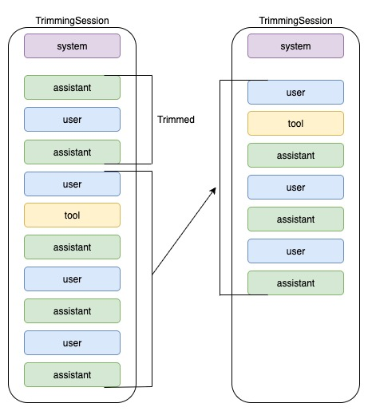

# 子课 01：Context Trimming

## 概览

学习如何实现 **context trimming**：只保留最近 N 轮对话，丢弃更早的上下文。这是最简单、最常见的上下文管理模式。

## 问题

随着对话不断变长：

- 上下文窗口会被旧的、无关的消息填满
- 成本增加（每次请求都要带更多 tokens）
- 延迟增加（prompt 更长，处理更慢）
- 模型可能会丢失对最近上下文的关注

## 解决方案

**Context Trimming**：只保留最近 N 个“turns”。



- 一个 **turn** = 一条用户消息 + 在下一条用户消息出现前的所有响应（assistant、tool calls、tool results）
- 当 turn 数量超过 `max_turns` 时，丢掉最旧的 turns
- 保持 turn 的边界完整，不要在中间截断

## 什么时候适合使用 Context Trimming

**最适合：**

- 短工作流（少于 30 分钟）
- 工具调用很多的任务（支持型 agent、数据分析等）
- 最近上下文比久远上下文更重要的任务
- 需要确定性、可预测行为的场景

**不适合：**

- 需要记住很久以前上下文的任务（长期研究、多日项目）
- 多轮之间依赖很强的任务
- 需要频繁引用早期细节的场景

## 优缺点

| 优点 | 缺点 |
| -------------------------------------------- | --------------------------------- |
| 零额外延迟 | 硬截断会丢失旧上下文 |
| 确定性强（没有 summarization 波动） | 可能“忘记”重要细节 |
| 易于实现与调试 | 不具备长程记忆 |
| token 使用可预测 | 可能重复处理已经解决的问题 |

## 工作原理

### 第一步：定义一个 Turn

```
Turn 1:
  - user: "My laptop won't start"
  - assistant: "Let's troubleshoot..."
  - tool_call: check_power_status()
  - tool_result: "Power cable connected"
  - assistant: "Try holding power button..."

Turn 2:
  - user: "Still not working"
  - assistant: "Let's check the battery..."
  ...
```

### 第二步：统计用户消息

- 遍历历史记录
- 统计 `role == "user"` 且不是 synthetic 的消息
- synthetic 消息（例如摘要）不算真实 turn

### 第三步：裁剪为最后 N 轮

- 如果用户 turns > `max_turns`，就找到最后 N 条用户消息中最早的那一条
- 保留从那个位置开始之后的全部内容
- 丢弃它之前的全部内容

## 什么算一个“turn”？

一个 turn = 一条用户消息，加上之后直到下一条用户消息出现之前的全部内容（assistant 回复、推理、tool calls、tool results）。

### 什么时候发生裁剪

- 写入时：`add_items(...)` 追加新项目后，会立刻对历史记录做裁剪
- 读取时：`get_items(...)` 返回的也是裁剪后的视图（即使你绕过写入路径，读取时也不会泄漏旧 turns）

### 它如何判断保留什么？

- 把所有 `role == "user"` 的项目当作用户消息（通过 `_is_user_msg`）
- 倒序扫描历史，收集最后 N 条用户消息的位置（`max_turns`）
- 找到这 N 条用户消息中最早的索引
- 保留从该索引到末尾的全部内容，之前的全部丢弃

这样可以保持完整 turn 边界：如果最早保留的用户消息在索引 `k`，那么 `k` 后面的 assistant/tool 项也会一并保留。

## 开始上手

### 1. 配置环境

```bash
# 复制环境模板
cp .env_backup .env

# 编辑 .env 并加入你的 API key
# GEMINI_API_KEY=your_key_here
```

## 关键参数：`max_turns`

### 如何选择

1. **估算平均 turn 复杂度**
2. **根据上下文窗口计算 token 预算**
3. **从较小值开始测试，再根据评估结果逐步调整**

核心原则是：保留足够多的近期上下文，同时避免让 prompt 无限制膨胀。
