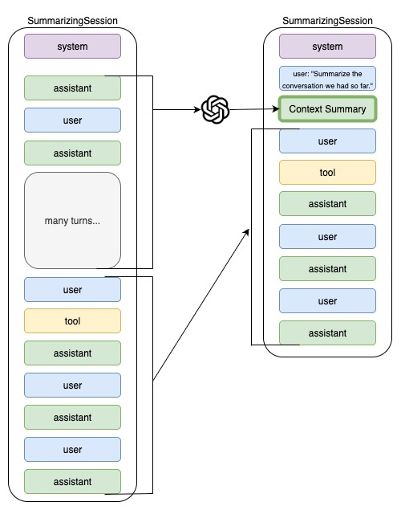

# Context Summarization

## 概览

**Context Summarization** 使用 LLM 把较早的对话历史压缩成简洁摘要，在大幅减少 token 使用量的同时保留关键信息。相比简单 trimming，这是一种更高级的方案。

## 问题

在长对话中：

- 每轮发送给 LLM 的 token 成本会不断累计
- 简单 trimming 可能会丢失早期的重要上下文
- 需要保持语义连贯性，不能随意删除消息

## 解决方案

Context summarization：



1. **原样保留最近几轮**（例如最近 5-10 条消息）
2. **把更早的对话总结成一个简洁的 system message**
3. **保留关键事实**（用户偏好、实体名称、已经做出的决策）
4. **随着对话增长增量更新摘要**

### 示例流程

```
Original (20 turns, ~5000 tokens):
User: I'm planning a trip to Japan
Agent: Great! When are you planning to go?
User: Next spring, around April
Agent: Perfect timing for cherry blossoms...
[15 more turns discussing flights, hotels, budget]

Summarized (5 turns + summary, ~1500 tokens):
Summary: User is planning trip to Japan in April (cherry blossom season).
         Budget: $3000. Prefers boutique hotels. Interested in Kyoto temples.
[Last 5 turns verbatim]
```

## 什么时候适合使用

**适合在以下情况下使用 summarization：**

- 对话经常超过 20-30 轮
- 早期上下文中有不能丢的重要事实
- 需要语义连贯性，不能只靠 trimming
- token 成本值得优化，但回答质量不能明显下降

**以下情况不建议使用 summarization：**

- 对话天然很短（少于 10 轮）
- 只关心最近上下文
- 总结本身的成本高于节省下来的成本
- 实时延迟极其关键（因为总结会增加额外延迟）

## 优缺点

### 优点

- **保留整段对话中的重要上下文**
- **显著减少 token 使用**（有机会降低 60-80%）
- **比 trimming 更能保持连贯性**
- **可配置性强**（可以控制保留多少原文、总结多少历史）

### 缺点

- **增加延迟**（要额外调用一次 LLM 来做总结）
- **生成摘要本身也要消耗 tokens**
- **存在信息损失**（summarization 天然是有损压缩）
- **实现更复杂**（需要较好的 summarizer prompts）

## 实现模式

### 1. LLM Summarizer

```python

summarizer = Agent(
    model=llm_model,
    system_message="Summarize the conversation, preserving key facts and decisions.",
    max_tokens=500  # Limit summary length
)
```

### 2. Summarizing Session

```python

session = SummarizingSession(
    summarizer=summarizer,
    keep_turns=5  # Keep last 5 turns verbatim
)
```

### 3. Agent Integration

```python
agent = Agent(
    name="LongConversationAgent",
    model=llm_model,
    session=session  # Use summarizing session
)
```

## 配置指南

### `keep_turns` 参数

用于控制最近多少轮原样保留：

| Turns | Use Case | Token Impact |
| ----- | ----------------------------------- | ----------------- |
| 3-5 | 短期上下文（客服） | 高压缩率 |
| 5-10 | 中等长度对话（咨询） | 平衡 |
| 10-20 | 长对话（心理咨询等） | 压缩率较低 |

### Summarizer Prompt 设计

**好的 summarizer prompt：**

```
"Summarize the conversation, preserving:
 1. User's main goal and preferences
 2. Key decisions made
 3. Important entity names (people, places, products)
 4. Open questions or next steps
 Keep summary under 200 tokens."
```

**不好的 summarizer prompt：**

```
"Summarize this."  过于模糊
"Include everything."  违背 summarization 的目标
```

## 评估指标

### Token 节省率

```
savings = (original_tokens - summarized_tokens) / original_tokens * 100
```

### 信息保留率

可以使用 LLM-as-judge 来评估：

1. **事实保留**：原始对话中的关键事实是否仍然存在
2. **决策保留**：已做出的决策或承诺是否被保留
3. **连贯性**：整体对话流是否仍然合理

### 成本分析

```
summarization_cost = summary_tokens * price_per_token
conversation_cost_savings = (original_tokens - summarized_tokens) * price_per_token
net_savings = conversation_cost_savings - summarization_cost
```

## 真实案例

### 客服场景（25 轮对话）

**没有 summarization：**

- 总 token：6,000
- 每次 agent 回答成本：$0.012

**使用 summarization（keep_turns=5）：**

- 摘要：300 tokens
- 最近几轮：1,200 tokens
- 总 token：1,500
- 每次回答成本：$0.003
- **节省：75%**

## 下一步

1. 从 `01_basic_summarization.py` 开始，先看最小实现
2. 再看 `02_production_summarization.py`，学习生产模式
3. 运行 `03_evaluate_summarization.py`，衡量质量和节省效果

## 延伸阅读

- [OpenAI Cookbook: Summarization Strategies](https://cookbook.openai.com/)
- [Token Optimization Guide](https://platform.openai.com/docs/guides/optimization)
- [Agents SDK: SummarizingSession](https://github.com/openai/openai-agents-sdk)
