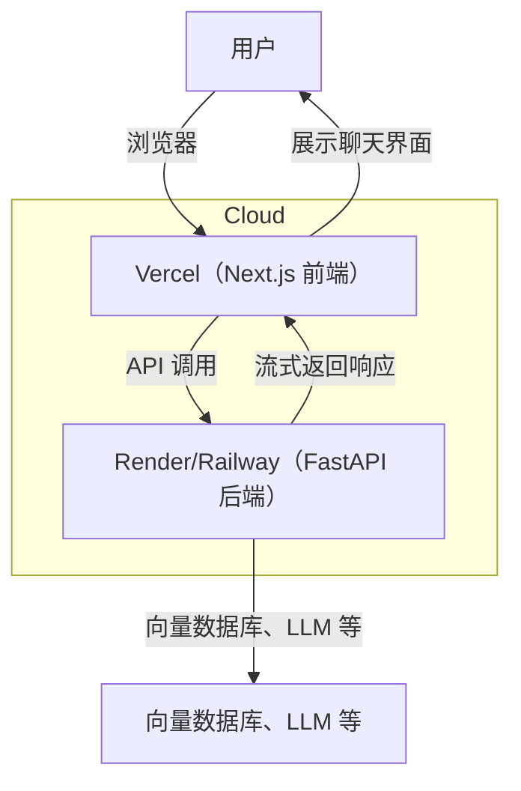

# 高级功能指南：Agentic RAG 聊天机器人

欢迎进入 Agentic RAG Chatbot 项目的高级阶段。在这一阶段，你将学习如何把后端容器化、把前后端都部署到云上，并测试你的可在线使用、接近生产就绪的聊天机器人。

---

## 阶段概览

- **Docker 化：** 把 FastAPI 后端打包成 Docker 容器，提升可移植性和可复现性
- **云部署：** 把 FastAPI 后端部署到免费的云服务（例如 Render、Railway 或类似平台）
- **前端部署：** 把 Next.js 前端部署到 Vercel
- **在线测试：** 随时随地访问并测试你已经部署好的 Agentic RAG Chatbot

## 学习目标

- 为 FastAPI 后端构建并优化 Docker 镜像
- 把前后端部署到云平台
- 在生产环境中配置环境变量和密钥
- 排查常见部署问题

---

## 第一步：将 FastAPI 后端 Docker 化

1. **在 FastAPI 后端目录下创建 `Dockerfile`：**

   ```dockerfile
   # Dockerfile
   FROM python:3.10-slim
   WORKDIR /app
   COPY . .
   RUN pip install --upgrade pip && pip install -r requirements.txt
   EXPOSE 8000
   CMD ["uvicorn", "app.main:app", "--host", "0.0.0.0", "--port", "8000"]
   ```

2. **构建 Docker 镜像：**

   ```bash
   docker build -t agentic-rag-backend .
   ```

3. **本地运行容器进行测试：**

   ```bash
   docker run -p 8000:8000 agentic-rag-backend
   ```

---

## 第二步：把 FastAPI 后端部署到云端

- **Render：**
  1. 将后端代码推送到 GitHub
  2. 在 [Render](https://render.com/) 上创建新的 Web Service，并连接你的仓库
  3. 设置构建与启动命令：
     - Build：`pip install --upgrade pip && pip install -r requirements.txt`
     - Start：`uvicorn app.main:app --host 0.0.0.0 --port 8000`
  4. 在 Render 控制台中设置环境变量（例如 API Key、数据库 URL）
  5. 完成部署并记录公开 API 地址

- **Railway：**
  1. 将后端代码推送到 GitHub
  2. 在 [Railway](https://railway.app/) 上创建新项目并关联仓库
  3. 配置所需环境变量
  4. 完成部署并记录公开 API 地址

---

## 第三步：把 Next.js 前端部署到 Vercel

1. 将 `agentic-rag-frontend` 目录推送到 GitHub（可以单独一个仓库，也可以作为子目录）
2. 打开 [Vercel](https://vercel.com/) 并导入你的仓库
3. 设置环境变量 `NEXT_PUBLIC_API_URL`，值为你部署好的 FastAPI 后端地址
4. 完成部署，获得前端公开地址

---

## 第四步：在线测试与问题排查

- 打开 Vercel 前端地址，与聊天机器人交互
- 查看浏览器控制台以及 Vercel / Render / Railway 的日志
- 常见问题包括：
  - **CORS 错误：** 确保 FastAPI 后端允许来自前端域名的请求
  - **环境变量错误：** 检查 API URL 和密钥是否设置正确
  - **构建失败：** 检查 Dockerfile、依赖文件和平台日志

---

## 推荐的生产目录结构

```text
Agentic-rag/
├── basic/
├── intermediate/
├── advanced/
├── agentic-rag-frontend/   # Next.js 前端（部署到 Vercel）
└── app/                    # FastAPI 后端（部署到 Render / Railway）
```

---

## 部署架构图



---

## 下一步

- 持续监控部署后的服务可用性与错误日志
- 为生产环境增加分析、日志和安全加固
- 把你的 Agentic RAG 聊天机器人分享给更多用户使用
