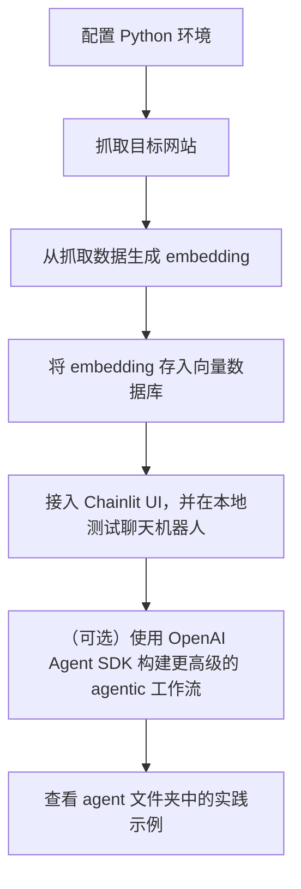

> **注意：** 开始之前，请先完成主 README 中的 [Python 环境配置](../README.md#step-1-set-up-your-python-environment)。



# 基础功能指南

本指南覆盖 Agentic RAG Chatbot 项目的第一阶段：抓取网站、生成 embedding、存入向量数据库，并接入 Chainlit UI 做本地测试。

## 什么是网页抓取？

网页抓取（Web Scraping）是指从网站中自动提取数据的过程。它可以让你从网页中批量收集信息，并用于分析、构建数据集、驱动聊天机器人等场景。在本项目里，网页抓取用于收集目标网站中的相关内容，作为聊天机器人知识库的来源。

### 为什么网页抓取重要？

- **自动化数据收集：** 比手工复制粘贴高效得多
- **保持数据最新：** 可以定期更新动态网站的数据
- **驱动数据型应用：** 对搜索引擎、聊天机器人和数据分析工具都很关键

## 最新 Python 网页抓取工具（2025）

Python 在网页抓取方面有非常丰富的生态，从简单 HTML 解析到高级浏览器自动化都覆盖到了。以下是一些常见且实用的工具：

- **BeautifulSoup：** 经典 HTML / XML 解析库，适合简单抓取任务
- **Requests：** 用于发起 HTTP 请求，常与 BeautifulSoup 搭配使用
- **Selenium：** 自动化浏览器，适合动态、重 JavaScript 的网站
- **Playwright：** Selenium 的现代替代方案，支持多浏览器，速度和稳定性都很好
- **Scrapy：** 强大、可扩展的网页抓取框架，适合大型项目
- **crawlerforge：** 基于 Scrapy 的高级框架，支持多引擎、智能代理管理和反检测能力
- **better-scraper：** 新型网页搜索与抓取库，可与 LLM 协同进行查询扩展与答案生成
- **dispider：** 批量部署和管理爬虫的工具，对新手友好
- **crawl4ai：** 现代 AI 驱动网页爬虫，适合大规模、智能数据提取，支持 LLM 集成和高级反爬能力

> **注意：** 抓取网站时始终要遵守网站服务条款和 `robots.txt`。合理使用代理、限速等手段，避免被封禁。

---

## 步骤

1. **配置 Python 环境**
2. **抓取目标网站**
3. **从抓取数据生成 embedding**
4. **将 embedding 存入向量数据库**
5. **接入 Chainlit UI，并在本地测试聊天机器人**

_随着阶段推进，下面会逐步提供更详细的说明。_

---

## 第二步：抓取目标网站

在这一步，你需要从自己选择的网站中提取相关内容。网页抓取能够帮你收集将来作为聊天机器人知识库的数据，而抓取数据的质量和结构会直接影响聊天机器人的表现。

### 为什么要抓取？

- 收集最新的、特定领域的信息
- 自动化构建后续处理所需的大规模数据集

### 如何抓取？

选择适合你需求的 Python 工具（见上面的工具列表）。对于大多数项目来说，BeautifulSoup、Playwright 或 crawl4ai 在能力和易用性之间比较平衡。

**可参考 [`crawl4ai_examples`](./crawl4ai_examples/) 目录中的实际示例代码。**

> _提示：抓取前一定要先检查网站服务条款和 `robots.txt`。务必采用礼貌抓取策略，例如限速、设置 User-Agent 等。_

---

## 第三步：从抓取数据生成 Embedding

### 什么是 Embedding？

Embedding 是文本（或其他数据类型）在高维向量空间中的数值表示。在自然语言处理（NLP）中，embedding 能够捕捉词语、句子或文档的语义含义，使语义相近的文本在向量空间中距离更近。

常见 embedding 模型包括 OpenAI 的 `text-embedding-ada-002`、Google 的 Universal Sentence Encoder，以及许多开源替代方案。

### 为什么 Embedding 很重要？

- **语义搜索：** 不只是按关键词检索，而是按语义检索
- **聚类与分类：** 有助于把相似文档组织在一起，也便于后续机器学习任务
- **上下文检索：** 在 RAG 系统中，embedding 用于把用户问题和最相关的数据片段匹配起来，再把这些数据片段作为上下文交给 LLM，从而得到更好的回答

### 在 RAG 系统中的作用

在抓取并清洗数据之后，你需要把每个数据块（例如一个段落、一个章节或一个文档）转换成 embedding。当用户提问时，系统会先把问题也转换成 embedding，然后在向量数据库中检索最相似的数据块，再把这些数据块作为上下文提供给 LLM，从而生成准确、具备上下文感知能力的回答。

> **下一步：** 学习如何从抓取数据中生成 embedding，并把它们存入向量数据库，以便快速检索。

---

## 第四步：将 Embedding 存入向量数据库

### 什么是向量数据库？

向量数据库是一类专门用来高效存储、索引和搜索高维向量数据的数据库，例如来自文本、图像或其他数据类型的 embedding。在 RAG 和 AI 搜索系统中，向量数据库使你能够快速、准确地找到与查询最相关的内容。

### 为什么使用向量数据库？

- **高效相似度搜索：** 按向量相似度（如余弦相似度、欧氏距离）查找最相关文档或数据块
- **可扩展：** 能处理数百万甚至数十亿条 embedding
- **集成能力强：** 很多向量数据库都提供 API，并支持与主流 AI 框架集成

### 常见向量数据库（2025）

- **Pinecone：** 全托管、云原生向量数据库，API 和生态集成成熟
- **Weaviate：** 开源、功能丰富，支持混合搜索和模块化架构
- **Qdrant：** 开源、高性能，支持 REST / gRPC API 和过滤能力
- **Chroma：** 开源、开发者友好，特别适合 LLM 与 RAG 工作流
- **Milvus：** 高度可扩展，适合大型 AI 应用
- **FAISS：** Facebook 的相似度搜索库，常用于本地或嵌入式方案
- **Redis（Vector）：** Redis 现在也支持向量搜索，适合中小规模或混合场景

> **注意：** 大多数向量数据库都支持与向量一起存储元数据、执行过滤查询，并和 Python、LangChain、LlamaIndex 等框架集成。

---

## 第五步：接入 Chainlit UI 并在本地测试聊天机器人

### 什么是 Chainlit？

Chainlit 是一个开源 Python 框架，用于构建漂亮、可交互的 LLM 聊天界面，而且你几乎不需要写前端代码。它很适合快速原型、内部工具，甚至生产级对话式 AI 应用。

**主要特性：**

- Python 优先：整个 UI 可用 Python 编写，不需要 JavaScript 或 React
- 流式支持：支持实时流式输出，提供现代聊天体验
- 丰富界面：支持 Markdown、代码块、图片、自定义元素等
- 认证支持：内建登录、OAuth、用户管理
- 会话与记忆：方便管理聊天历史、用户会话和状态
- 工具 / Agent 集成：可与 OpenAI、LangChain、LlamaIndex、向量数据库顺畅协作
- 可扩展：支持添加自定义聊天配置、设置，甚至自定义 React 组件

**为什么使用 Chainlit？**

- 不需要从零开发前端
- 你可以专注在 LLM 逻辑和 Agent 工作流上
- 自带专业、现代的 UI
- 本地和云端部署都很方便

**快速开始：**

```bash
uv add chainlit
chainlit hello
```

或者直接运行自己的应用：

```bash
chainlit run app.py
```

官网：[chainlit.io](https://chainlit.io/)

**最小 Chainlit 聊天机器人示例：**

```python
import chainlit as cl

@cl.on_chat_start
async def start():
    await cl.Message("How can I help you today?").send()

@cl.on_message
async def main(message: str):
    # 这里替换为你的 LLM / Agent 逻辑
    response = "You said: " + message
    await cl.Message(response).send()
```

**参考资料：**

- [Chainlit Official Docs](https://docs.chainlit.io/)
- [Chainlit on GitHub](https://github.com/Chainlit/chainlit)
- [Chainlit LLM App Guide (2025)](https://medium.com/mitb-for-all/its-2025-start-using-chainlit-for-your-llm-apps-558db1a46315)

---

### 关于 OpenAI Agent SDK

OpenAI Agent SDK 是一个用于构建 agentic 应用的工具包，它能让应用在对话上下文中进行推理、规划和调用工具（函数、API、插件）。它可以帮助你构建更高级的 LLM Agent，使其能够：

- 使用工具和 API（函数调用）
- 维护记忆和上下文
- 编排多步骤工作流
- 与 Chainlit、LangChain、LlamaIndex 等框架集成

**参考资料：**

- [Agent SDK Tools](https://openai.github.io/openai-agents-python/tools/)
- [OpenAI Agent SDK (GitHub)](https://github.com/openai/openai-python)

---

> **实践示例：** Chainlit 与 OpenAI Agent SDK 的实际例子会放在 `agent` 文件夹中。项目安装和依赖管理统一使用 UV，以保持一致性与高速度。
