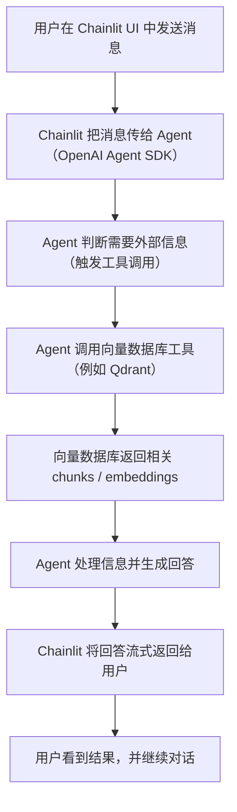
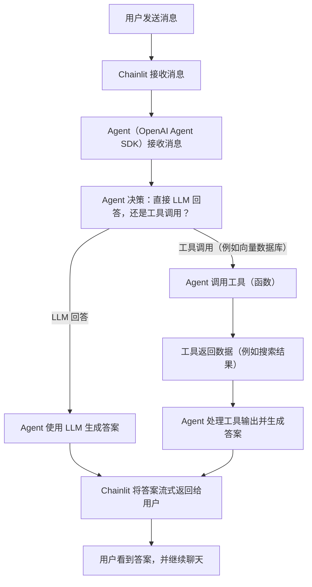
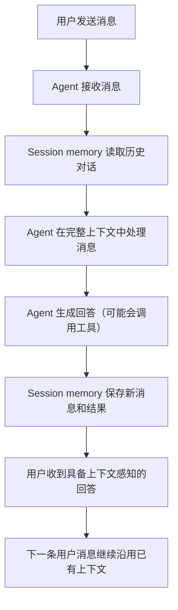

# Agent 示例：Chainlit 与 OpenAI Agent SDK

## Agentic Chatbot 流程（工具 + 向量数据库）

下面展示的是一个 agentic 聊天机器人的高层流程：它会通过工具调用向量数据库（例如 Qdrant），处理返回信息，再把结果回复给用户。



---

## Agent 工作流：决策与工具调用

这个图展示了 Agent（基于 OpenAI Agent SDK）如何处理用户消息，决定是直接用 LLM 回答，还是调用工具（例如向量数据库），最后再把答案返回给用户。



---

## 为什么 Session Memory 对 Agentic Chatbot 很重要

Session memory 对构建真正可对话的 Agent 非常关键，因为它让 Agent 可以记住之前的交互、保持上下文，并在多轮对话中给出连贯且有上下文感知的回答。

有了 session memory，你的 Agent 可以：

- 自动跟踪对话历史（不需要手动管理状态）
- 回顾用户之前提过的问题以及自己给出的回答
- 支持纠错、追问和多步骤工作流
- 支持跨会话的持续对话（例如按用户、按线程保存）

[OpenAI Agents SDK](https://openai.github.io/openai-agents-python/sessions/) 提供了内建 session memory（如 `SQLiteSession`），可以很方便地为 agentic 应用增加这类能力。

### Session Memory 流程图



**为什么重要？**

- 没有 session memory 时，Agent 会把每条消息都当成一个全新的、无状态请求处理，从而丢失所有上下文，几乎不可能实现真正的多轮对话。
- 有了 session memory，Agent 才能回答追问、回顾前面的主题，并提供更自然、更有帮助的用户体验。

---

# 目的

- 演示如何用极少的 Python 代码构建可交互聊天机器人和 Agent 工作流
- 展示 Chainlit UI 与 OpenAI 最新 agentic 能力的集成方式
- 为你自己的 agentic RAG、工具型 Agent 或对话式 AI 项目提供起点

## 包含的示例

- `chainlit_hello.py`
  最小 Chainlit 聊天机器人（echo bot，可直接扩展为 LLM / Agent 逻辑）
- `openai_agent_sdk_example.py`
  官方 OpenAI Agent SDK “Hello World” 示例（参见 [OpenAI Agents SDK Docs](https://openai.github.io/openai-agents-python/)）
- `session_tool_example.py`
  展示 OpenAI Agent SDK 的 session memory 示例，同时使用天气工具和向量数据库工具，演示上下文保持与多工具调用

## 使用方式

1. **安装依赖（使用 UV）：**

   ```bash
   uv add chainlit openai openai-agents
   ```

2. **运行 Chainlit 示例：**

   ```bash
   chainlit run chainlit_hello.py
   ```

3. **运行 OpenAI Agent SDK Hello World 示例：**

   ```bash
   python openai_agent_sdk_example.py
   ```

   - 请确保已经设置好 `OPENAI_API_KEY` 环境变量

4. **运行 session + tool 示例：**

   ```bash
   python session_tool_example.py
   ```

   - 这个示例会展示 Agent 如何记住上下文，并按需调用天气工具和向量数据库工具

## 参考资料

- [Chainlit Official Docs](https://docs.chainlit.io/)
- [OpenAI Agents SDK Docs](https://openai.github.io/openai-agents-python/)

---

> **提示：** 可以把这些示例作为基础，继续扩展出更复杂的 agentic 工作流、工具集成和 RAG 聊天机器人。
