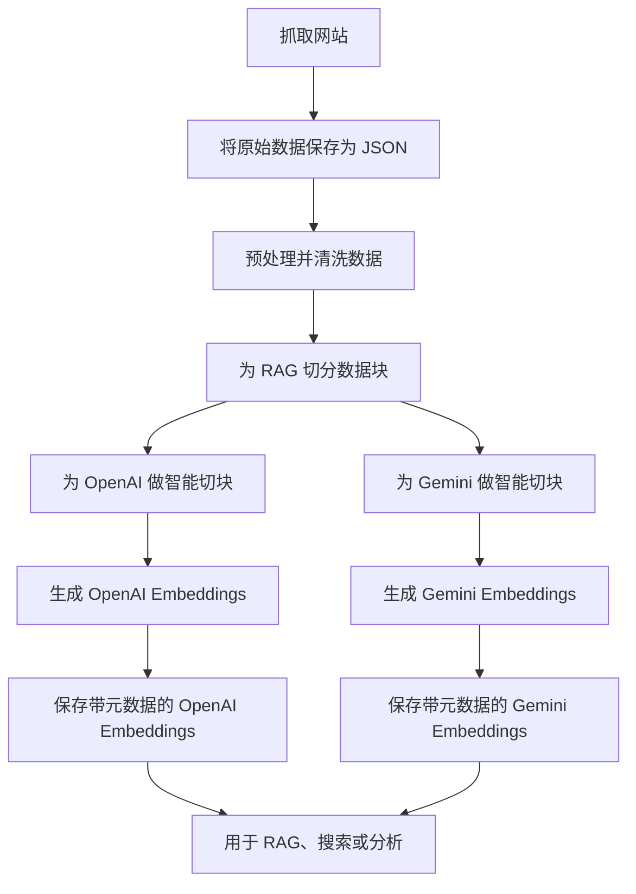

# Embedding 示例

这个目录包含一组代码示例，用来演示如何通过 Google Gemini、OpenAI 等常见 API 生成文本 embedding。

## RAG 数据准备工作流

下面是为 Retrieval-Augmented Generation（RAG）系统准备并生成 embedding 的高层流程：



---

## 什么是 Embedding？

Embedding 是文本的向量表示，它能够保留语义信息，使 AI 系统具备更强的搜索、聚类和检索能力。

## 官方文档

- [Google Gemini Embeddings (Python)](https://ai.google.dev/gemini-api/docs/embeddings#python)
- [OpenAI Embeddings (Python)](https://platform.openai.com/docs/guides/embeddings)

## 示例脚本

- `google_gemini_embeddings.py`：使用 Google Gemini API 生成 embedding
- `openai_embeddings.py`：使用 OpenAI API 生成 embedding
- `generic_rag_preprocessor.py`：**对抓取数据进行预处理和切块，供 RAG 使用**
- `openai_smart_chunker.py`：**使用 tiktoken 为 OpenAI embedding 进行智能切块**
- `gemini_smart_chunker.py`：**为 Gemini embedding 做智能切块（基于 token 估算）**
- `generate_openai_embeddings.py`：**从切块后的 RAG 数据生成 OpenAI embedding**
- `generate_gemini_embeddings.py`：**从切块后的 RAG 数据生成 Gemini embedding**

## 如何使用：抓取、存储、切块并生成 Embedding

1. **运行抓取脚本**
   - 使用如 `deep_crawl_to_json.py` 这样的脚本（见 `../crawl4ai_examples/`）抓取网站，并把结果保存在本地 JSON 文件中。
   - 示例：
     ```bash
     python ../crawl4ai_examples/deep_crawl_to_json.py
     ```

2. **把数据保存为 JSON**
   - 抓取脚本会把每个页面保存成一个 JSON 文件（包含清洗后的内容、元数据等），并在 `data/` 子目录中保存一个汇总文件。

3. **为 RAG 做预处理**
   - 使用 `generic_rag_preprocessor.py` 清洗、标准化并切块抓取结果，使其适合 embedding 与 RAG 工作流。
   - 示例：
     ```bash
     python generic_rag_preprocessor.py
     ```
   - 该脚本会读取 `data/crawlers_json/` 中所有 JSON 文件，对文本进行处理和切块，并输出一个统一的 RAG 输入文件：`data/rag_ready/rag_ready_data.json`
   - 输出中的每条记录都经过清洗，必要时已切块，并附带可追踪元数据。

4. **为 Embedding 做智能切块**
   - 使用智能切块脚本，把 RAG-ready 数据进一步切成更适合具体模型的 chunk：
   - 对 **OpenAI**（使用 tiktoken）：
     ```bash
     python openai_smart_chunker.py
     ```
     - 输入：`data/rag_ready/rag_ready_data.json`
     - 输出：`data/openai_chunked/openai_chunked_data.json`
   - 对 **Gemini**（基于 token 估算）：
     ```bash
     python gemini_smart_chunker.py
     ```
     - 输入：`data/rag_ready/rag_ready_data.json`
     - 输出：`data/gemini_chunked/gemini_chunked_data.json`
   - 这些脚本可以确保每个 chunk 都在模型 token 限制内，从而优化成本和效果。

5. **生成 Embedding**
   - 使用 embedding 生成脚本，从切块后的 RAG 数据中生成向量：
   - 对 **OpenAI**：
     ```bash
     python generate_openai_embeddings.py --input data/openai_chunked/openai_chunked_data.json --output data/embeddings/openai_embeddings_with_metadata.json
     ```
     - 需要环境变量：`OPENAI_API_KEY`
     - 支持：批处理、限速，以及通过环境变量或 CLI 自定义模型和维度
     - 输出：`data/embeddings/openai_embeddings_with_metadata.json`
   - 对 **Gemini**：
     ```bash
     python generate_gemini_embeddings.py --input data/gemini_chunked/gemini_chunked_data.json --output data/embeddings/gemini_embeddings_with_metadata.json
     ```
     - 需要环境变量：`GOOGLE_API_KEY`
     - 支持：批处理、限速，以及通过环境变量或 CLI 自定义模型和维度
     - 输出：`data/embeddings/gemini_embeddings_with_metadata.json`

## 环境变量

- `OPENAI_API_KEY`：OpenAI API Key（OpenAI 脚本必需）
- `GOOGLE_API_KEY`：Gemini API Key（Gemini 脚本必需）
- `BATCH_SIZE`：每批处理文本数量（默认 100）
- `RATE_LIMIT_DELAY`：批次之间的延迟秒数（默认 1）
- `EMBEDDING_MODEL` / `GEMINI_MODEL`：模型名称（见脚本默认值）
- `EMBEDDING_DIMENSIONS`：embedding 维度（默认 1536）

你也可以在项目根目录通过 `.env` 文件设置这些变量。

## 输出结果

- 切块数据和 embedding 会保存在 `data/` 子目录中，并附带完整元数据，供后续 RAG、搜索或分析流程使用。

> **欢迎贡献！** 你可以添加自己的示例或经验，帮助其他人学习 embedding、RAG 预处理、智能切块和 embedding 生成。
