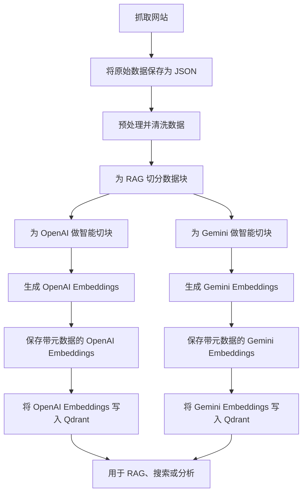

# Qdrant 向量数据库

## RAG + 向量数据库工作流

下面是为 Retrieval-Augmented Generation（RAG）系统准备、生成并存储数据到向量数据库（Qdrant）的高层流程：



---

Qdrant 是一个现代化、开源的向量数据库，专门用于存储、索引和搜索高维向量 embedding。由于它性能好、支持元数据过滤、并且易于和 Python 及主流框架集成，因此在 AI、RAG 和语义搜索场景里非常常见。

## 为什么选择 Qdrant？

- **开源且免费：** 没有厂商锁定，可本地运行，也可部署到云上
- **快且可扩展：** 能高性能处理数百万条向量
- **支持过滤：** 除了向量搜索，还支持按元数据过滤
- **API 丰富：** 提供 REST 和 gRPC API，也有 Python 客户端
- **生态集成好：** 能与 LangChain、LlamaIndex 等 AI 工具顺畅协作

## 如何在 Python 中使用 Qdrant

1. **安装 Qdrant 客户端：**

   ```bash
   uv add qdrant-client
   ```

2. **启动 Qdrant（Docker）：**

   ```bash
   docker run -p 6333:6333 -p 6334:6334 qdrant/qdrant
   ```

3. **基础 Python 示例：**

   ```python
   from qdrant_client import QdrantClient
   from qdrant_client.models import PointStruct, VectorParams, Distance

   client = QdrantClient("localhost", port=6333)

   client.recreate_collection(
       collection_name="my_vectors",
       vectors_config=VectorParams(size=1536, distance=Distance.COSINE)
   )

   vectors = [
       PointStruct(id=1, vector=[0.1]*1536, payload={"text": "Hello world"}),
       PointStruct(id=2, vector=[0.2]*1536, payload={"text": "Goodbye world"}),
   ]
   client.upsert(collection_name="my_vectors", points=vectors)

   search_result = client.search(
       collection_name="my_vectors",
       query_vector=[0.1]*1536,
       limit=2
   )
   for hit in search_result:
       print(hit.payload, hit.score)
   ```

---

## 将 Embedding 插入 Qdrant

### 把 OpenAI Embeddings 写入 Qdrant

- **脚本：** `add_openai_embeddings_to_qdrant.py`
- **输入文件：** `data/embeddings/openai_embeddings_with_metadata.json`
- **使用方式：**

  ```bash
  python add_openai_embeddings_to_qdrant.py
  ```

### 把 Gemini Embeddings 写入 Qdrant

- **脚本：** `add_gemini_embeddings_to_qdrant.py`
- **输入文件：** `data/embeddings/gemini_embeddings_with_metadata.json`
- **使用方式：**

  ```bash
  python add_gemini_embeddings_to_qdrant.py
  ```

两个脚本都会创建新的 collection（如 `openai_vectors` 或 `gemini_vectors`），并写入 embedding、元数据与 payload。

---

## 参考资源

- [Qdrant Docs](https://qdrant.tech/documentation/)
- [Qdrant Python Client](https://qdrant.github.io/qdrant_client/)
- [Qdrant on GitHub](https://github.com/qdrant/qdrant)
- [LangChain Qdrant Integration](https://python.langchain.com/docs/integrations/vectorstores/qdrant)
- [LlamaIndex Qdrant Integration](https://docs.llamaindex.ai/en/stable/examples/vector_stores/qdrant.html)
