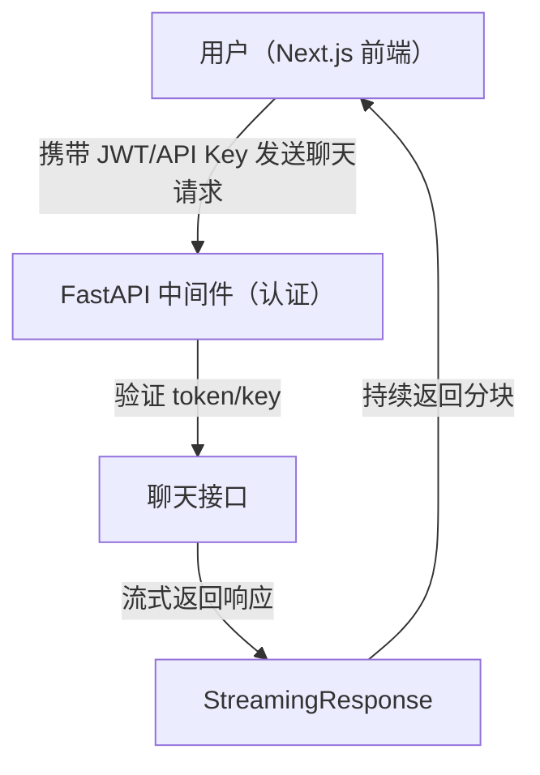

# 中级功能指南：Agentic RAG 聊天机器人

欢迎进入 Agentic RAG Chatbot 项目的中级阶段。在这一阶段，你将构建一个更健壮的聊天机器人后端 API，并把它连接到现代化网页前端。

---

## 环境要求

- Python 3.9+
- [FastAPI](https://fastapi.tiangolo.com/)
- [Uvicorn](https://www.uvicorn.org/)（ASGI 服务器）
- [python-jose](https://python-jose.readthedocs.io/en/latest/)（JWT 认证）
- [passlib](https://passlib.readthedocs.io/en/stable/)（密码哈希，如有需要）
- [httpx](https://www.python-httpx.org/)（异步 HTTP 调用，可选）
- [pydantic](https://docs.pydantic.dev/)（数据校验）
- [python-dotenv](https://pypi.org/project/python-dotenv/)（环境变量）

安装命令：

```bash
uv add fastapi uvicorn python-jose passlib[bcrypt] httpx pydantic python-dotenv
```

---

## 安全：保护所有路由

所有 API 路由都应该通过认证中间件保护。常见方案包括：

- **JWT 认证：** 使用 OAuth2 + JWT 实现安全、无状态认证
- **API Key 中间件：** 要求每次请求都在 header 中携带 API Key

JWT 示例：

```python
from fastapi import Depends, HTTPException, status
from fastapi.security import OAuth2PasswordBearer
from jose import JWTError, jwt

oauth2_scheme = OAuth2PasswordBearer(tokenUrl="/token")

async def get_current_user(token: str = Depends(oauth2_scheme)):
    try:
        payload = jwt.decode(token, SECRET_KEY, algorithms=[ALGORITHM])
        # ... 用户校验逻辑 ...
    except JWTError:
        raise HTTPException(status_code=status.HTTP_401_UNAUTHORIZED, detail="Invalid token")
```

把这个依赖应用到所有需要保护的路由上。

---

## 推荐后端目录结构

```text
intermediate/
├── app/
│   ├── main.py           # FastAPI 入口
│   ├── api/              # 路由定义
│   │   ├── __init__.py
│   │   └── chat.py
│   ├── core/             # 核心逻辑（认证、配置、安全）
│   │   ├── __init__.py
│   │   ├── auth.py
│   │   └── config.py
│   ├── models/           # Pydantic 模型
│   │   ├── __init__.py
│   │   └── chat.py
│   ├── services/         # 业务逻辑（聊天机器人、向量数据库等）
│   │   ├── __init__.py
│   │   └── rag.py
│   └── middleware.py     # 自定义中间件（例如 API Key、CORS）
├── .env                  # 环境变量
├── requirements.txt      # （如需要）
└── README.md
```

---

## 流程图：前端到 FastAPI 后端（带认证与流式输出）



---

## 阶段概览

- **后端：** 使用 FastAPI 提供聊天机器人响应，并处理检索增强查询
- **流式输出：** 让回答可以实时流式返回，提升用户体验
- **API 文档：** 利用 FastAPI 自带文档进行测试和探索
- **前端：** 使用 Next.js 构建可与 FastAPI 后端交互的网页界面

## 学习目标

- 使用 FastAPI 为聊天机器人构建并文档化 REST API
- 实现流式聊天响应
- 使用 FastAPI 自动生成的文档测试和记录 API
- 创建 Next.js 前端并接入你的后端

---

## 第一步：构建 FastAPI 后端

1. **安装 FastAPI 和 Uvicorn：**

   ```bash
   uv add fastapi uvicorn
   ```

2. **创建基础 FastAPI 应用：**

   ```python
   # main.py
   from fastapi import FastAPI

   app = FastAPI()

   @app.get("/")
   async def root():
       return {"message": "Agentic RAG Chatbot API is running!"}
   ```

3. **本地运行 API：**

   ```bash
   uvicorn main:app --reload
   ```

---

## 第二步：实现流式响应

- 使用 FastAPI 的 `StreamingResponse` 实现一边生成一边返回的效果
- 示例：

  ```python
  from fastapi.responses import StreamingResponse

  @app.post("/chat/stream")
  async def chat_stream(request: Request):
      async def event_generator():
          # 用你自己的聊天机器人流式逻辑替换这里
          for chunk in ["Hello, ", "this is ", "a streamed response."]:
              yield chunk
      return StreamingResponse(event_generator(), media_type="text/plain")
  ```

---

## 第三步：API 文档与测试

- FastAPI 会自动生成交互式 API 文档：
  - `/docs`（Swagger UI）
  - `/redoc`
- 访问 `http://localhost:8000/docs` 可以直接测试你的接口

---

## 第四步：创建 Next.js 前端

1. **在同级目录初始化一个 Next.js 应用：**

   ```bash
   npx create-next-app@latest agentic-rag-frontend
   cd agentic-rag-frontend
   ```

2. **安装 Tailwind CSS：**

   ```bash
   npm install -D tailwindcss postcss autoprefixer
   npx tailwindcss init -p
   ```

   按照 [Tailwind 官方 Next.js 指南](https://tailwindcss.com/docs/guides/nextjs) 更新 `tailwind.config.js` 并把 Tailwind 接入你的 CSS。

3. **（可选）接入 UI 组件库**

4. **连接你的 FastAPI 后端**

5. **构建一个简单聊天 UI，并显示后端返回结果**

---

## 下一步

- 当你的后端和前端都能在本地顺利联通后，就可以继续阅读 [高级功能指南](../advanced/README.md)，进入 Docker 化和云部署阶段。
