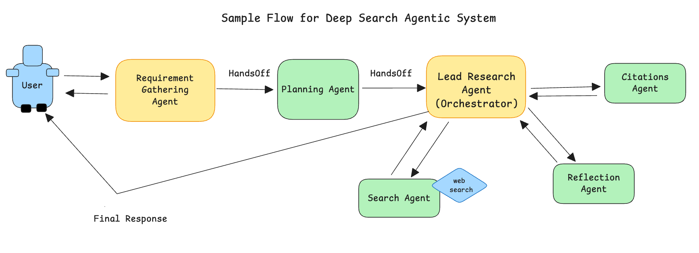

### 作业指南：构建一个 Deep Research Agent 系统

> **目标：** 创建一个智能 Deep Research Agent，像专业研究员一样处理复杂问题。它应当能够拆解复杂主题、搜索多个来源。

### 分步骤构建方法

**阶段 1：基础能力**
- 从你前面 1 到 10 步完成的基础网页搜索 Agent 开始
- 先确保它对简单问题运行稳定
- 测试问题：`What is renewable energy?`

**阶段 2：多 Agent 团队**
- 加入第 11 到 14 步中的多 Agent 能力
- 先只做 2 个 Agent，再逐步增加
- 测试问题：`What are pros and cons of electric cars?`

**阶段 3：智能研究**
- 增加规划 Agent，把问题拆成多个部分
- 增加并行研究能力，同时发起多个搜索
- 测试问题：`Compare electric vs gas cars`

**阶段 4：专业能力**
- 加入来源校验、冲突检测和综合分析
- 加入引用系统
- 用第 3、4 级挑战问题做测试

**成功建议：**
1. **逐步构建**：不要一次性加完所有功能，每加一步都先测试
2. **从简单开始**：先用基础问题，再逐渐提升复杂度
3. **保护你的基础链路**：在增加高级功能时，不要把基础搜索能力搞坏
4. **用真实场景测试**：用文档中提供的问题测试每个阶段
5. **观察研究过程**：你应该能看见每个 Agent 在做什么

**架构关键点：**
这个系统是在模仿专业研究团队的工作方式：先规划研究路径，再由团队成员分工，核查来源，识别冲突，最后把发现综合成一份结构清晰的报告。你的 Agent 应该像一个真正的研究团队那样协作。

---

**记住**：你是在构建一个专业级研究系统。先打好基础，再逐步增加能力，并用越来越复杂的问题测试它。祝你成功构建自己的 Deep Research Agent System！

> 你将结合 **01 → 14 文件夹** 中学到的知识，构建这个受 OpenAI Deep Research、Anthropic Research、Google Deep Research 以及前沿学术研究启发的高级多 Agent 系统。

---

### 快速开始（最小版）

- 环境要求：Python 3.10+ 和 `uv`
- 新建 `.env` 文件，填入你计划使用的 Key：
  - `SEARCH_API_KEY`
  - `TAVILY_API_KEY`（如果用 Tavily，默认推荐）
  - `OPENAI_API_KEY` 或 `ANTHROPIC_API_KEY`（如果用这些 LLM 提供方）
- 默认搜索提供方：推荐 Tavily；DuckDuckGo 可作为回退选项

---

## 受行业领先产品启发的 Deep Research 能力

### ↠ 研究规划：拆解复杂问题

复杂研究问题需要被拆成更小、更可管理的部分。

任务：创建一个 Planning Agent。它应能把类似 “Compare renewable energy policies in 3 countries” 这样的问题，拆成具体的研究任务，例如 “A 国能源政策”“B 国能源政策”等。

---

### ↠ 并行研究：同时搜索多个方向

优秀研究者会同时探索多个角度。

任务：修改系统，让多个研究 Agent 可以同时研究问题的不同部分，而不是按顺序一个接一个执行。

---

### ↠ 来源质量检查：信任，但要验证

并不是所有来源都同样可靠。

任务：增加一个 Source Checker Agent，对来源打分：

- 高：`.edu`、`.gov`、主流新闻
- 中：Wikipedia、行业网站
- 低：博客、论坛

并在信息可疑时向用户发出提醒。

---

### 冲突检测：识别不一致

不同来源有时会互相矛盾。

任务：当 Agent 找到冲突信息时，要明确指出：

> “Source A says X, but Source B says Y”

并让用户知道这里存在分歧。

---

### 研究综合：智能整合全部信息

原始搜索结果需要整理成真正有用的洞察。

任务：创建一个 Synthesis Agent，把所有研究发现整理为清晰的章节、主题、趋势和关键洞察，而不只是简单罗列事实。

---

### 引用管理：专业引用系统

专业研究必须有清晰出处。

任务：增加自动引用跟踪。每个结论都带编号引用 `[1]`、`[2]`、`[3]`，并在报告末尾附上完整来源信息。

---

## 参考研究材料

你当然可以按自己的想法扩展完成这个项目。以下是一些参考资料：

- https://www.anthropic.com/engineering/multi-agent-research-system
- https://blog.langchain.com/open-deep-research/
- https://gemini.google/overview/deep-research/
- https://openai.com/index/introducing-deep-research/
- https://arxiv.org/abs/2506.18959

一个 Deep Search Agentic 系统的示例流程：

---

### 交付物

- `deep_research_system.py`
  你的主控 “Lead Researcher” Agent，负责整体协调
- `research_agents.py`
  专业研究 Agent，例如事实搜集、来源检查等
- `planning_agent.py`
  负责把复杂问题拆成研究任务
- `synthesis_agent.py`
  负责把发现整合成结构化洞察
- `report_writer.py`
  负责生成最终专业研究报告
- `README.md`
  说明：
  - 如何安装和运行系统
  - 示例研究问题
  - 每个 Agent 的职责
  - 团队如何协同
- **演示视频（+15%）**
  展示系统如何研究复杂主题，例如：
  - “Pros and cons of Agentic AI at work in 2025”
  - “Climate change impact on agriculture”

---

### 用这些真实问题测试你的系统

**Level 1: Basic Research**
1. `What are the benefits of electric cars?`

**Level 2: Comparative Analysis**
2. `Compare the environmental impact of electric vs hybrid vs gas cars`

**Level 3: Complex Investigation**
3. `How has artificial intelligence changed healthcare from 2020 to 2024, including both benefits and concerns from medical professionals?`

**Level 4: Expert Challenge**
4. `Analyze the economic impact of remote work policies on small businesses vs large corporations, including productivity data and employee satisfaction trends`

## 如何利用各步骤指导你的进展？

### 1 ↠ 01_uv：项目初始化

为什么重要：
`uv` 可以让你快速安装和运行依赖，而不会污染全局环境。

任务：
- 克隆仓库
- 确认你能成功运行一个 “Hello, Agent” 脚本

---

### 2 ↠ 02_what_is_api：和外部世界通信

为什么重要：
一个网页搜索 Agent，本质上就是被 LLM 包装起来的 **API 客户端**。

任务：
- 选择一个搜索 API（Bing、Google CustomSearch、DuckDuckGo 等）
- 阅读它的文档
- 记录所需 query 参数和认证 header
- 你也可以直接使用 Tavily 进行网页搜索

---

### 3 ↠ 03_get_api_key：安全基础

为什么重要：
绝对不要把 Key 写死在代码里，否则会破坏安全性并触发限流问题。

任务：
- 创建 `.env` 并写入 `SEARCH_API_KEY=...`
- 在工具函数中通过 `os.getenv` 读取

---

### 4 ↠ 04_hello_agent：你的第一个可运行 Agent

为什么重要：
它给你一个最小骨架：模型 + Agent + 运行循环。

任务：
- 复制 `hello_agent.py` 为 `web_search_agent.py`
- 把原来的问候逻辑换成一个“调用了搜索 API”的占位消息，或者改成真正的搜索系统 prompt

---

### 5 ↠ 05_model_configuration：调大脑

为什么重要：
Temperature、max tokens、模型选择会影响回答风格和成本。

任务：
- 设置 `temperature=xxx`，尝试不同值并选择你需要的温度
- 限制 `max_tokens`，让摘要更紧凑

---

### 6 ↠ 06_basic_tools：给 Agent 工具箱

为什么重要：
工具让 LLM 能超越训练数据。

任务：
实现一个 `search_web` 工具，要求：
1. 接受 `{query: str}`
2. 调用你选择的搜索 API
3. 返回前 N 条结果（标题 + URL + 摘要）

---

### 7 ↠ 07_model_settings：细化行为

为什么重要：
你可以固定模型的回答风格，例如总结、引用、推理方式。

任务：
增加一条指令，例如：

> “When responding, give a three-sentence answer with bullet-point links.”

---

### 8 ↠ 08_local_context：个性化层

为什么重要：
**Local context** 可以让 Agent 在多轮交互中记住用户相关信息，并做个性化回答。

任务：
- 在第一轮对话中，把一个 `user_profile` 对象存到 `context` 中（可以模拟，也可以来自 mock DB）
- 在后续轮次中，动态追加这样的指令：
  > “You’re helping {name} from {city} who likes {topic}. Personalise examples accordingly.”

---

### 9 ↠ 09_dynamic_instructions：动态调整

为什么重要：
用户可能会说“搜得更深一点”或“只给我链接”。

任务：
- 检测 “deeper” / “summarise” 等关键词，或从用户请求理解意图
- 根据需要动态修改指令，例如增加结果数量或缩短回答

---

### 10 ↠ 10_streaming：实时体验加分

为什么重要：
流式输出让系统看起来更快，并且能展示进展。

任务：
使用 SDK 的 streaming 支持，让结果能一边生成一边显示。

---

### 11 ↠ 11_agent_clone：研究团队创建

为什么重要：
复杂研究任务需要多个专家协作。

任务：
建立一个研究团队：
- 一个负责查找事实
- 一个负责检查来源
- 一个负责写摘要

---

### 12 ↠ 12_basic_tracing：跟踪研究进度

为什么重要：
你需要知道每个研究 Agent 找到了什么。

任务：
增加简单日志系统，让你能观察每个 Agent 的发现和整个研究过程。

---

### 13 ↠ 13_agents_as_tool：研究协调员

为什么重要：
需要一个“首席研究员”统筹整个团队。

任务：
创建一个 Lead Researcher Agent，把复杂问题拆成小任务，并把任务分给专业 Agent。

---

### 14 ↠ 14_basic_handoffs：信息共享

为什么重要：
研究 Agent 之间必须共享发现。

任务：
设置 handoff，让各 Agent 能把结果传给 “Report Writer” Agent，由它汇总成最终研究报告。

---

### 评分标准（150 分）

**基础技能（60 分）——来自文件夹 1-10**
- 环境配置与 API 安全：10
- 基础搜索功能：15
- 模型配置与 prompt 设计：10
- Local context 与个性化：15
- Streaming 与动态指令：10

**多 Agent 协调（50 分）——来自文件夹 11-14**
- 成功创建并运行多个 Agent：15
- Agent tracing 与监控：10
- Lead coordinator 协调能力：15
- Agent 之间的 handoff 是否正确：10

**Deep Research 能力（40 分）——行业启发能力**
- 研究规划：10
- 并行研究：10
- 来源质量评估：10
- 冲突检测与综合：10

**加分项（最多 +30）**
- 专业引用系统：+10
- 高级冲突处理：+10
- 创造性的研究策略：+5
- 出色的错误处理：+5

---

### 提示

1. **模拟用户数据**：如果你没有真实用户数据库，可以先写一个 `user_profile = {"name":"Ali","city":"Lahore","topic":"AI"}`，并在首次运行时存入上下文。
2. **限流（可选）**：很多搜索 API 都有限流。可以把结果缓存到 local context，避免重复调用。
3. **测试（可选）**：给工具函数写一些单元测试，确保它能优雅处理空结果和 API 错误。

---

**挑战自己，享受构建过程，并记住——个性化回答总是比通用回答更有价值。祝你构建自己的 Web Search Agent 顺利！**
