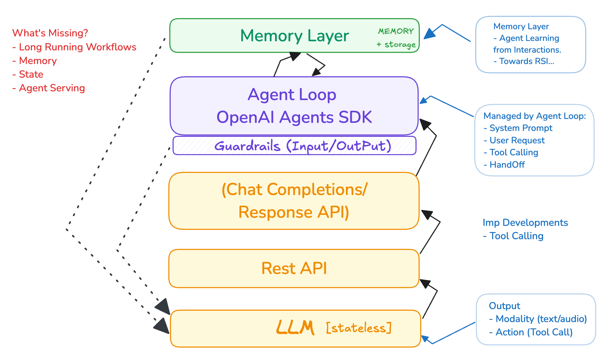
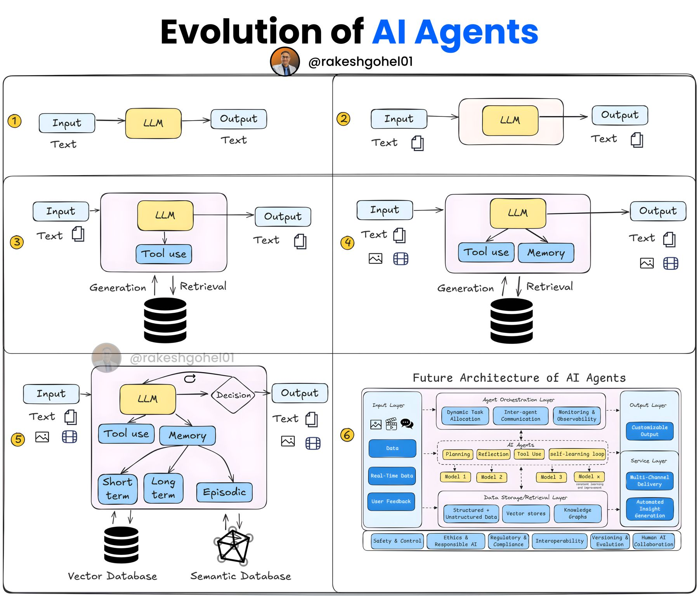

# 从 LLM 到有状态的长期运行多 Agent 系统

## 从 LLM 到多 Agent 系统

2025 年被认为是 Agentic AI 之年。企业会在这一年开始开发和部署 AI Agents，用来自动化他们的工作流。你可以把这看作 SaaS（Software as a Service，软件即服务）的演进或下一代形态。AI agents 确实可以被视为 SaaS 的延伸：与其仅仅向人类提供软件工具，不如由软件本身（通过 agents）自主承担任务。不过，这种表述也可能过于简化 agentic AI 的复杂性，因为它远远超出了 SaaS 的范畴，加入了推理、适应性和自主性。现在的问题是，这些 AI Agents 会具备哪些特性和能力？

### AI Agents 的定义：

> “AI agents 是在迭代循环中运行的大语言模型（LLMs），它们利用工具和环境反馈（例如工具调用结果）来自主规划并执行朝向某个目标的行动，并且通常会结合人类检查点来确保一致性与监督。”

参考：

https://www.linkedin.com/posts/rakeshgohel01_how-did-the-agentic-ai-era-evolve-in-the-activity-7310276654218493953-8G4v

### 定义拆解

* **LLMs：** 驱动 agent 的核心智能是大语言模型。
* **迭代循环：** agents 通过持续的规划、行动和观察循环来运作（例如 “think-act-observe” 过程）。
* **工具：** 它们利用外部函数或 API 与世界交互（例如搜索、抓取数据、发送消息）。
* **环境反馈：** 来自工具或外部输入的结果会指导 agent 的下一步。
* **自主规划与执行：** agents 会动态决定自己的动作，而不是遵循固定脚本，并根据目标进行调整。
* **人类检查点（通常存在）：** 经常会有人类介入做验证或关键决策，在自主性和可控性之间取得平衡。

这个定义强调，AI Agents 本质上是处于动态循环中的 LLM，它们借助工具和反馈自主行动，并在需要时由人类介入。它更少强调固定步骤（例如工作流），而更强调可适应、以目标为导向的行为。

## LLM APIs

LLM API 通过提供便捷、可扩展的先进语言能力访问方式，改变了游戏规则，使 agent 开发更快、更便宜，也更容易上手。LLM APIs（例如 OpenAI API、Anthropic API、Google Gemini API）让开发者可以程序化地访问强大的语言模型。

这些 API 允许 agents：

* 推理并生成文本（例如回答问题、制定计划）。
* 调用工具（例如通过 OpenAI 或 Anthropic Claude 的 function calling）。
* 处理自然语言输入并生成结构化输出。

**为什么这很重要：** 在 LLM API 出现之前，要构建一个具备自然语言理解和生成能力的 agent，必须训练自定义模型，这是一项资源密集型任务，通常只有资金充足的组织才能承担。API 让这项能力普及化，使开发者无需自己训练模型，就能把最先进的 LLM 集成到 agents 中。

**示例：** 一个 agent 使用 OpenAI API 解释“Book a flight”，并调用 `book_flight` 工具，全部通过一次简单的 HTTP 请求完成。

最初，不同的 LLM 有不同的 API；不过最近行业似乎已经标准化到 **OpenAI Chat Completion API**，而且几乎所有主要 LLM 提供商都开始支持它。截至 2025 年，行业已经在很大程度上围绕 OpenAI Chat Completion API 形成了标准。大多数主要 LLM 提供商要么原生支持它，要么提供兼容层，这背后受到开发者需求、生态效应以及该 API 实用设计的推动。虽然早期 API 形式多样，但向这一标准的转变速度很快、范围很广，使它成为跨供应商构建 AI agents 的首选接口。

最近，OpenAI 推出了 **Responses API**，这是对 Chat Completion API 更先进、更灵活的演进版本，并有望在 agentic AI 系统的发展中发挥重要作用。

### 作为 Chat Completion API 超集的 Responses API

**介绍：** OpenAI 在 2025 年 3 月发布了 Responses API，作为面向开发者的新工具，旨在增强 AI agent 能力。它建立在 Chat Completion API 的基础之上，继承其核心功能，同时增加了更先进的特性。

**超集特性：**

* 它将 Chat Completion API 的简单性（例如处理对话输入与输出）与此前仅在 Assistants API 中出现的额外能力结合起来，例如内建工具支持和状态管理。
* 关键新增功能包括对 web search、file search 以及 computer use（通过 Computer-Using Agent，简称 CUA）的原生支持，这使 agents 能在单次 API 调用中直接与外部系统交互。
* 与主要负责生成文本响应的 Chat Completion API 不同，Responses API 支持多工具交互和更复杂的工作流，因此在功能上可以看作一个“超集”。

### Responses API 在 agentic AI 系统中的角色

**Agentic AI 的定义：** Agentic AI 指的是能自主行动、通过任务进行推理，并与世界交互以达成目标的系统——它超越了被动生成回复，转向主动执行。

**为什么这很重要：** Responses API 正是为构建这类系统而设计的，具体体现在：

* **支持工具使用：** agents 可以抓取实时数据（例如 web search）、处理内部文档（例如 file search），或者自动化任务（例如通过 CUA），这些都是自主行为的关键。
* **简化开发：** 它简化了 agentic 工作流的编排，减少了以往使用 Chat Completion API 时需要的自定义集成。
* **面向未来：** OpenAI 计划在 2026 年年中逐步弃用 Assistants API，并将其特性整合到 Responses API 中，这表明这是其面向 agentic 应用的前瞻性基础。

**开发者工具：** 除了 API 之外，OpenAI 还发布了开源的 Agents SDK，它通过为多 agent 系统提供编排能力，与 Responses API 形成互补，进一步支持 agentic AI 开发。

**性能：** 该 API 利用 GPT-4o search 等模型（在 SimpleQA 上准确率达 90%）并支持动态交互，因此非常适合需要推理和行动的 agents。

作为 Chat Completion API 的超集，Responses API 引入了先进能力，预计将推动下一波 agentic AI 系统的发展。这是向“AI 不只是会说、还会做”迈出的重要一步，也与行业推动更具功能性和真实世界应用的方向保持一致。

**Responses API 有望成为 agentic AI 系统的事实标准**，就像 Chat Completion API 曾经成为对话式 AI 的事实标准一样。虽然现在下定论还为时过早，但从趋势来看，大多数主要 LLM 提供商很可能会实现或支持它的兼容版本，用于 agentic AI。

虽然这不是百分之百确定的（技术世界里，在事情发生前都不能算数），但 Responses API 已具备成为 agentic AI 事实标准的条件：OpenAI 的过往记录、开发者对 agentic 能力的需求，以及生态系统的推动力，都与 Chat Completion API 走向对话式 AI 事实标准时很相似。预计在未来 12 到 18 个月内，大多数 LLM 提供商都会采用或适配它，尤其是在 2025 年及以后 agentic 系统成为主角的时候。

让 AI Agents 成为可能的不仅是 LLM API，还有它的 tool calling 或 function calling 能力。这是所有功能建立的基础。简单来说，LLM 会被提供一组函数及其函数签名的细节，如果在思考提示词并回复时需要额外信息，它们就可以调用这些函数。显然，LLM 位于另一台服务器上，因此无法直接调用这些函数；但它们可以发送一条响应，指示客户端应用代表它们调用该函数，并传入 LLM 提供的参数。客户端应用使用指定参数调用该函数，当收到函数返回值后，会把结果再传回 LLM，然后由 LLM 把工具调用结果整合进最终回复返回给客户端应用。如果存在多个工具，模型可以在单次响应中返回多个工具调用。这个过程就叫做 Agent loop。

让多个 agents 成为可能的第二个 LLM 功能，是你可以分别指定 **system prompt** 和 **user prompt**：

* **System Prompt：** 设置 LLM 的行为、语气或规则（例如 “做一名快乐的厨师”）。由开发者控制，作用于全局。
* **User Prompt：** 用户的具体请求或问题（例如 “晚餐吃什么？”）。驱动即时回复。

**简而言之：** system 决定 LLM 如何回应；user 决定它回应什么。

**LLMs 是无状态的**，因此要注意 system prompt 和 user prompts 都必须在每次请求中发送给 LLM。user prompt 还必须包含上下文，包括之前的请求和回复列表，这样 LLM 才能正确响应。这被称为 agent/llm 的短期记忆，短期记忆通常会作为上下文嵌入到提示词中。还要注意，上下文/user prompt 的大小是有限制的。

### 短期记忆

**它是什么：** agent 在单次对话或会话中使用的临时上下文。通常是最近的交互历史（例如当前聊天）。

**如何包含：** 通常作为提示词的一部分传入（例如在 user 或 assistant 消息中），包含在 LLM 的上下文窗口中。这样模型可以立即访问刚刚说过或做过的内容。

**示例：** 在聊天中，最近几条消息（“今天天气怎么样？” → “天气晴朗。”）会被包含进提示词，以保持连贯性。

**正确部分：** 是的，。

### 长期记忆

**它是什么：** 存储在当前会话之外的持久信息，例如事实、用户偏好或过往交互，agent 在需要时可以回忆起来。

**如何可用：** 存储在外部数据库中（例如向量库、键值存储），并通过检索机制（例如 embeddings 搜索）取回。也可以通过工具显式访问，例如 agent 显式调用函数去获取它（如 `retrieve_user_history()`）。有时如果相关，也会预先加载进提示词中，但由于上下文长度限制，这种方式较少见。

**示例：** “用户 X 喜欢辣味食物”这类过去聊天中的信息，存储在数据库中，在规划食谱时被检索出来。

**注意：** 长期记忆不一定总是工具调用——它更常见的是集成在 agent 工作流中的检索系统，不过工具调用也可以是访问它的一种方式。

### 关键区别

* **短期记忆：** 即时的、提示词内的上下文（例如最近消息），受 LLM 上下文窗口限制。
* **长期记忆：** 持久的、外部存储（例如数据库），按需访问，不受会话限制。

### Agentic RAG 中的长期记忆

**什么是 Agentic RAG？：** 它是 RAG 的一种演进形式，在这种模式下，agent 不只是被动检索和生成，而是会主动推理、规划，并使用工具抓取或处理信息。这里的长期记忆指的是存储在即时对话之外的持久知识（例如文档、历史交互）。

**长期记忆如何工作：**

* 通常存储在向量数据库或类似的外部存储中（例如文档或用户历史的 embeddings）。
* agent 会检索这些记忆来增强回复，通常作为其推理过程的一部分。

**它一定是工具调用吗？**

不一定。在 agentic RAG 中，长期记忆检索可以是：

* **隐式：** 集成在 agent 的 pipeline 中，检索自动发生（例如在 LLM 处理提示词之前先运行检索器），而不需要 LLM 显式调用工具。
* **显式（工具调用）：** LLM 决定调用一个工具（例如 `search_memory` 或 `retrieve_context`）来获取长期记忆，把检索当作推理循环中的一个动作。

在现代 agentic RAG 系统中，当 agent 对何时以及检索什么内容拥有控制权时，把检索当作工具调用是很常见的，这与 agent 动态选择行动的能力相一致。

不过，有些实现会预先获取相关长期记忆并将其注入提示词，而不要求 LLM 调用工具，尤其是在更简单的 RAG 方案中。

随着更 agentic 的设计出现，长期记忆检索越来越多地被视作一种工具，或者是 agent 可以执行的显式动作。这让 LLM 拥有更大的控制权，使它可以决定是否以及何时访问记忆，而不是总是预先加载。

**示例：** agent 可能会调用 `retrieve_past_interactions` 作为工具，只在相关时获取长期记忆，而不是一直把它注入上下文。

总的来说，在现代 agentic RAG 中，长期记忆通常被实现为工具调用，以赋予 agent 灵活性（例如，“我应该查看过去的数据吗？”）。但这并不总是工具调用——有些系统仍然会隐式检索记忆并注入上下文。以前在 LangChain 中，检索更常见的是一个内建步骤，而不是显式工具调用，不过随着 agentic 设计的兴起，工具调用变得越来越普遍。

**[模型上下文协议（MCP）](https://modelcontextprotocol.io/introduction)** 标准化了工具调用。

## 多 Agent 系统

正如我们指出的，System prompt 是多 agent AI 系统中定义单个 agent 角色的关键构件，但其基础还包括框架、协调机制和工具，这些共同让整个系统运作起来。

### System Prompt 在多 Agent AI 系统中的作用

**它们做什么：** 在多 agent 系统中，system prompt 通常定义某个单独 agent 的角色、行为或规则。例如，“你是一个负责寻找数据的研究员 agent”或者“你是一个负责分配任务的协调员 agent”。

**作用范围：** 系统中的每个 agent 都可以拥有自己的 system prompt，为其特定功能定制人格、语气或目标。

**影响：** System prompt 会指导每个 agent 如何解释用户输入以及如何与其他 agents 互动，确保其在指定角色内保持一致性。

System prompt 是多 agent AI 系统中定义单个 agent 角色的关键构件，但其基础还包括框架、协调机制和工具，这些共同让整个系统运作起来。

多 agent AI 系统的另一个构件是 **AI agents 之间的消息传递**。单个 agent 本质上就是客户端与 LLM 之间的一次封装交互。agent-to-agent 的通信同样通过工具调用完成，这被称为 **handoff**。请注意，把工具调用作为“handoff”在 agentic 设计中很常见，但也存在其他非工具方式可以让它们“直接消息传递”彼此，而不遵循这个范式。这可能包括：记忆、队列、事件等——即系统在不让 LLM 显式调用工具的情况下促进通信。

工具调用功能不仅为 AI agents 提供了连接外部世界并获取信息的机制，也让它们能够通过这些工具调用采取行动。它体现了工具调用的双重角色：既是输入机制（获取数据），也是输出机制（执行动作）。

### 模型上下文协议（MCP）：Agentic AI 的标准

工具调用是一项强大的功能，它让 AI agents 不再只是聊天机器人，而成为主动与世界交互的实体！为了以标准化方式完成工具调用，Model Context Protocol（MCP）被提出，并正在行业内获得采用。MCP 的目标是让工具调用更具可扩展性和互操作性。与其让开发者为每个工具或数据源都构建专用连接器，不如由 MCP 提供一个单一协议，任何符合标准的 AI 系统都可以使用，从而降低复杂度和维护开销。它的目标是用一个统一接口取代碎片化的自定义集成，就像有些人说的那样，类似于 AI 的“USB-C”。这使 agents 能以一致的方式与 Google Drive、Slack、GitHub 或自定义数据库等系统交互。

MCP 使用客户端-服务器架构，其中：

* **MCP Servers** 暴露工具或数据（例如一个 `get_weather` 工具或文件系统）。
* **MCP Clients**（AI 应用或 Agents）连接到这些服务器，发现可用工具，并通过标准化调用（基于 JSON-RPC）来调用它们。然后 LLM 可以根据任务决定何时以及如何使用这些工具。

MCP 允许 agent 在某个 MCP server 上调用 `list_tools`，从而接收可用工具列表（例如 `get_file`、`send_email`）以及它们的 schema（参数、描述）。这让 agent 可以在运行时决定使用哪些工具，而不需要事先硬编码知道这些工具。这种动态发现能力是 MCP 与普通 API 的关键区别。它也正是 MCP “AI-native”的原因——它就是为让 LLM 探索并利用工具而设计的，而不是预先假定固定工具集。

另一项极大增强 Agentic 工作流的 LLM 功能，是 LLM 输出 **结构化输出** 的能力，从而让 Agents 可以解析输出并采取适当行动。

LLM 越来越依赖网站信息，但面临一个关键限制：上下文窗口太小，无法完整处理大多数网站。把包含导航、广告和 JavaScript 的复杂 HTML 页面转换为适合 LLM 的纯文本，既困难又不够精确。虽然网站既服务于人类读者也服务于 LLM，但后者更适合更简洁、专家级、集中在一个可访问位置的信息。我们需要一个标准，而 **`/llms.txt`** 正是正在兴起的标准，是将面向 LLM 的网站内容标准化的领先方案。行业向 agentic AI 和实时数据访问的转变，只会进一步增强它的重要性。

像 Anthropic 的 Model Context Protocol（MCP）这样的替代方案更关注工具调用，而不是内容总结，因此它们是互补而非竞争关系。一些人提议使用更丰富的格式（例如 JSON），但 Markdown 的简洁性目前让 `/llms.txt` 占据了优势。

## 多 Agent 系统的设计模式

Anthropic 在题为 “Building Effective Agents” 的论文中记录了 agentic AI 系统的常见设计模式。这篇论文基于与跨行业数十个团队合作构建基于大语言模型（LLM）的 agents 所积累的经验。下面快速梳理一下：

### Anthropic 记录了什么

**Agentic Systems 的定义：** Anthropic 区分了 “workflows”（预定义、已编排的系统）和 “agents”（动态驱动的系统，LLM 控制其流程和工具使用）。这为理解设计模式奠定了基础。

**常见设计模式：** 论文列出了五种广泛适用于 agentic AI 的关键工作流模式：

* **Prompt Chaining：** 顺序调用 LLM，每一步处理前一步输出（例如先起草，再翻译文本）。
* **Routing：** LLM 对输入进行分类，并将其导向专门的任务或模型（例如把简单查询发送到轻量模型）。
* **Parallelization：** 多个 LLM 调用同时运行，可以用于投票（多样化输出）或分段处理（子任务）（例如并行审查代码）。
* **Orchestrator-Workers：** 一个中心 LLM 将任务分配给多个 worker LLM，并汇总结果（例如协调多来源研究）。
* **Evaluator-Optimizer：** 一个 LLM 生成输出，另一个评估它，循环迭代直到满意为止（例如通过反馈循环优化代码）。

**Agent 专属模式：** 除了工作流之外，agents 还被描述为在循环中运行、借助工具和环境反馈（例如工具调用结果）自主规划和行动的 LLM，并且通常带有人类检查点。

这些设计模式可以在本地使用 Python 编排，用于短期多 agent 工作流；也可以在云端运行，用于需要可扩展性和可靠性的长期、有状态工作流。它们足够灵活，可以在本地用 Python 实现短期、临时性的多 agent 工作流，也可以在云端实现长期、有状态、需要稳健性和扩展性的工作流。这与不同场景的运营需求完美契合！

这些模式是模块化且实现无关的，意味着它们可以应用于不同环境：

### 短期多 Agent 工作流：

**使用 Python 或其他语言在本地编排：** 正确。短期工作流——即不需要在单次会话之外保持持久性的临时任务——可以用 Python（或其他语言）在本地编排。例如：

**示例：** 一个使用 OpenAI Agents SDK 或自定义代码的 Python 脚本，在内存中运行一个 prompt chaining 工作流（例如起草 → 编辑 → 总结）或一个 agent loop（例如研究 → 写作）。

**可行性：** 本地执行之所以可行，是因为这些任务较轻量，不需要扩展性，并且可以依赖内存状态或本地文件。

**工具：** 像 OpenAI 的 Python SDK 这样的库，可以用最少的配置在本地实现这些模式。

### 长期运行的有状态工作流：

**在云端编排：** 长期运行的、有状态的工作流——那些需要跨会话持久化、可扩展性或可靠性的工作流——通常需要云基础设施。例如：

**示例：** 一个跟踪多周项目的 agent（例如 orchestrator-workers 模式）需要把状态（例如任务进度）保存到云数据库中，借助无服务器函数或容器跨用户扩展，并通过云冗余保证可用性。

**为什么用云：** 云平台（例如 Cloud Native Kubernetes）提供持久存储（例如 CockroachDB 和 Postgres）、分布式计算（例如 Serverless Containers）以及容错能力——这些对有状态、长期运行的操作至关重要。

**工具：** Kubernetes、Serverless Containers、Kafka 等云端方案都可以管理这些工作流。

## 从本地多 Agent 系统到有状态长期运行多 Agent 系统

短期多 agent 工作流可以在本地环境中用 Python 或其他语言管理，而长期、有状态的 agentic 工作流则更依赖云基础设施来获得稳健性和可扩展性。两者的区别取决于持久性、并发性和运维需求——当这些需求增长时，云就变得至关重要。

### 短期多 Agent 工作流

**使用 Python 或其他语言进行编排：**

短期多 agent 工作流——那些运行时间短、且不需要在单次会话之外保持状态的工作流——确实可以使用 Python 编排。这些工作流通常涉及 agents 在内存中或通过本地资源交互，例如一个脚本协调多个 agents 解决某个任务（比如规划旅行）。

**如何实现：** Python 库甚至自定义代码都可以管理 agent 通信（例如通过函数调用、共享变量或本地消息传递），而不依赖外部服务。例如，一个脚本可能启动一个规划 agent、一个研究 agent 和一个写作 agent，全部运行在同一个进程里。

**局限性：** 这种方法很适合临时性、小规模任务，但在并发、持久性或分布式执行方面会受限。

### 长期有状态的 Agentic 工作流

**需要云基础设施：**

长期、有状态的 agentic 工作流——那些需要跨会话维护状态、在时间维度上处理复杂交互、或者扩展到很多用户/任务的工作流——通常需要云基础设施来获得可扩展性和可靠性。

**为什么用云：**

* **状态持久化：** 云数据库（例如 PostgreSQL）或内存存储（例如 Redis）可以保存 agent 状态、对话历史或任务进度；这在一个本地 Python 脚本里持续几天或几周并不现实。
* **可扩展性：** 云平台（例如 Kubernetes）提供分布式计算资源来处理多个 agents、并发用户或高负载任务——这超出了单机所能承担的范围。
* **可靠性：** 云服务提供容错能力（例如自动扩缩容、负载均衡、定时任务）和可用性保障，确保 agents 能够持续运行于长期任务中（例如一个 24/7 运行的客户支持 agent）。

## 主题：Agentic AI 框架设计分析：分层式 vs 统一式方法

### 引言：

我正在分析 agentic AI 框架的当前格局。我提出，agentic 系统可以沿着两个关键维度进行分类：

#### 执行风格：

**工作流：** 通过预定义、通常由代码编排的路径来协调 LLM 和工具的系统。

**Agents：** LLM 动态规划、指导自己的执行路径，并选择工具使用方式来完成任务的系统。

#### 运行时长维度：

**短期：** 通常在单次会话或较短时间内完成的任务。状态管理和持久化通常不是关键问题。

**长期：** 跨越较长时间段（小时、天、月）的任务，需要稳健的状态管理、持久化、错误处理，以及可能的异步执行。

### 框架示例与分析：

**OpenAI Agents SDK：** 它似乎主要面向 Agent / Short-Term 象限。其设计强调开发者在单次会话中创建 agentic 行为的易用性，并将状态持久化等复杂性抽象掉（会在会话期间隐式处理）。这使它成为适用于特定场景的轻量且易用的框架。

### 分层架构

我假设，更优的 agentic 框架设计范式应该是分层架构：

**第 1 层（核心 Agentic 执行）：** 一个轻量基础层，专注于核心 agentic 循环（LLM 规划、工具使用），面向短期任务。该层将优先考虑简洁性和易用性，类似 OpenAI Agents SDK 的最初定位。

**第 2 层（持久性与编排）：** 建立在第 1 层之上，这一层将引入长期运行所必需的能力。这包括稳健的状态管理、持久化、错误处理、重试、监控，以及可能的异步任务编排。像 FastAPI、Docker Containers、Serverless Containers、Kafka、Kubernetes 和 Kubernetes CronJobs 这样的技术，为这一层要解决的这类问题（持久执行）提供了工具。

---

### 我们构建 Agentic AI 的指导原则

在设计 agentic AI 时，我们关注简洁性、赋能和多功能性，目标是创建既强大又易于接近的系统。我们的理念是为用户和开发者提供工具，让他们能够自由探索宇宙，尽量减少阻碍，并最大化自主性。以下是我们如何将这一愿景落地：

1. **用最少的抽象简化系统**  
   - 我们直接开放 agents 的核心能力，即它们的推理、工具和输出，而不是把它们埋在复杂层级之下。通过剥离不必要的复杂性，我们为用户和开发者提供一个清晰、开放的接口，让他们能够接触到 AI 的全部潜力。  
   - **为什么重要：** 透明性和可定制性让用户可以按自己的需求调整 AI，无论他们是在解开宇宙之谜，还是在做细致分析，都不会受限于僵化的框架。

2. **提供必要构件，而不是僵硬蓝图**  
   - 我们只提供解锁 agent 能力所必需的基础元素，避免强制模板或过度约束的工作流。我们的系统是一个灵活的起点，而不是固定路径，邀请用户设计符合自己愿景的方案。  
   - **为什么重要：** 最小化结构可以减少杂乱，让用户自由构建从快速查询到复杂多 agent 系统的一切内容，并且与他们的目标完全对齐。

3. **倡导适应性与透明性**  
   - 我们的 agents 被设计成敏捷、直观的工具，而不是僵硬的一体化套件。我们去掉多余负担，让系统保持轻量，便于理解、排查和增强。  
   - **为什么重要：** 一个轻量、可适应的核心能推动快速实验和创新，让用户能够突破边界——无论是集成 web search 这样的工具，还是攻克科学突破。

4. **通过简洁释放力量**  
   - 我们信任用户——无论是开发者还是好奇的探索者——并把 agents 的原始能力交到他们手中。你可以把它想象成一把宇宙级瑞士军刀：直接、强大、可被创造性使用。  
   - **为什么重要：** 简洁会放大影响力。用户可以快速迭代、适应不同场景，并专注于自己的目标，而不是和过于复杂的系统纠缠。

在本质上，我们的方法体现的是“少即是多”的理念——在提供 AI 原始力量的同时，避开不必要的约束或过度照顾。它提供的是一个多功能、务实、可被用户掌握并按其意愿塑造的工具箱。

---
