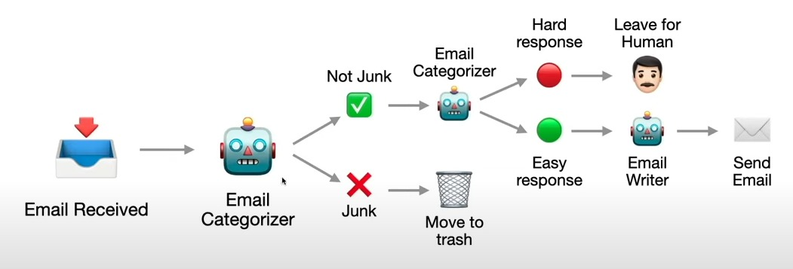

# 邮件管理 Agent 架构

我们来设计一个 **Email Agent**，采用 **事件驱动架构（EDA）**、**三层微服务架构**、**无状态计算**、**定时计算（CronJobs）** 和 **human-in-the-loop（HITL）** 的组合架构。下面我会先说明需求，再详细讲实现方式。

---

### 邮件 Agent 的需求

#### 功能需求
1. **邮件监控与过滤**：
   - 持续检查用户收件箱中的新邮件。
   - 根据预定义规则过滤邮件，例如优先级、发件人、关键词；也可以用 AI 进行分类，例如垃圾邮件、紧急、普通。
   - 将过滤后的邮件以及建议回复通知用户。

2. **建议回复**：
   - 分析邮件内容并生成上下文合适的回复建议，例如使用 NLP 或预定义模板。
   - 通过通知或界面把建议呈现给用户审批。

3. **回复审批与发送**：
   - 允许用户批准、编辑或拒绝建议回复。
   - 代表用户发送已批准的回复邮件。

4. **新邮件撰写**：
   - 允许用户通过 agent 撰写新邮件。
   - 检查邮件准确性，例如语法、语气、清晰度，并在需要时建议修改。
   - 在发送前把修正版本展示给用户审批。

#### 非功能需求
1. **可扩展性**：能够高效处理多个用户或高邮件量。
2. **实时性**：快速处理新邮件并及时通知用户。
3. **可靠性**：确保不会漏掉邮件，且回复能准确发送。
4. **易用性**：为审批和邮件撰写提供直观界面。
5. **学习能力**：根据用户反馈持续改进建议质量。

#### 用户故事
- 作为用户，我希望在收到新邮件时得到带建议回复的通知，这样我可以快速响应。
- 作为用户，我希望在回复发送前能够批准或编辑建议回复，以确保准确。
- 作为用户，我希望撰写新邮件后系统能检查错误，并在发送前让我确认。

---

### 使用所定义架构的实现

#### 架构概览
- **三层架构**：展示层（用户交互 UI）、业务逻辑层（agent 处理）、数据层（邮件存储和状态）。
- **EDA**：事件驱动邮件检查、过滤、通知和审批流程。
- **无状态计算**：可扩展的邮件处理和 HITL 任务。
- **CronJobs**：周期性轮询邮件（如果没有实时 API）。
- **HITL**：用户对回复和修正进行审批。

---

#### 组件与工作流

##### 1. 三层架构
- **展示层**：
  - 用户通过 Web 或移动应用：
    - 查看过滤后的邮件和建议回复。
    - 批准 / 编辑 / 拒绝回复。
    - 撰写新邮件并查看修正建议。
  - 对新邮件进行通知，例如推送提醒、邮件摘要。
- **业务逻辑层**：
  - **邮件监控 Agent**：检查新邮件、过滤邮件并生成建议。
  - **回复生成器**：使用 NLP（例如 GPT 类模型）建议回复。
  - **邮件撰写 Agent**：分析新邮件准确性并提出修改。
  - **HITL 协调器**：管理人工审批流程。
- **数据层**：
  - 存储：
    - 邮件元数据，例如发件人、主题、时间戳。
    - 过滤类别和建议回复。
    - 用户反馈和已批准邮件。
    - 待处理 HITL 任务状态，例如等待审批。
  - 工具：数据库（例如 PostgreSQL）、缓存（例如 Redis）用于快速访问。

##### 2. 事件驱动架构
- **事件类型**：
  - `NewEmailReceived`：收到新邮件时触发。
  - `EmailFiltered`：邮件已分类并生成建议回复。
  - `HumanReviewRequired`：需要用户审批时发送，例如回复或修正。
  - `HumanResponseReceived`：用户批准 / 编辑 / 拒绝建议。
  - `EmailSent`：回复或新邮件已发送。
- **事件总线**：使用消息 broker，例如 RabbitMQ 或 Kafka，在组件之间路由事件。
- **工作流**：
  1. `NewEmailReceived` → 邮件监控 Agent 过滤 → `EmailFiltered`
  2. `EmailFiltered` → 回复生成器建议回复 → `HumanReviewRequired`
  3. `HumanResponseReceived` → 发送邮件 → `EmailSent`

##### 3. 无状态计算
- **邮件处理器**：无状态服务，例如 AWS Lambda，负责：
  - 轮询或响应 `NewEmailReceived`，过滤邮件并发出 `EmailFiltered`。
  - 随邮件量自动扩展。
- **回复生成器**：根据邮件内容生成建议的无状态函数。
- **HITL 处理器**：向用户展示任务并处理用户反馈的无状态服务。
- **邮件发送器**：通过 SMTP API，例如 SendGrid，发送已批准邮件的无状态函数。

##### 4. 定时计算（CronJobs）
- **邮件轮询器**：如果没有实时邮件 API，例如带 push 的 IMAP，那么就用 CronJob 每分钟检查一次收件箱并发出 `NewEmailReceived`。
- **反馈聚合器**：每天运行的 CronJob 收集用户反馈（批准 / 拒绝建议），用于重新训练建议模型。

##### 5. Human-in-the-Loop（HITL）
- **收件邮件回复**：
  - 在 `EmailFiltered` 后，回复生成器创建建议。
  - HITL 处理器发出 `HumanReviewRequired`，把邮件和建议推送到 UI。
  - 用户通过 UI 批准 / 编辑，HITL 处理器发出 `HumanResponseReceived`。
- **新邮件撰写**：
  - 用户在 UI 中撰写邮件 → 邮件撰写 Agent 检查 → 提出修正 → `HumanReviewRequired`
  - 用户批准 → `HumanResponseReceived` → 邮件发送

---

#### 详细实现

##### 第 1 步：邮件监控与过滤
- **技术**：使用邮件 API，例如 Gmail API，或使用 IMAP + 无状态轮询器。
- **流程**：
  - CronJob 或实时监听器检测新邮件 → `NewEmailReceived {emailId, content}`
  - 邮件处理器（无状态）基于规则 / ML 过滤，例如如果来自老板则标记为 urgent → 存储到数据层 → `EmailFiltered {emailId, category, suggestion}`

##### 第 2 步：建议回复
- **技术**：NLP 模型，例如微调后的 GPT，运行在无状态函数中。
- **流程**：
  - 消费 `EmailFiltered` → 分析内容 → 生成建议 → 更新数据层 → `HumanReviewRequired {emailId, suggestion}`

##### 第 3 步：HITL 审批回复
- **技术**：Web 应用（Next.js/FastAPI）+ HITL 处理器（Lambda）。
- **流程**：
  - HITL 处理器把 `HumanReviewRequired` 推送到 UI / 通知，例如“回复老板：‘Yes, I’ll handle it’ - Approve/Reject”
  - 用户响应 → HITL 处理器发出 `HumanResponseReceived {emailId, approvedText}`
  - 邮件发送器（无状态）发送邮件 → `EmailSent`

##### 第 4 步：新邮件创建与纠错
- **技术**：UI 表单 + 邮件撰写 Agent（无状态）。
- **流程**：
  - 用户在 UI 提交邮件 → 撰写器检查语法 / 语气（例如 Grammarly API、定制 ML）→ 提出修改 → `HumanReviewRequired {draftId, correctedText}`
  - 用户批准 → `HumanResponseReceived` → 邮件发送器发送

##### 第 5 步：数据管理
- **Schema**：
  - `Emails`：{id, sender, content, category, suggestion, status}
  - `HITL_Tasks`：{taskId, emailId/draftId, suggestion, status: pending/approved}
- **存储**：PostgreSQL 负责持久化，Redis 负责存放待处理 HITL 任务。

##### 第 6 步：学习闭环
- CronJob 聚合 `HumanResponseReceived` 数据 → 每周重新训练 NLP 模型 → 更新建议准确性。

---

#### 示例工作流
1. **收到邮件**：
   - 邮件内容：“3 点开会？” 来自老板。
   - `NewEmailReceived` → 被分类为 “urgent” → 建议：“Yes, I’ll be there.”
   - `HumanReviewRequired` → 用户通过 UI 批准 → `HumanResponseReceived` → 邮件发送。
2. **新邮件**：
   - 用户写：“I cant make it.”
   - 撰写器修正为：“I can’t make it.” → `HumanReviewRequired` → 用户批准 → 发送。

---

### 优势
- **实时性**：EDA 保证邮件处理和通知很快。
- **可扩展**：无状态服务可以处理多个用户和多封邮件。
- **用户控制**：HITL 让人类始终掌握最终决定。
- **结构清晰**：三层架构将 UI、逻辑和数据清楚分开。

### 挑战
- **API 限制**：邮件轮询可能触发速率限制，能用 webhook 就尽量用。
- **建议质量**：需要强大的 NLP 模型和用户反馈闭环。

这个 Email Agent 很好地利用了该架构，在自动化和人工监督之间取得平衡。

