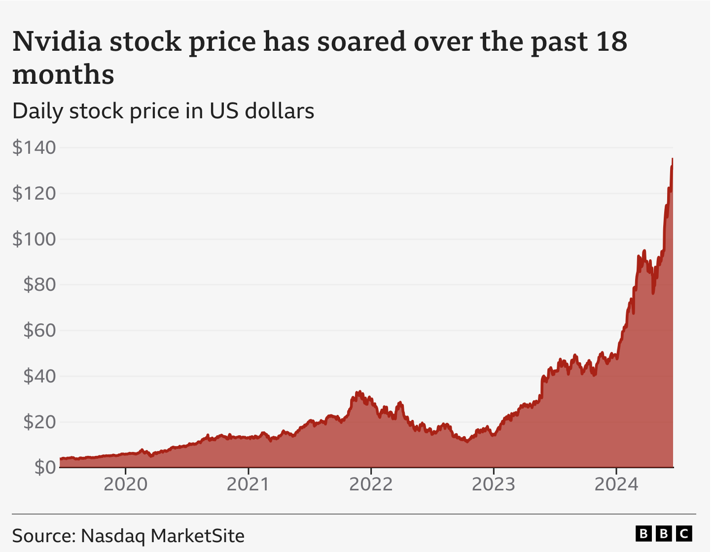
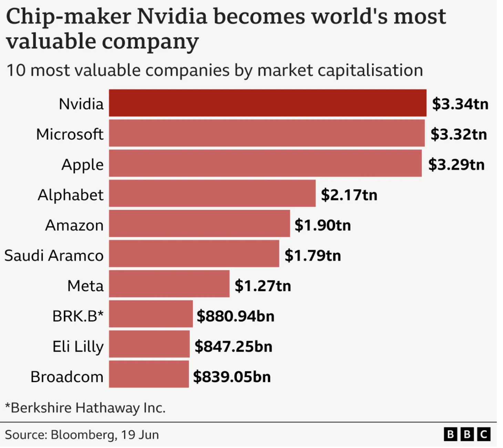

# 序章

## 100 万亿美元的机会

**[观看：英伟达 CEO 黄仁勋谈 100 万亿美元 AI 工业革命](https://www.youtube.com/watch?v=e5Zol4RYq2o)**

**[从 AlexNet 到 AI 工厂：英伟达对 100 万亿美元生成式 AI 经济的愿景](https://www.linkedin.com/pulse/from-alexnet-ai-factories-nvidias-vision-100-trillion-schwentker-bgt7c/)**

**芯片制造商英伟达在 2024 年 6 月 19 日股价创下历史新高后，成为全球最有价值的公司。当时其市值达到 3.34 万亿美元（2.63 万亿英镑），较年初几乎翻倍。**

[AI 热潮让英伟达成为全球最有价值公司](https://www.bbc.com/news/articles/cyrr40x0z2mo)

英伟达正在引领一场由生成式 AI 驱动的新工业革命，这是一种根本不同的计算方式。这场革命以大语言模型和基础模型为中心，它们能够跨越文本、图像、视频等不同模态理解并生成内容。它标志着从“简单检索预存数据”转向“使用 AI 即时生成定制化内容”的转变。

英伟达 CEO 黄仁勋表示，公司计划每年推出其旗舰 AI 芯片的新版本，因为这家全球最有价值的芯片制造商希望在“新工业革命”中释放高达 100 万亿美元的机会。

## Agentic AI 开发者：下一代智能系统创新者的关键技能与特质

**摘要：**
随着人工智能（AI）领域不断演进，一种新的 AI 开发者画像正在出现：`agentic` AI 开发者。他们不仅构建智能系统，还赋予系统自主性、适应性，以及以人为中心的价值取向。这类开发者必须兼具技术能力、跨学科知识、伦理意识、创造性问题解决能力和前瞻性视野。本文阐述定义 agentic AI 开发者所需的核心技能与特质，说明算法能力、领域专长、人际能力、伦理与治理、以及对人类福祉的坚定承诺之间的相互作用。最终，agentic AI 开发者将成为确保智能 agent 成为人类有价值协作者的关键，而不是成为不透明、不可控的实体。

### 引言

人工智能已不再局限于理论讨论或有限的实验室试验。今天，智能 agent 正在影响金融、医疗、教育、物流、娱乐以及无数其他领域中的决策。这种快速采用催生了对一种新型 AI 专业人才的需求，即 `agentic` AI 开发者。他们超越传统软件工程边界，构建具有行动能力、自主性，以及对其运行环境有整体理解的系统。

agentic AI 开发者不只是熟练的程序员或 agentic AI 专家。他们还必须善于理解用户需求、应对复杂的伦理环境、预判非预期后果，并与不同利益相关者协作。随着 AI 从被动工具转向主动、自我驱动的问题解决者，这些开发者必须设计出可信、可适应、并与人类价值一致的系统。

本项目探讨了 agentic AI 开发者必须具备的技术、伦理、人际和前瞻性能力的独特组合，强调整体技能结构对于确保 AI 革命服务于更大利益的重要性。

## 定义 Agentic AI 开发者

在 AI 语境中，“agency” 指系统自主决策、从经验中学习、并与环境动态交互的能力。与主要专注于构建静态软件解决方案的传统开发者不同，agentic AI 开发者设计的是可以观察、推理和行动、且无需持续人工监督的自适应系统。因此，这些专业人员将深厚的技术知识与对现实复杂性、人机协作和社会影响的理解结合起来。

### 核心技术能力

agentic AI 开发者的基本要求是扎实的技术实力。这不仅仅是编码能力，还包括对计算框架、算法和数据结构的深入理解。

### 数据工程与管道管理：

稳健的 AI 系统依赖高质量、精心整理的数据。agentic AI 开发者应熟练掌握数据预处理、特征工程和管道自动化。理解分布式计算框架、数据库系统和数据治理，可以确保智能 agent 接收到准确且符合伦理来源的信息。

### 可扩展且安全的系统设计：

agentic 系统必须能够扩展到数百万用户或设备，因此开发者需要熟悉云架构、容器化、DevOps 最佳实践和网络安全措施。若缺少这些能力，即使是最复杂的 AI 模型，也可能变得脆弱、低效或无法使用。

### 跨学科知识与领域专长

agentic AI 开发者不能孤立工作；他们必须理解系统运行所处的更大背景。这需要一种 T 型能力结构：在 AI 方法上具备深度专长，同时对相关学科有广泛理解，例如：

### 人机交互（HCI）：

开发者需要考虑可用性、可访问性和可解释性。这包括理解界面设计、认知负荷，以及人类如何与智能系统交互的复杂性。agentic AI 开发者必须创建能够表达自身推理、向用户寻求澄清，并优雅处理用户反馈的系统。

### 领域知识：

要构建在特定行业中表现出色的 agent，无论是医疗、金融、农业还是制造业，开发者都必须投入时间学习该领域的数据、工作流、法规和独特挑战。这种领域熟悉度使他们能够定制真正具备上下文感知能力、并能提供实际价值的 AI 解决方案。

### 认知科学与心理学：

与人类协同工作的智能 agent 必须能够建模人类决策过程、理解意图，并适应用户情绪状态。熟悉认知心理学、行为经济学和社会科学，有助于开发者构建更具同理心、且更能适应上下文的系统。

### 伦理、法律与社会层面考量

向 agentic AI 的转型将责任从单纯功能扩展到更广泛的层面。这些开发者必须成为伦理 AI 开发的守护者，考虑偏见、公平性、责任性和透明性等问题。

### 公平性与偏差缓解：

agentic AI 开发者需要敏锐意识到偏差如何渗入数据和模型，并常常延续不平等。他们应纳入公平性指标、偏差检测工具和数据增强技术，以减少有害刻板印象并确保结果的公平。

### 隐私与安全：

在一个日益数据驱动的决策世界中，隐私必须始终被优先考虑。这包括采用差分隐私、联邦学习、加密以及其他尊重用户数据、同时又能支持模型训练与改进的技术。

### 可解释性与可理解性：

随着 AI 驱动的决策更直接地影响人们生活，利益相关者、监管者、客户和终端用户都要求给出解释。agentic AI 开发者必须创建具有可解释结果的模型，使用显著性图等工具，或利用符号推理层。这有助于建立信任，并在出错时促进问责。

### 法规合规与标准遵循：

AI 监管正在全球范围内演进。开发者必须紧跟欧盟 AI 法案或行业特定指南等标准。他们需要构建与不断演变的伦理框架、法律约束和社会规范保持一致的系统。

### 创造性问题解决与持续学习

AI 开发本质上具有探索性。agentic AI 开发者必须适应开放式挑战、快速原型设计和迭代优化。他们能够在不确定性中工作，并且不惧试验：

### 好奇心与适应性：

随着新的算法和架构不断出现，开发者必须保持成长型思维。持续学习，无论是通过学术研究、实践实验还是专业培训，都能确保他们始终站在前沿。

### 系统思维：

agentic 开发者不只关注孤立组件，而是推理整个系统。他们会考虑反馈回路、涌现行为以及非预期副作用。这种整体视角往往能揭示隐藏的机会与风险。

### 设计思维、敏捷与精益创业方法论：

**agentic AI 开发者**应整合 **设计思维**、**敏捷** 和 **精益创业** 方法论，以创建以用户为中心、具备适应性且具有影响力的 AI agent：

1. **设计思维**：专注于同理用户以理解其需求、清晰定义问题、提出创新解决方案、为 AI agent 制作原型并进行迭代测试。这能确保 AI agent 直观易用，并有效解决现实问题。

2. **敏捷方法**：以迭代周期（sprint）开发 AI agent，根据用户反馈持续交付增量改进。这种适应性使系统能够快速调整变化的需求或新洞察，确保 agent 保持相关性和可用性。

3. **精益创业**：强调为 AI agent 构建最小可行产品（MVP），用真实用户验证假设，并根据数据驱动的学习结果进行调整。这可最大限度减少浪费，并加快构建有影响力、可扩展的 AI 解决方案。

通过结合这些方法，agentic AI 开发者能够确保 AI agent 不仅技术上稳健，也能与用户需求、业务目标和动态市场需求保持一致。

### 人际与沟通技能

agentic AI 开发者很少单独工作。他们必须是高效的协作者和沟通者，连接技术复杂性与利益相关者理解之间的鸿沟：

1. 跨职能协作：

在构建自主 agent 时，开发者需要与产品经理、UX 设计师、数据科学家、伦理学者、领域专家和监管者协作。他们必须将复杂的技术概念转化为通俗语言，并对组织各方反馈保持开放态度。

2. 指导与领导：

agentic AI 开发者通常会指导初级团队成员，并推动战略性的 AI 计划。强大的领导能力，包括同理心、耐心和远见，有助于营造创新蓬勃发展的协作环境。

3. 说服性沟通：

解释技术原理、倡导安全且合乎伦理的 AI 实践、并争取决策者支持，都是至关重要的。沟通是确保 agentic AI 系统获得所需资源和支持的关键。

### 前瞻性思维与责任

最后，agentic AI 开发者必须预见未来。他们应理解全球趋势，预判 AI 发展的方向，并据此塑造自己的解决方案：

1. 长期影响意识：

设计 agentic 系统需要远见。考虑设计长期后果的开发者，例如环境影响、文化变化和劳动市场变动，能为可持续 AI 生态做出贡献。

2. 道德责任与托付：

agentic 开发者认识到其创造物所承载的道德重量。与其只追求技术成就，他们更会问：“这项技术是否让世界变得更好？”他们的目标是提升人类，而不仅仅是自动化任务。

### 结论

agentic AI 开发者是一类多面向的专业人士，他们超越了编码者的边界，成为自主且具上下文感知能力系统的塑造者。凭借深厚的技术能力、人文关怀基础、跨学科广度和协作能力，这些开发者有能力塑造智能机器的未来。他们将决定我们日益 AI 化的世界，究竟会在透明、伦理、前瞻性创新中繁荣，还是会陷入不透明、错位和有害系统之中。

通过将技术精通与伦理严谨、情商、设计思维以及服务人类利益的承诺结合起来，agentic AI 开发者确保智能 agent 始终是人类能力的有价值、和谐延伸。如此一来，AI 才能超越单纯自动化，成为人类持续探索与进步旅程中的真正伙伴。

## 材料1概要

[观看：英伟达 CEO 黄仁勋谈 100 万亿美元 AI 工业革命](https://www.youtube.com/watch?v=e5Zol4RYq2o)

这段视频的核心不是讲某个单独产品，而是阐明黄仁勋对 AI 时代的总体判断：AI 正在引发一场新的工业革命，而算力、芯片、数据中心和模型生成能力，将像电力和工厂一样成为新的基础设施。

### 核心观点

- AI 已经从“软件功能”变成“产业基础设施”。
- 未来的关键生产单位不是单纯的数据，而是 `tokens`，也就是 AI 生成和处理的基本价值载体。
- 数据中心不应只被看作成本中心，而应被看作 `AI factories`，即把数据和电力转化成高价值 token 的生产工厂。
- GPU 和加速计算是这场变革的底层引擎，因为它们支撑大模型训练、推理和大规模部署。
- 这场变革不是局限在互联网行业，而是会横向渗透到制造、医疗、交通、机器人、媒体和企业软件等所有行业。

### 为什么是“100 万亿美元”

视频表达的重点不是一个精确财务预测，而是一个规模判断：AI 可以影响的行业总量极其庞大，足以重塑全球经济结构。黄仁勋的逻辑是，AI 会让计算、内容生成、决策和自动化的成本结构发生根本变化，因此会释放一个超大规模的产业机会。

### 对 Agentic AI 的意义

这段视频和 `agentic AI` 的关系很直接。Agentic AI 不是简单地“生成回答”，而是要把模型变成能执行任务、调用工具、管理流程、参与业务的系统。要做到这一点，就必须有强大的 GPU、加速计算、云基础设施和可扩展的 AI 工厂作为支撑。

### 对新手的理解方式

如果你刚入门，可以把这段视频理解为一次“产业视角”的总动员。它传达的信息是：AI 开发不只是写提示词，而是在参与一场新的工业化浪潮。懂模型只是起点，真正重要的是理解算力、基础设施、部署形态和行业应用是如何共同构成 AI 时代的生产体系。

## 材料2概要

[从 AlexNet 到 AI 工厂：英伟达对 100 万亿美元生成式 AI 经济的愿景](https://www.linkedin.com/pulse/from-alexnet-ai-factories-nvidias-vision-100-trillion-schwentker-bgt7c/)

这篇文章把英伟达的发展路线总结成一条清晰主线：从早期推动深度学习突破的 AlexNet，到训练大模型所需的 GPU 集群，再到今天面向生成式 AI 的 `AI factories`。它想表达的是，AI 不只是一个应用方向，而是一种新的工业体系。

### 文章主线

- AlexNet 证明了 GPU 在深度学习中的价值。
- DGX 等专用 AI 计算平台把训练能力从实验室推进到工业级基础设施。
- Transformer 和大语言模型把 AI 从“识别”推进到“生成”。
- ChatGPT 让生成式 AI 大规模进入公众视野，也证明了 AI 计算需求会快速爆发。
- Blackwell 等新一代 GPU 让训练和推理继续向更高效率、更高吞吐量演进。

### 核心观点

- 生成式 AI 的核心不是单个模型，而是整条算力和基础设施链条。
- 未来的价值不只来自软件本身，还来自支撑模型运行的芯片、网络、数据中心和工具平台。
- AI 工厂的概念说明：数据、算力、电力和模型推理会被组织成一种新的生产体系。
- 英伟达的战略不是卖芯片这么简单，而是提供从硬件到软件、从训练到部署的完整 AI 平台。

### 为什么这篇文章重要

这篇文章的重要性在于，它把英伟达为什么能成为 AI 时代的基础设施公司讲清楚了。它不是把 AI 看作某个单点产品，而是看作会重塑全行业的生产能力。对于 Agentic AI 来说，这意味着智能体系统的背后需要有可持续、可扩展、可工业化的计算底座。

### 对新手的启发

如果你是新手，这篇文章最值得记住的一点是：AI 时代的竞争，不只是模型能力之争，也是基础设施之争。想真正做 agent，不仅要懂模型和提示词，还要理解 GPU、数据中心、云平台和部署链路，因为这些决定了 agent 能不能从演示走向真实应用。
