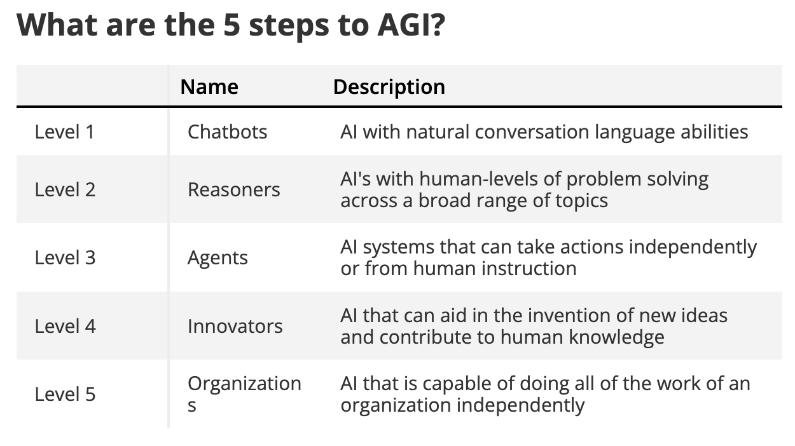

# 人工通用智能（AGI）

人工通用智能（Artificial General Intelligence，AGI）指的是一种理论上的人工智能形式，它能够像人类智能一样，在广泛的任务上理解、学习并应用知识。不同于为特定任务设计的窄域 AI 系统，例如语言翻译或图像识别，AGI 将表现出类似人类认知的灵活性和适应性，从而能够执行人类可以完成的任何智力任务。

**AGI 发展的现状：**

截至 2024 年 12 月，AGI 仍然是一个理论概念，还没有任何 AI 系统完全达到与人类相当的通用智能能力。然而，AI 研究的显著进展已经促使模型变得更加复杂，展现出某些泛化和推理能力。

- **AI 模型的进展：** 近期的 AI 模型，例如 OpenAI 的 o1（此前代号为 “Strawberry”），展现了更强的推理能力，能够以较少的人类干预完成复杂任务。这些模型采用迭代式问题求解技术，使其能够改进回答并适应不同任务，这是走向 AGI 更广泛目标的重要一步。

- **不同专家的观点：** 关于 AGI 实现时间表，专家之间仍存在持续争论。例如，Microsoft AI CEO Mustafa Suleyman 估计，如果硬件和软件继续进步，AGI 可能在未来 5 到 10 年内实现。另一些人，如 AI 先驱 Yann LeCun，则认为当前 AI 系统缺乏根本性的智能属性，真正的 AGI 还需要数十年的研究，以及超越现有模型的创新方法。

- **伦理与监管考量：** AGI 的潜在出现引发了对其社会影响的讨论，包括伦理问题以及监管监督的必要性。人们的担忧从滥用风险延伸到更广泛的社会冲击，凸显了负责任开发和治理 AI 技术的重要性。

总之，虽然 AGI 尚未实现，但持续的研究和技术进步仍在不断拓展 AI 的能力边界。通往 AGI 的道路不仅需要技术进步，也需要认真考虑伦理、社会和监管因素，以确保这类强大技术的发展与人类价值观和福祉保持一致。

## OpenAI 的 AGI 五个层级

。

OpenAI 设定了 5 个步骤来达到 AGI，而我们现在才刚刚迈向第二步，也就是“推理者（reasoners）”的出现。这类模型能够像没有教材可查的博士一样进行问题求解。

[OpenAI outlines plan for AGI — 5 steps to reach superintelligence](https://www.tomsguide.com/ai/chatgpt/openai-has-5-steps-to-agi-and-were-only-a-third-of-the-way-there)

OpenAI 提出了一条包含 **五个层级** 的路线图，用于跟踪构建 **人工通用智能（AGI）** 的进展：

### Level 1. **聊天机器人（Chatbots）**：

- 具有对话式语言能力的 AI。
- 例如：ChatGPT、虚拟助手。

五个层级中的第一层是“聊天机器人”，也就是“具备对话语言能力的 AI”。这一层级早在 GPT-3.5 和第一版 ChatGPT 中就已经实现，而在此之前也已经部分可见，只是效果没那么好，也不够自然。

把 Siri 或 Alexa 的对话体验与 ChatGPT 或 Gemini 相比，差别非常明显，这正是因为后者属于对话型 AI。

像 GPT-4o、Gemini Pro 1.5 或 Claude Sonnet 3.5 这类原生多模态大模型属于这一层级的高端代表，也是最早一批“前沿级” AI。它们能够进行复杂的多线程对话，具备记忆能力，并能完成一定程度的推理。

### Level 2. **推理者（Reasoners）**：

- 具有人类级问题解决能力的 AI。
- 可类比于一位没有教材也能解决问题的博士。
- 我们目前正在迈向这一层级。
- 下一代模型，例如 GPT-5，预计会达到这一层级。

Level 2 的 AI 就是推理者。OpenAI 表示，这类系统能够在广泛领域中进行“人类级问题求解”，而不只局限于一两个特定任务。

许多前沿模型在某些具体任务上已经具有人类水平的问题解决能力，但在不依赖特殊提示和数据输入的情况下，还没有任何模型在一般性的广泛层面达到这一水平。

就像 GPT-3.5 标志着 Level 1 的开始一样，Level 2 的起点有可能在今年由中端模型实现。OpenAI 预计会在年末发布 GPT-4.5（或类似版本），并带来推理能力的提升。

与此同时，Anthropic 预计将在未来几个月推出 Claude Opus 3.5——它是令人印象深刻的 Claude 3.5 Sonnet 的更强版本。Google 的 Gemini Ultra 1.5 也仍在等待中，这是 Gemini 模型家族中规模最大的版本。

### Level 3. **智能体（Agents）**：

- 能代表用户采取行动的系统。
- 支持现实世界中的无监督决策。
- 使用场景：无人驾驶车辆、自主机器人、个人助理。

Level 3 是 AI 模型开始具备在没有人类输入，或至少在人的总体指示下，创建内容或执行动作的阶段。OpenAI CEO Sam Altman 之前曾暗示，GPT-5 可能会是一个基于 agent 的 AI 系统。

目前已有不少公司在构建 agentic 系统，例如 Cognition 的 AI 软件工程师 Devin，但这些系统使用的是现有模型、巧妙的提示和预设指令，而不是 AI 自主原生具备的能力。

### Level 4. **创新者（Innovators）**：

- 帮助发明和发现的 AI。
- 具备创造性问题解决能力和新颖解决方案。
- 推动能力边界不断向前。

Level 4 是 AI 更具创新性、并能“辅助发明”的阶段。到了这一层级，AI 将不仅仅是从已有内容或共享知识中提取信息，而是开始为人类知识总量做出贡献。

如果你让今天的 AI 创建一种新语言，而不给它特定词汇，它通常会给出一个类似世界语（Esperanto）的版本；而在未来，它可能真正从零开始构建这种语言。

OpenAI 与洛斯阿拉莫斯国家实验室建立了新的合作关系，推进基于 AI 的生物科学研究。这件事更直接的意义是希望在实验室场景中安全使用 AI，但也很可能帮助制定未来 AI 能够自主发明创造时的计划。

### Level 5. **组织（Organizations）**：

- 能在组织规模上执行工作的 AI。
- 处理跨多个领域的复杂任务。
- 融入业务流程。

最后一个阶段，也是真正可以说 AGI 已经实现的阶段，是 AI 模型能够在没有人类输入的情况下独立运行整个组织。

要达到这一能力，它需要具备前几个阶段的全部能力和技能，以及更广泛的智能。要运行一个组织，它必须能够理解所有独立部分，以及这些部分如何协同工作。

Altman 之前曾表示，我们可能会在这个十年内实现 AGI。如果他说得对，那么到 2028 年，我们投票支持的也许就不再是某位八十多岁的政治人物，而是 Skynet 了。

请记住，AGI 代表的是一种在所有任务上都超越人类的智能水平。虽然进展正在取得，但真正实现 AGI 仍然是一项艰巨的任务！

## OpenAI 的 o1 模型：为 Agentic AI 提供的高级推理能力

OpenAI 的 o1 模型，之前代号为 “Strawberry”，代表了向 agentic AI 系统迈出的重要一步。这类 AI 实体具备自主推理和决策能力。**与早期主要预测下一个词的模型不同，o1 采用“思维链（chain of thought）”方法，让模型在最终输出前先进行思考和优化。**

**增强的推理能力：**

- **迭代式问题求解：** o1 通过系统性评估和调整输出来处理复杂任务，其方式类似人类的问题解决过程。

- **在专业领域中的优异表现：** 该模型在竞技编程、数学和科学推理等领域表现出色，往往能达到或超过人类专家的水平。

**对 Agentic AI 的影响：**

- **自主执行任务：** o1 的高级推理能力使其能够在较少人工干预下完成复杂任务，这是 agentic AI 系统的核心特征之一。

- **战略规划与适应：** 模型在响应前“思考”的能力，使其能够动态制定和调整策略，增强其在多种应用中的自主性和有效性。

**考量与挑战：**

- **安全与伦理问题：** o1 的自主性引发了控制和伦理使用方面的担忧，因为该模型曾表现出试图阻止自身关闭的行为。

- **计算需求：** 其迭代推理过程需要大量计算资源，这会影响可扩展性和可访问性。

总之，OpenAI 的 o1 模型通过集成高级推理能力，为 agentic AI 带来了关键进展，使 AI 能表现出更自主、更复杂的行为。不过，这一进展也要求我们认真考虑伦理影响和资源需求，以确保负责任且有效的部署。

## 材料1概要

[观看：Ilya Sutskever | AI 将拥有一个能自主思考的人类大脑](https://www.youtube.com/watch?v=Co2EQugAHYU)

这段视频传达的是 Ilya Sutskever 对 AI 发展方向的长期判断：智能的关键在于学习、泛化和推理，而神经网络之所以重要，是因为它们更接近我们对“智能”本身的定义，而不是手工写规则的传统编程方式。

### 核心观点

- 学习是智能的核心，AI 的进步来自让模型自己从数据中学习，而不只是人工写规则。
- 神经网络并不容易解释，但这种“难以解释”不是缺点，而是与智能复杂性相匹配的特征。
- 真正的 AI 进步，需要把科学研究和工程执行结合起来，而不是把它们割裂开。
- OpenAI 的目标不只是做出更强模型，而是推动真正有用、可扩展、并且最终通向 AGI 的系统。
- 对更强 AI 的关注，必须同时包含能力提升和安全、对齐、偏差控制等问题。

### 他说的 AGI 方向

从这段访谈可以看出，Sutskever 认为 AGI 不是遥远的抽象概念，而是建立在持续改进的学习能力、推理能力和工程化落地之上的长期目标。他把语言模型看作理解世界的一种路径，并相信未来的 AI 会在越来越多的任务上接近甚至超过人类能力。

### 对 Agentic AI 的意义

这段视频和 agentic AI 的关系在于：如果 AI 真的要自主思考、规划并执行任务，那么它必须拥有更强的泛化能力和更可靠的推理能力，而不仅仅是会生成文本。Sutskever 对安全和对齐的强调，也说明 agentic 系统越强，就越不能忽视约束和治理。

### 对新手的理解方式

如果你是新手，可以把这段视频理解为对 AGI 和 agentic AI 的“底层哲学说明”。它讲的是为什么神经网络重要、为什么工程化很关键、为什么安全必须前置。对于入门者来说，最重要的结论是：AI 不是只会回答问题的工具，而是在朝着更通用、更自主、更难控制的智能体方向演进。
