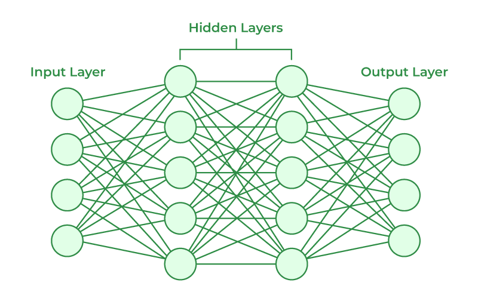
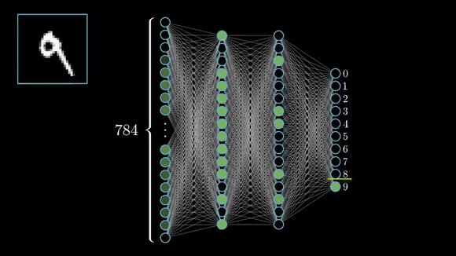

# 使用神经网络构建 GAN、Diffuser 和 Transformer 模型

## 神经网络：AI 的基础构件

**神经网络（Neural networks）** 是一种受人脑结构和功能启发的机器学习模型。它由一组相互连接的节点组成，这些节点称为神经元（neurons），它们共同协作来处理数据并从数据中学习。

### 神经网络如何工作

1. **输入层（Input Layer）：** 这是数据进入网络的地方。输入层中的每个神经元都表示数据中的一个特征。
2. **隐藏层（Hidden Layers）：** 这些层会处理输入数据并提取相关特征。它们可以包含多层，每一层学习不同的模式和关系。
3. **输出层（Output Layer）：** 这一层生成网络的最终输出，输出可能是分类结果、预测值或生成结果。



#### **示例：手写数字识别（MNIST 数据集）**

在传统机器学习中，使用神经网络的经典示例之一就是 MNIST 数据集，其任务是对手写数字（0-9）进行分类。

**涉及的步骤：**

1. **输入层：** 每张数字图像（28x28 像素）会被展平成一个包含 784 个特征的向量（每个像素对应一个特征）。
2. **隐藏层：** 例如一个拥有 128 个神经元的单隐藏层，会对加权输入应用如 ReLU（修正线性单元）这样的非线性激活函数。
3. **输出层：** 输出层有 10 个神经元，对应 10 个数字类别。应用 softmax 激活函数后，会得到各类别的概率分布。

**训练：** 网络使用带标签的手写数字样本进行训练。通过反向传播和梯度下降来调整权重，从而最小化分类误差。

**输出：** 给定一张新的数字图像，网络会预测它最有可能表示的数字（0-9）。



### 神经网络的类型

* **前馈神经网络（Feedforward Neural Networks）：** 最简单的一类神经网络，信息沿单一方向从输入层流向输出层。
* **循环神经网络（RNNs）：** 用于处理序列数据，例如文本或时间序列。它们带有反馈连接，因此能够记住过去的信息。
* **卷积神经网络（CNNs）：** 专门用于处理类似图像这种网格状数据。它们使用滤波器从数据中提取特征。
* **生成对抗网络（GANs）：** 由两个神经网络组成：生成器和判别器。它们常用于生成新的数据，例如图像或文本。

### 示例：图像分类

假设你要训练一个神经网络，把图像分类为猫或狗。

1. **输入层：** 输入层会有大量神经元，每个神经元代表图像中的一个像素。
2. **隐藏层：** 隐藏层会从图像中提取边缘、角点和纹理等特征。
3. **输出层：** 输出层会有两个神经元，一个表示“猫”，另一个表示“狗”。激活值较高的神经元即表示预测的类别。

### 激活函数

激活函数为网络引入非线性，使其能够学习复杂模式。常见的激活函数包括：

* **Sigmoid：** 将数值映射到 0 到 1 之间
* **ReLU：** 返回 0 与输入值中的较大者
* **Tanh：** 将数值映射到 -1 到 1 之间

**总之，神经网络是强大的工具，它们可以从数据中学习并执行复杂任务。它们已经彻底改变了多个领域，包括计算机视觉、自然语言处理和机器人学。**

## 神经网络中的权重

**权重（Weights）** 是神经网络中的数值参数，用来决定神经元之间连接的强度。从本质上说，它们就是网络在训练过程中学习得到的参数。

**你可以把权重理解为连接上的“音量大小”。** 权重越高，连接越强；权重越低，连接越弱。当一个神经元从其他神经元接收输入时，会先计算这些输入的加权和，以此确定该神经元的激活程度。

**下面是一个简化示例：**

假设有一个简单的神经网络，包含两个输入神经元（A 和 B）以及一个输出神经元（C）。这些神经元之间的连接权重如下：

* A 到 C 的权重：W_AC
* B 到 C 的权重：W_BC

如果 A 和 B 的输入分别是 X_A 和 X_B，那么神经元 C 的激活值计算方式如下：

```text
Activation_C = W_AC * X_A + W_BC * X_B
```

在训练过程中，神经网络会不断调整这些权重，以最小化其预测输出和正确输出之间的误差。这通常是通过反向传播等算法完成的。

**本质上，权重是神经网络能够学习并从数据中泛化的关键。** 通过不断调整权重，网络可以学习数据中的复杂模式和关系。

## 神经网络中的前向传播与反向传播

神经网络通过调整权重来最小化预测输出与真实输出之间的差异。这个过程主要包括两个步骤：**前向传播（forward propagation）** 和 **反向传播（backward propagation）**。

### 前向传播

* **输入：** 输入数据被送入网络。
* **计算：** 输入数据逐层通过网络。在每一层中，都会先计算输入的加权和，再应用激活函数来得到输出。
* **输出：** 最终得到网络的输出结果。

### 反向传播

* **误差计算：** 计算预测输出与真实输出之间的差异（误差）。
* **梯度计算：** 计算误差相对于各个权重的梯度。这告诉我们每个权重对误差的贡献程度。
* **权重更新：** 使用优化算法（例如梯度下降）来更新权重，以最小化误差。

**本质上，前向传播是“做出预测”的过程，而反向传播是“从预测错误中学习”的过程。**

**下面是一个简化示例：**

假设有一个简单神经网络，包含一个输入神经元、一个隐藏神经元和一个输出神经元。

1. **前向传播：** 输入先乘以输入神经元与隐藏神经元之间连接的权重，结果再经过激活函数。隐藏神经元的输出随后再乘以隐藏层到输出层之间的权重，再通过另一个激活函数，最终产生输出。
2. **反向传播：** 计算预测输出与真实输出之间的误差；再计算误差相对于各权重的梯度；最后通过优化算法更新权重，从而最小化误差。

这个过程会用不同的训练样本反复执行很多次，直到网络学会做出准确预测。

## 神经网络如何体现智能：拆解说明

**神经网络（Neural networks）** 是受人脑启发的一种机器学习模型。虽然它们不像人类那样具有意识或感知能力，但它们能够通过从数据中学习并做出复杂决策来表现出“智能行为”。

### 促成神经网络智能表现的关键因素：

1. **从数据中学习：** 神经网络从大规模数据集中学习。它们能够识别数据中的模式、关系和相关性，而这些模式有时是人类很难直接发现的。
2. **权重调整：** 神经网络中的权重决定了神经元之间连接的强弱。通过反向传播，网络会不断调整这些权重，以减少误差并提升表现。这让网络能够随着时间推移不断学习和适应。
3. **激活函数：** 激活函数为网络引入非线性，使其能够学习线性模型无法捕捉的复杂模式。
4. **架构与层数：** 神经网络的架构，包括层数和神经元数量，决定了它学习和表示复杂函数的能力。更深的网络通常可以学习更复杂的模式。
5. **大规模数据集：** 神经网络需要大量数据才能有效学习。训练数据越多，它们对新数据的泛化能力通常越强。
6. **计算能力：** 训练包含数百万甚至数十亿参数的大型神经网络，需要大量计算资源。硬件和软件的进步才使这成为可能。

### 神经网络智能的例子：

* **图像识别：** 神经网络能够准确识别图像中的物体、人物和场景。
* **自然语言处理：** 它们可以理解和生成自然语言，从而支持机器翻译、文本摘要等任务。
* **游戏博弈：** 神经网络已经在围棋、国际象棋等游戏中取得超越人类的表现。
* **推荐系统：** 它们能够基于用户偏好和行为推荐产品或内容。

**虽然神经网络不具备意识或主观体验，但它们从数据中学习、调整行为并执行复杂任务的能力，使其成为人工智能中的强大工具。** 需要注意的是，神经网络所体现的是一种“计算智能”，这与人类智能并不相同。
