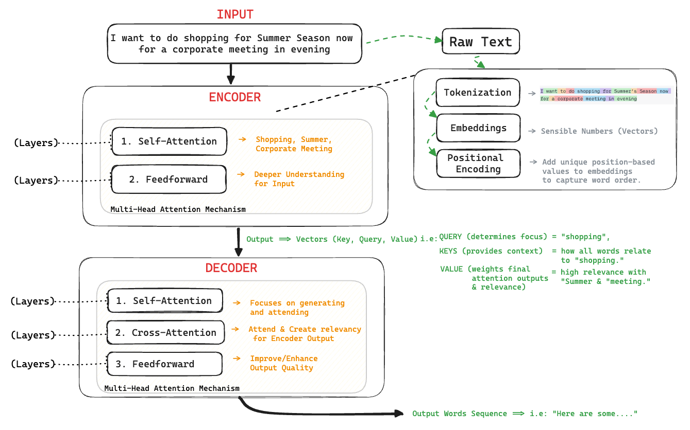

# Transformers：AI 中最好的想法

想象一下你正在一个派对上，试图通过听不同人交谈的片段来判断房间里最热门的话题是什么。所有人都在同时讲话，但你需要在不完整听清每个词的情况下，弄明白主要意思。Transformer 模型在处理文本时做的事情和这很相似。

- 试试 [OpenAI Tokenizer](https://platform.openai.com/tokenizer)，理解文本是如何被 LLM 拆分并标记化的。

- 使用 [Visualize Word Embeddings](https://projector.tensorflow.org/) 看看单词是如何在多维空间中表示的。

## 理解 Transformer 模型最简单的方法

一开始，理解 Transformer 模型可能会感觉像是在解码一种外星语言，但别担心，我们可以把它拆成几个容易理解的小块，并配上一些有趣的类比，帮助你真正记住它。

### **步骤 1：理解核心思想**

从本质上说，Transformer 模型就像一群朋友在一起做小组作业（我们都经历过，对吧？）。每个朋友（也就是序列中的一个 token）都有自己的工作要做，但与旧模型不同，以前大家必须按顺序一个接一个地工作；而在 Transformer 中，他们可以同时工作，只要彼此之间通过一种非常高效的方式进行沟通就行。

### **步骤 2：深入理解自注意力机制**

让这些朋友能够协同工作、又不会互相干扰的魔法，叫做 **自注意力机制（Self-Attention Mechanism）**。你可以这样理解：每个朋友都拥有一种超能力，能随时观察其他所有人在做什么，并决定自己应该对每个人的工作投入多少关注。如果某个朋友正在做非常关键的事情，其他人可能就会更多关注他；如果另一个朋友只是在摸鱼，那大家给他的注意力就会少一些。这就是模型决定“输入中哪些部分更值得关注”的方式。

### **步骤 3：多头注意力，实现多任务处理**

现在，再想象每个朋友都能戴不同的帽子（也就是 Multi-Headed Attention，多头注意力），同时完成多项任务。通过戴上这些不同的“帽子”，他们能够从多个角度看待整个项目，例如从整体视角、细节视角，或特定模式的视角，从而让最终成果更加完整、更加精致。

### **Attention VS Self-Attention VS Multi-Head Attention**

下面这张简化表格，用类比的方式解释了 Attention、Self-Attention 和 Multi-Head Attention：

| **概念** | **Attention** | **Self-Attention** | **Multi-Head Attention** |
| --- | --- | --- | --- |
| **作用** | 聚焦输入中最重要的部分。 | 输入中的每一部分都会查看其他部分，以便更好地理解自己。 | 多个“聚焦小组”从不同角度同时观察输入。 |
| **类比** | 就像读一本书时，特别注意那些解释主旨的关键句子。 | 就像给书中的不同句子做高亮，观察它们之间是如何相互关联的。 | 就像几个人同时阅读同一本书，每个人关注不同细节，然后把各自的理解整合起来。 |
| **使用场景** | 翻译、摘要，或任何需要从序列中挑出重要信息的任务。 | 用于理解句子中各个词之间的关系，例如文本理解模型。 | 用于 Transformer 等高级模型，从多个角度理解文本或数据。 |
| **工作方式** | 给输入中最相关的部分分配更多“注意力”。 | 比较输入中每一部分与其他所有部分之间的关系，理解序列内部的联系。 | 同时运行多个自注意力过程，每个过程关注不同部分，最后合并结果。 |
| **技术解释** | 通过加权求和得到结果，对重要部分赋予更大权重。 | 计算每一对输入元素之间的关系（或“权重”），判断它们如何相互影响。 | 将输入划分为多个“头”，每个头上运行自注意力，再将输出组合成更丰富的表示。 |
| **课堂类比** | 就像老师强调课程中最重要的部分。 | 就像学生彼此讨论，理解课程不同部分之间的联系。 | 就像多个老师分别关注课程的不同方面，然后共同给出一个更完整的理解。 |
| **优点** | 简单、有效，适合提取关键信息。 | 有助于理解输入中的复杂关系。 | 通过融合多种视角，能提供更丰富的理解。 |
| **缺点** | 可能忽略复杂关系。 | 计算复杂，资源消耗较高。 | 更复杂、资源消耗更高，但能力也更强。 |

#### 总结：

- **Attention** 就像在一个故事中，特别关注最重要的部分。
- **Self-Attention** 就像故事中的每一句话都会去看其他句子，以便更好理解整个故事。
- **Multi-Head Attention** 就像让多个人一起读这个故事，每个人关注不同细节，最后把各自的理解整合起来，形成完整认识。

### **步骤 4：前馈网络，真正干活的部分**

在完成这些注意力和沟通之后，每个朋友就会开始通过自己的 Feedforward Network 真正把事情做出来。你可以把它理解为：他们把之前收集到的所有信息，真正转化为实际输出，就像在写小组报告中自己负责的那一部分。

### **步骤 5：编码与解码，项目流程**

最后，如果你看的是一个完整的 Transformer 模型，就会涉及 Encoder-Decoder（编码器-解码器）结构。Encoders 就像负责收集资料、整理研究内容的“学霸成员”，而 Decoders 则像表达能力很强的人，负责把这些研究内容写成最终报告或展示出来。

## 对 Transformer 模型的另一种简单解释

**想象你正在读一本书。** 在阅读时，你并不是只看当前这个词，而是会结合前面的词来理解整个意思。Transformer 模型在计算机里做的事情和这个类似。

**Transformer 的关键组成部分：**

1. **注意力机制（Attention Mechanism）：** 这有点像大脑专注于句子或图像中特定部分的能力。在 Transformer 中，注意力机制帮助模型理解输入数据中不同部分之间的关系。
2. **编码器-解码器架构（Encoder-Decoder Architecture）：** 这有点像翻译器。编码器把输入数据转换成解码器可以理解的表示形式，而解码器则基于编码后的输入来生成输出。

**它如何工作：**

* **输入（Input）：** 模型接收一个词序列或其他形式的数据。
* **编码（Encoding）：** 每个词或元素会被赋予一个数值表示。编码器层会处理这些表示，并关注它们之间的关系。
* **解码（Decoding）：** 解码器层使用编码后的信息生成输出，例如翻译、摘要或预测。

**为什么 Transformer 如此强大：**

* **并行处理（Parallel processing）：** 与传统顺序模型不同，Transformer 可以同时处理输入数据的所有部分，因此速度更快。
* **长距离依赖（Long-range dependencies）：** Transformer 可以捕捉序列中相距很远的词或元素之间的关系，这对机器翻译和文本摘要等任务非常关键。
* **灵活性（Flexibility）：** Transformer 可适配多种任务，例如语言建模、图像识别和语音识别。

## Transformer：一个中级难度的解释

**想象一个语言翻译员。** 当你说一句英语时，翻译员会把它转换成西班牙语。但它是怎么知道哪些西班牙语词对应哪些英语词的？它必须对两种语言都有深刻理解。

**Transformer** 是一种神经网络，工作方式和这个翻译员类似，但它能做的事情远不止翻译。它既能理解和生成文本，也能翻译语言、写不同类型的创意内容，甚至回答你的问题。

### Transformer 是如何工作的？

1. **输入（Input）：** Transformer 接收一个由词组成的序列作为输入。例如：“The cat sat on the mat.”
2. **嵌入（Embedding）：** 每个词都会被转换成一个数值表示，这个表示叫做 embedding。它帮助 Transformer 理解词语的含义和上下文。
3. **编码器（Encoder）：** 编码器处理这个嵌入后的序列，并提取重要信息。它会把句子分解成更小的部分，并理解这些部分之间的关系。
4. **解码器（Decoder）：** 解码器根据编码器提取出的信息生成新的词序列。它利用编码器的输出，创建一个连贯且有意义的句子。

**Transformer 模型通常使用两个不同的神经网络：编码器和解码器。**

* **编码器（Encoder）：** 这个网络处理输入序列，把它转换成一串向量，用来表示输入的上下文和语义。

**[观看：Transformer 模型：编码器](https://www.youtube.com/watch?v=MUqNwgPjJvQ)**

* **解码器（Decoder）：** 这个网络负责生成输出序列，它会利用编码器给出的表示，以及自身的内部状态，逐步生成目标输出。

**[观看：Transformer 模型：解码器](https://www.youtube.com/watch?v=d_ixlCubqQw)**

编码器和解码器之间通过注意力机制连接起来，这使得解码器能够根据需要关注编码后输入序列中的不同部分。这种注意力机制是 Transformer 的关键组成部分，也是它能够捕捉输入和输出序列中长距离依赖关系的原因。

**[观看：Transformer 模型：编码器-解码器](https://www.youtube.com/watch?v=0_4KEb08xrE)**

**Transformer 的关键组成部分：**

* **自注意力（Self-attention）：** 这种机制使 Transformer 能够衡量输入序列中不同词语的重要性。例如，在句子 “The cat sat on the mat” 中，Transformer 可能会更关注 “cat” 和 “mat”，而不是 “the”。
* **位置编码（Positional encoding）：** 这帮助 Transformer 理解输入序列中词语的顺序。它会给 embeddings 加上位置信息，使 Transformer 知道哪个词在前，哪个词在后。
* **多头注意力（Multi-head attention）：** 这使 Transformer 能够同时捕捉输入序列的不同方面。它通过多个 attention heads 关注输入的不同部分，并提取不同类型的信息。

### 为什么 Transformer 这么强大？

* **并行处理（Parallel processing）：** Transformer 可以并行处理整个输入序列，因此非常高效。
* **长距离依赖（Long-range dependencies）：** Transformer 可以捕捉词与词之间的长距离关系，这对机器翻译和文本摘要等任务非常重要。
* **灵活性（Flexibility）：** Transformer 可以通过改变输入和输出格式，适应非常广泛的任务。

总之，Transformer 是一种能够理解并生成文本的强大神经网络。它们被广泛应用于机器翻译、文本摘要和问答等任务。

### 更详细地看：什么是 Transformer 模型？

Transformer 是一种人工智能（AI）模型，专门设计用来理解和生成自然语言。它是许多高级 AI 系统的底层架构，包括像 GPT（Generative Pre-trained Transformer）这样的模型。Transformer 就像超级聪明的算法，能够基于它从大量数据中学到的模式，去阅读、理解，甚至撰写文本。

### Transformer 是如何工作的？

1. **在上下文中理解词语：**
   Transformer 在读取文本时是逐词处理的，但它不会只盯着当前这个词，而是会关注整句话，甚至整段话。这有点像你在读一本推理小说时，有时需要回想前面章节里的细节，才能理解此刻发生了什么。

2. **注意力机制（Attention Mechanism）：**
   Transformer 使用一种叫做 “attention” 的机制，来判断句子中哪些词对理解含义最重要。例如，在句子 “The cat sat on the mat because it was soft” 中，单词 “it” 指的是 “the mat”。注意力机制帮助 Transformer 判断出这一点。

3. **多层理解（Layers of Understanding）：**
   模型会通过多层结构来处理文本，每一层都会进一步细化其理解。你可以把它想象成剥洋葱，每一层都会让你更接近文本真正的核心含义。

### 训练 Transformer 模型

训练一个 Transformer，就像教一个学生去理解并预测文本。它的过程如下：

1. **收集数据（Collecting Data）：**
   首先，模型会接触到海量文本数据，例如大量书籍、文章和网站内容。这些数据就是模型学习的材料。

2. **预处理（Preprocessing）：**
   文本会被拆分成更小的片段，通常是单词或子词，然后转换成数字（因为计算机处理的是数值）。模型利用这些数字来理解文本。

3. **学习模式（Learning Patterns）：**
   模型一开始会做出随机猜测，但会随着时间不断改进。它通过观察前面的词来预测句子中的下一个词。例如，对于句子 “The sky is”，模型可能会猜 “blue” 或 “clear”。如果猜错了，它会从错误中学习，并调整自己的理解方式。

4. **多轮反复（Multiple Passes）：**
   模型会对这些文本反复学习很多次（有时多达数百万次），每一轮都会让它更擅长理解语言中的模式。

5. **微调（Fine-Tuning）：**
   在模型从大量通用文本中学会基础语言能力后，它还可以在特定领域文本上继续微调，例如医学文档或法律文书，从而让它在这些领域表现得更好。

### 推理（使用模型）

当模型训练完成后，它就可以用来理解或生成文本。过程如下：

1. **输入文本（Input Text）：**
   你给模型输入一些文本，例如一个问题，或者一段需要续写的句子。

2. **处理（Processing）：**
   模型使用自己的注意力机制和多层结构来理解输入，并预测下一个最合适的内容。例如你问：“What is the capital of France?” 它会处理这些词语，并给出 “Paris” 作为答案。

3. **生成输出（Generating Output）：**
   模型也可以生成全新的文本，例如写一个短故事，或者总结一篇新闻文章。它会一个词一个词地预测，并把这些词依次拼接起来，直到生成完整句子。

### 为什么它这么酷？

Transformer 很强大，因为它能够理解并生成非常接近人类表达风格的文本。它被应用在从聊天机器人到语言翻译的各种场景中，也正是它让 AI 可以写文章、作诗，甚至像我们现在这样进行对话。

## Transformer 的学习过程：一步一步看

**理解 Transformer 的学习过程**

Transformer 是一种彻底改变了自然语言处理（NLP）任务的神经网络架构。它尤其擅长处理像文本这样的序列数据。下面我们一步一步拆解它的学习过程。

**1. 数据准备（Data Preparation）**

* **Tokenization：** 将文本拆分成更小的单位（token），例如单词或子词。
* **Encoding：** 将 token 转换成模型可以理解的数值表示（embeddings）。
* **创建训练集和验证集：** 将数据划分为训练集和验证集，以便在训练过程中评估模型性能。

**2. 模型架构（Model Architecture）**

* **编码器-解码器结构（Encoder-Decoder Structure）：** Transformer 的核心由编码器和解码器组成。
* **自注意力（Self-Attention）：** 编码器和解码器都使用自注意力机制，来衡量输入序列中不同 token 的重要性。
* **位置编码（Positional Encoding）：** 为了表示 token 的顺序，位置编码会加入到输入 embeddings 中。
* **多头注意力（Multi-Head Attention）：** 使用多个 attention heads 来捕捉输入序列的不同方面。
* **前馈神经网络（Feed-Forward Neural Networks）：** 这些层用于进一步处理注意力机制输出的结果。

**3. 训练（Training）**

* **前向传播（Forward Pass）：** 输入数据经过编码器和解码器，生成输出。
* **损失计算（Loss Calculation）：** 使用损失函数（例如交叉熵损失）来计算预测输出与真实输出之间的差异。
* **反向传播（Backpropagation）：** 计算损失相对于模型参数的梯度。
* **参数更新（Parameter Update）：** 使用优化算法（例如 Adam）更新模型参数，以最小化损失。

**4. 微调（可选，Fine-Tuning）**

* **任务专用数据（Task-Specific Data）：** 如果模型先是在通用数据集上训练的，那么之后还可以针对具体任务（例如问答、文本摘要）在更专门的数据集上微调。
* **迁移学习（Transfer Learning）：** 预训练模型的权重会作为新任务的起点，从而加快训练过程。

**5. 评估（Evaluation）**

* **指标（Metrics）：** 使用与任务相关的指标评估性能，例如准确率、F1-score，或机器翻译中的 BLEU 分数。
* **验证集（Validation Set）：** 模型会在验证集上评估，以测试其泛化能力。

**示例：机器翻译**

1. **数据（Data）：** 一个包含两种语言句子对的数据集，例如英语和法语。
2. **模型（Model）：** 一个采用编码器-解码器结构的 Transformer 模型。
3. **训练（Training）：** 模型通过最小化预测的法语翻译与真实法语翻译之间的交叉熵损失，学习将英语句子翻译成法语。
4. **评估（Evaluation）：** 模型表现通常使用 BLEU 分数等指标来衡量。

**关键点：**

* Transformer 由于自注意力机制，非常擅长处理序列数据。
* 在大规模数据集上进行预训练，可以提升下游任务的表现。
* 微调通常用于让预训练模型适应具体任务。
* 评估指标对于判断模型表现至关重要。

通过这些步骤，你就可以为多种 NLP 任务训练 Transformer 模型，并获得业界领先的效果。

# 现在让我们借助外部资源进一步深入理解

[观看：Transformers: The best idea in AI | Andrej Karpathy 和 Lex Fridman](https://www.youtube.com/watch?v=9uw3F6rndnA)

[观看：Transformer 神经网络，ChatGPT 的基础，清晰讲解！！！](https://www.youtube.com/watch?v=zxQyTK8quyY)

[How Transformers Work: A Detailed Exploration of Transformer Architecture](https://www.datacamp.com/tutorial/how-transformers-work)

[The Animated Transformer](https://prvnsmpth.github.io/animated-transformer/)
