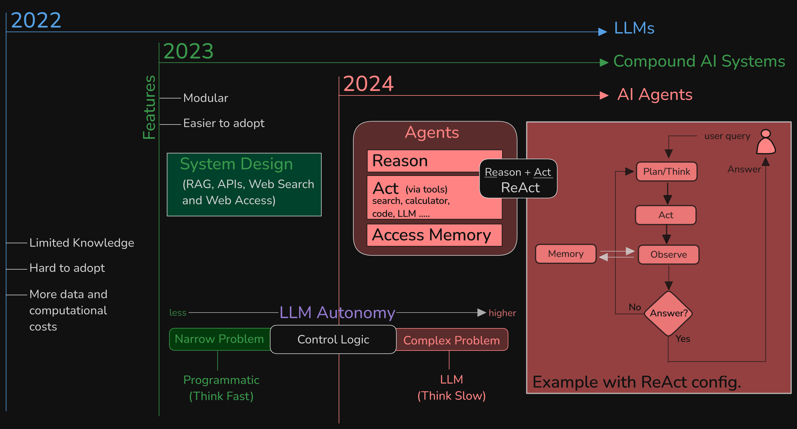

# 复合式 AI 系统：AI 的新前沿

[从模型走向复合式 AI 系统的转变](https://bair.berkeley.edu/blog/2024/02/18/compound-ai-systems/)

[观看：AI 的未来：释放复合系统的力量](https://www.youtube.com/watch?v=5QIpc6hKaKg)

[观看：从大语言模型（LLMs）走向复合式 AI 系统](https://www.youtube.com/watch?v=IaMOZq1O7JI)

[什么是复合式 AI 系统？](https://www.databricks.com/glossary/compound-ai-systems)

[为什么复合式 AI 系统是复杂问题求解的未来](https://ashishjaiman.medium.com/why-a-compound-ai-systems-is-the-future-of-complex-problem-solving-bd7be16ed57f)

**复合式 AI 系统（Compound AI systems）** 代表了我们构建 AI 方式中的一次重要转变。与依赖单一、庞大模型不同，这类系统会结合多个 AI 模型、工具和技术，以构建更稳健、更灵活、更高效的复杂问题解决方案。

复合式 AI 系统是人工智能中的一种新兴趋势，它通过集成多个 AI 组件来更有效地处理复杂任务。与依赖单一模型的传统 AI 系统不同，复合式 AI 系统会把各种模型、检索器、数据库以及外部工具组合起来，以提升性能、灵活性和鲁棒性¹²。

这种方法能够通过发挥每个组件的优势来获得更好的表现，使整个系统更具适应性和韧性。这标志着 AI 发展思路的一个重大变化：不再只关注单纯扩大模型规模，而是转向有策略地组装多组件系统。

### 为什么复合式 AI 正在获得关注：

* **克服单一模型的局限性：** 单个模型在面对复杂现实问题时往往力有不逮。复合式 AI 系统通过把问题拆分成更小、更易管理的组件来应对这一点。
* **提升效率和资源利用率：** 通过让不同组件承担不同专长，复合式 AI 系统可以更高效地使用资源，并降低计算成本。
* **增强灵活性与可扩展性：** 模块化架构让系统可以更容易集成新模型和新组件，从而更好适应变化中的需求。

### 现实世界中的应用：

复合式 AI 系统的潜在应用非常广泛，覆盖多个行业：

* **医疗保健：** 药物发现、医学图像分析、个性化治疗方案
* **金融：** 欺诈检测、风险评估、算法交易
* **自动驾驶：** 感知、决策制定、控制
* **自然语言处理：** 高级聊天机器人、语言翻译、情感分析

**从本质上说，复合式 AI 系统标志着 AI 开发范式的一次转变，它有望提供更复杂、更可靠、更有效的解决方案，以应对广泛挑战。**

## LLMs -> 复合式 AI 系统 -> AI Agents

**我们正在见证一条从 LLM 到复合式 AI 系统，再最终走向 [AI agents](https://www.youtube.com/watch?v=F8NKVhkZZWI) 的演进路径。**

人工智能（AI）的演化过程，可以看作是从孤立模型逐步走向具备自主决策和行动执行能力的一体化系统。这条路径大致包含三个阶段：

1. **大语言模型（LLMs，Large Language Models）：** 这类高级 AI 模型在大规模文本数据上训练，能够生成类似人类的语言，是许多应用的基础工具。

2. **复合式 AI 系统（Compound AI Systems）：** 这类系统通过结合多个 AI 组件和外部资源来完成复杂任务，从而增强灵活性和控制力。

3. **AI Agents：** 在复合系统基础上，AI agent 可以自主运行，与环境交互并达成特定目标，这代表着 AI 能力的一次显著提升。

### **大语言模型（LLMs）：**

像 OpenAI GPT 系列这样的 LLM，会在海量数据集上训练，以理解并生成人类风格的文本。它们擅长语言翻译、摘要和内容创作等任务。然而，它们的能力通常局限于根据输入提示处理和生成文本，并不具备直接执行动作或与外部系统交互的能力。

### **复合式 AI 系统：**

复合式 AI 系统通过整合多个 AI 模型和外部工具来处理更复杂的任务。通过组合数据库、代码解释器和权限系统等组件，这类系统相较于单个模型更加动态且灵活。这种模块化方法还能带来更好的控制性和可信度，因为每个组件都可以独立更新或替换，以适应新数据或变化中的需求。

### **AI Agents：**

AI agent 代表了进一步的演进，它们是一类能够感知环境、做出决策并执行行动以达成特定目标的自主系统。它们通常利用 LLM 进行决策，并通过与各种工具和 API 交互来完成任务，例如预约、管理邮件或控制智能设备。由于具备自主性，它们无需持续人工输入，就能在动态环境中运行，因此非常灵活。

### **从 LLM 走向 AI agent 的转变：**

从 LLM 到 AI agent 的转变，意味着给 AI 系统增加文本生成之外的能力：

- **与外部系统集成：** AI agent 可以访问数据库、执行代码，并与 API 交互，因此可以完成范围更广的任务。

- **自主决策：** 与仅仅根据提示词响应的 LLM 不同，AI agent 可以根据目标自主做出决策并采取行动。

- **环境交互：** AI agent 能够感知并响应环境中的变化，从而动态调整自己的行为。

### **对未来的影响：**

AI agent 的发展意味着我们正在走向更自主、更智能的系统，它们能够在不同领域处理复杂、多步骤任务。这一演进会提升效率，并为客户服务、医疗保健和个人助手等应用领域打开新的可能性。

总之，从 LLM 到复合式 AI 系统，再到最终的 AI agent，这条演化路径反映了 AI 技术日益增强的复杂性和自主性，也为未来更集成、更强大的系统铺平了道路。
