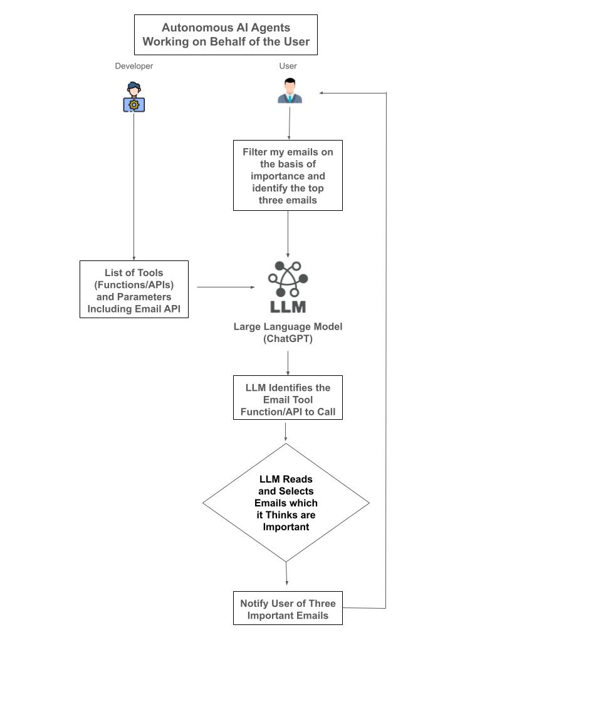
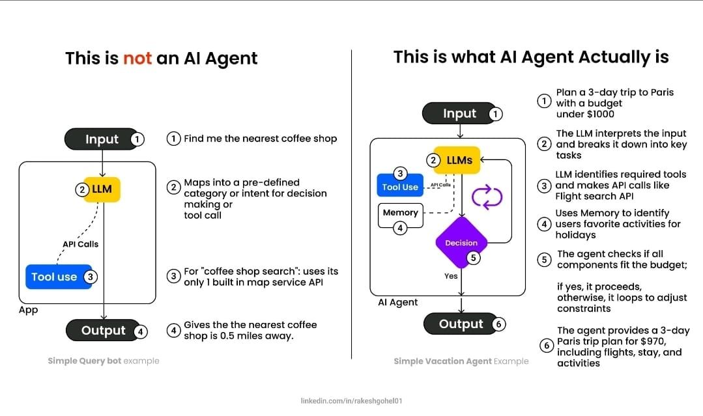

# 定义 AI Agent：软件、机器人、自动驾驶汽车与[人形机器人](https://en.wikipedia.org/wiki/Humanoid_robot)

在人工智能语境中，*AI agents* 是一种软件实体（或者在某些更特殊的情况下，是机器人、人形机器人等具身系统），它们被设计用来感知环境、对所观察到的信息进行推理，并执行行动以实现特定目标。它们通常具有自主性，会持续处理输入信息、更新内部世界模型，并以目标导向的方式选择行为。

AI Agent 的关键特征通常包括：

1. **自主性（Autonomy）：**  
   它们能够在初始设置或指令之后，不依赖人工持续干预，自主地做出决策并执行行动。

2. **感知与传感（Perception and Sensing）：**  
   AI Agent 可以通过多种输入渠道收集环境或任务领域中的信息，例如传感器数据、结构化数据库、自然语言文本、图像、音频或用户输入。

3. **状态表示与建模（State Representation and Modeling）：**  
   它们会维护一个关于环境状态的内部表示，这可能包括当前条件、已学习事实或推断出的关系。这个内部模型帮助它们理解上下文、预测未来状态，并推理行动可能带来的结果。

4. **决策与推理（Decision-Making and Reasoning）：**  
   它们会使用各种认知机制来做出选择，从简单的规则逻辑，到复杂的机器学习模型。某些 Agent 使用预定义的逻辑推理引擎，另一些则依赖强化学习或深度学习等高级技术。

5. **目标导向行为（Goal-Directed Behavior）：**  
   AI Agent 一般是为了完成明确目标或任务而存在的。这些目标可能很简单，例如寻找两点之间的最短路径；也可能非常复杂，例如维持一个多步骤工业流程的运行效率。

6. **行动选择与执行（Action Selection and Execution）：**  
   当 Agent 决定采取某种行动之后，它还必须具备执行该行动的能力。行动形式可以是：向其他软件系统发出命令、修改数据结构、控制物理设备的执行器，或者与其他 Agent 和人类进行通信。

7. **适应与学习（Adaptation and Learning）：**  
   很多 AI Agent 被设计成会随着时间推移不断提升性能。它们会从经验中学习，根据成功与失败调整自己的策略或模型，从而变得更高效、更稳健、更准确。

本质上，你可以把 AI Agent 看作一种智能“问题解决者”：它与环境交互，以改变环境、或者获取所需信息。这类 Agent 是机器人、虚拟助手、自动驾驶汽车、推荐系统以及复杂仿真环境等领域中的基础构件。

**一个代表用户自主运行的 Agent 示例**

**详细说明：**

1. **用户发起请求：**  
   整个流程从用户提出请求开始：*“根据重要程度筛选我的邮件，并通知我最重要的前 3 封邮件。”* 这是一个用户希望系统代为完成的任务，而不是自己手动去邮箱里查看。

2. **LLM 理解请求：**  
   大语言模型（例如 ChatGPT）接收到用户请求后，会理解用户的意图是：对邮件进行优先级排序、筛选出关键邮件，并把最重要的信息呈现出来。此时 LLM 的职责既包括“理解需求”，也包括“规划完成任务所需的步骤”。

3. **识别外部动作：**  
   为了完成请求，LLM 需要访问用户邮件。这意味着它必须连接一个外部邮箱 API，或者调用一个能获取用户邮件数据的函数。LLM 会推断出调用该服务所需的参数，例如认证令牌、邮箱地址、筛选条件等。

4. **自主决策步骤：**  
   到了这一步，LLM 开始代表用户自主行动（前提是用户已授予相应权限，并且诸如 OAuth token 等安全前置条件已经就绪）。它不再每一步都请求用户确认，而是具备继续执行的授权能力。这个“Decision Step”可以理解为系统中的逻辑检查点，用于确认在无需用户进一步输入的情况下可以继续执行。

5. **从邮件服务中获取数据：**  
   LLM 调用外部邮箱服务的 API，获取用户邮件数据。这些数据可能包含：邮件元数据、时间戳、发件人、主题，以及正文内容。

6. **处理并排序邮件：**  
   在拿到邮件数据后，LLM 会应用“重要性判断标准”。重要性可以基于以下因素：
   - **发件人优先级：** 来自特定联系人或 VIP 发件人的邮件权重更高。
   - **关键词检测：** 包含 “ASAP”“urgent”“deadline” 等紧急词汇，或属于关键项目相关邮件。
   - **机器学习模型：** 系统可能会根据用户过往行为学习出哪些邮件通常更重要。

   随后，LLM 会过滤垃圾邮件、低优先级新闻简报或无关更新，并给每封邮件打分，选出最重要的前 5 封。

7. **总结并报告给用户：**  
   一旦最重要的 5 封邮件被识别出来，LLM 就会生成一个简洁摘要。例如，它可能会这样告诉用户：  
   *“Here are the 5 most important emails you received today:  
   1. Project deadline update from Jane Doe.  
   2. Invoice due reminder from Finance Dept.  
   ...”*

   然后再以友好、易读的形式展示给用户。

8. **通知用户：**  
   最终，用户会收到一条由 LLM 生成的通知，其中包含前 3 封最重要邮件的信息。换句话说，用户实际上已经把“判断”和“分拣”这项工作委托给 AI Agent，由它自主完成请求、连接外部服务、应用逻辑并返回结果。

---

总的来说，这个场景展示的是：一个运行在 LLM 内部或通过 LLM 驱动的自主 Agent，不仅能理解用户指令，还能独立执行一个多步骤流程，包括连接外部 API、做决策、筛选内容，并最终输出结果，而不需要用户持续参与。

## 什么是 AI Agent，什么不是 AI Agent？

下面用更通俗的语言解释：什么是 AI Agent、它与一个简单的查询机器人（query bot）有什么区别，以及这种区别为什么重要。

---

## 1. **什么是“简单查询机器人”（图左侧）**

- **单步请求 / 响应：** 用户提出一个问题（例如 *“帮我找最近的咖啡店”*），系统返回一个直接答案（*“最近的咖啡店距离你 0.5 英里。”*）。
  
- **智能程度很有限：** 虽然它背后可能用到了大语言模型（LLM），但大部分“AI”能力其实只是把你的请求分类或映射到某个预先定义好的类别中，比如 **地图查询** 或 **天气查询**，然后把结果返回。

- **工具使用很窄：** LLM 只调用 **一个** 固定工具（这里是地图服务 API）。它不会进一步推理或决策。如果结果不理想，它不会迭代、不会记住你的反馈，也不会主动寻找替代方案。

简而言之，这类机器人更像是一个 *面向单一任务的接口*：你提问，它从一个来源抓取信息，然后返回答案。

---

## 2. **什么是 AI Agent（图右侧）**

AI Agent 不只是一次性回答问题的助手。它把多个能力组合在一起，包括：**推理、工具使用、记忆、决策**，以完成更复杂的多步骤任务。

### 2.1 **多步骤推理**
- 用户可能会说：*“帮我规划一个 3 天巴黎旅行，预算控制在 1000 美元以内。”*
- AI Agent 不会简单地把它映射到一个“巴黎旅游”类别，而是会把任务拆成多个子任务：
  1. 查找飞往巴黎的机票。
  2. 搜索酒店或住宿。
  3. 考虑活动安排（博物馆、旅行团等）。
  4. 检查总成本是否低于 1000 美元。

### 2.2 **工具使用（不止单一 API）**
- AI Agent 可能会调用 **航班搜索 API** 来查找便宜机票。
- 接着调用 **酒店搜索 API** 查看房价和空房情况。
- 它甚至还可能使用 **汇率转换器** 或 **行程规划工具**。
- 每次调用后，它都会整合结果，并重新检查约束条件（例如预算是否超出）。

### 2.3 **记忆（Memory）**
- Agent 会记住中间步骤的结果：
  - 例如它“记得”自己已经找到哪些航班和酒店。
  - 它还可以结合用户偏好（例如用户之前提过自己偏好 3 星级、靠近市中心的酒店，或者有特定饮食限制）。

### 2.4 **迭代式决策（Iterative Decision-Making）**
- 如果 AI Agent 发现机票加酒店已经超出预算，它会自动调整：
  - 例如寻找不同日期的更便宜机票、推荐更实惠的住宿，或者建议替代活动来降低开销。
- 它会不断循环尝试，直到满足用户约束（时间、预算、个人偏好）。

### 2.5 **最终计划 / 回答**
- 只有在评估完所有组成部分（航班、酒店、活动、预算）之后，它才会输出一份完整行程方案。
- 如果用户中途修改要求（例如 “Actually, I’d like 4-star hotels.”），AI Agent 会重新跑一遍流程，重新评估约束，并更新最终方案。

---

## 3. **AI Agent 的关键区分特征**

1. **自主推理（Autonomous Reasoning）**  
   AI Agent 不依赖单次“输入问题，输出答案”的模式。它会思考问题，并自主决定下一步该做什么。

2. **动态工具选择（Dynamic Tool Selection）**  
   它不会只使用一个预先固定好的工具，而是可以从多个 API、数据库或插件中动态挑选最相关的工具。

3. **记忆与上下文（Memory & Context）**  
   Agent 会保留之前步骤的记录和用户偏好。这样的记忆能力让它能够优化方案，也能记住上一次什么有效、什么无效。

4. **迭代式处理（Iterative Approach）**  
   如果约束不满足（例如预算、日期可用性、用户偏好），Agent 可以回退、调整变量，并不断提出替代方案，直到找到合适结果。

---

## 4. **为什么这件事重要**

- **更个性化**、**更具适应性**：AI Agent 可以根据你的具体情况塑造回答、从你的反馈中学习，并据此不断优化结果。
- **能处理复杂任务**：它不会只返回一个单步的“最好猜测”，而是能够解决需要多种资源和反复决策的复杂多步骤任务。
- **更接近“人类式”问题解决方式**：通过迭代、记忆上下文、比较不同选项，AI Agent 模拟了人类处理复杂问题的一部分方式。

---

### 总结
一个 **AI Agent** 远不止是一个简单问答机器人。它会结合：
1. **推理**：把任务拆解成多个步骤，  
2. **工具使用**：调用多个 API 或服务，  
3. **记忆**：保存中间结果和用户偏好，  
4. **决策**：不断迭代，直到满足约束条件（例如预算）。

正因为如此，AI Agent 非常适合处理旅行规划、活动组织、项目管理等复杂场景，因为这些任务不是单次查询就能完成的。

## 人形机器人、自动驾驶汽车和机器人也算 AI Agent 吗？

人形机器、自动驾驶汽车和机器人是否属于 AI Agent，取决于我们如何定义“AI Agent”，以及它们具体具备哪些能力。

**什么是 AI Agent？**  
在人工智能里，“agent” 一般是指一种能够通过传感器感知环境、处理信息做决策，并对环境采取行动以实现特定目标的实体。AI Agent 往往使用算法、机器学习模型和决策过程，以自主或半自主的方式运行。其关键特征包括：

- **自主性（Autonomy）：** 能在没有直接人工干预的情况下运作。  
- **目标导向行为（Goal-Directed Behavior）：** 能为了特定目标或任务采取行动。  
- **适应性 / 智能性（Adaptability / Intelligence）：** 能从经验中学习、适应变化条件，并做出有依据的选择。

**人形机器人（Humanoid Robots）：**  
人形机器人指的是外形类似人体的机器人，通常包括头、手臂、腿，有时还带有面部表情能力。但它是否属于 AI Agent，取决于它的控制系统。有些人形机器人相对简单，只会执行预设脚本，而没有自适应决策能力，这种情况就不能算真正的 AI Agent。但很多先进的人形机器人会使用机器学习、自然语言处理、计算机视觉等 AI 技术来理解环境、识别人类语言，并以动态方式与人类交互。当它们具备感知、决策和自主行动能力，而不仅仅是执行固定指令时，就完全可以被视为 AI Agent。

**自动驾驶汽车（Autonomous Cars / Self-Driving Cars）：**  
自动驾驶汽车通过摄像头、激光雷达、雷达、GPS 等多种传感器，结合高级感知算法、预测模型和决策系统，实现安全驾驶。它们感知环境、理解交通规则、应对风险、规划路线，并实时做出驾驶决策。这与 AI Agent 的定义完全吻合。现代自动驾驶系统本质上就是高度复杂的 AI Agent，它们持续从环境中获取信息、更新内部模型，并据此调整驾驶行为。

**其他机器人（Other Robots）：**  
“机器人”这个词本身很宽泛。它可以指流水线上那种只会重复执行固定动作的自动化机器，这类设备如果没有智能和适应能力，通常不被视为 AI Agent。另一方面，很多现代机器人（例如酒店服务机器人、仓储机器人、无人机）配备了由 AI 驱动的感知和决策能力，能够在复杂环境中导航、识别物体、应对变化。这类机器人就是真正意义上的 AI Agent。换句话说，一个机器人只有在具备“感知、推理、自主行动以达成目标”的能力时，才算 AI Agent。

**结论：**  
- **人形机器人：** 仅仅长得像人，并不自动意味着它是 AI Agent。只有当它具备感知、推理和自适应行动能力时，才算。  
- **自动驾驶汽车：** 几乎所有依靠感知和决策系统实现自动驾驶的车辆，都可以看作 AI Agent。  
- **机器人：** 是否属于 AI Agent，取决于它是否拥有必要的感知、推理与目标导向自主能力。很多现代机器人具备这些能力，因此可以被归为 AI Agent。

总结来说，人形机器人、自动驾驶汽车以及许多现代机器人，确实经常都属于 AI Agent，前提是它们拥有足够的智能能力：能够感知环境、自主做决策，并采取恰当行动。

