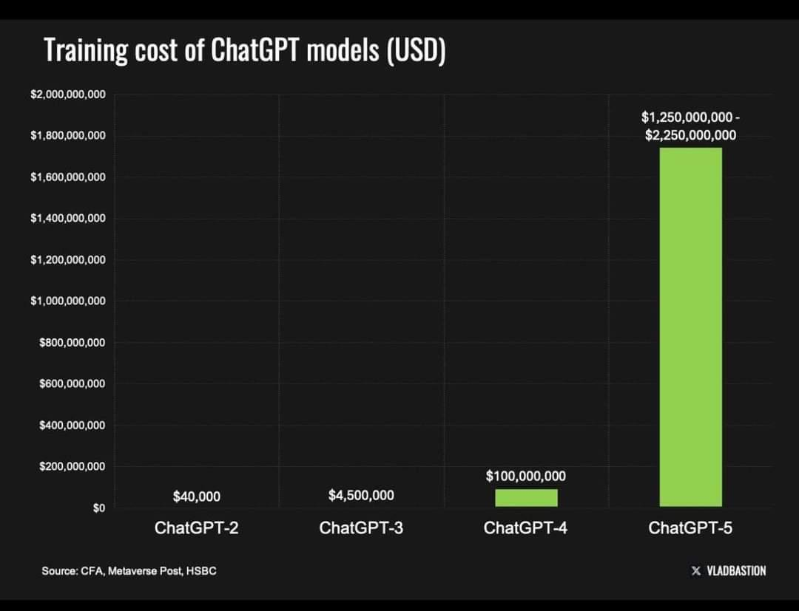

# AI Agent 的经济学

开发自有大语言模型（LLM）对大多数公司而言都面临巨大挑战，包括高昂的资金投入、复杂的技术难题以及长期维护压力。相比之下，把重点放在 **垂直 AI Agent（Vertical AI Agents）** 上，即面向特定行业场景的 AI 系统，往往是更现实、也更有效的路径。本文讨论自研 LLM 的局限性，并主张把垂直 AI Agent 作为更具战略价值的替代方案。

**开发自有 LLM 的挑战**

1. **资金限制（Financial Constraints）**：先进 LLM 的开发需要极其庞大的算力和专业人才，因此成本迅速攀升。训练最先进模型的成本可高达 10 亿美元，未来模型甚至可能达到 100 亿美元。对于没有雄厚资金支持的公司来说，这样的支出通常是难以承受的。 

2. **技术复杂性（Technical Complexities）**：构建 LLM 不仅需要机器学习和数据工程能力，还需要获取海量数据。与此同时，AI 技术本身演化极快，这进一步加大了开发难度，使企业很难持续跟上前沿进展。

3. **维护与更新（Maintenance and Updates）**：模型上线之后，还需要不断更新，以提升性能并处理偏见、幻觉和不准确等问题。这种持续维护需要长期投入专门资源和团队精力。

**垂直 AI Agent 的优势**

垂直 AI Agent 是为特定行业或业务职能量身打造的 AI 系统。与自研通用 LLM 相比，它们具有以下优势：

1. **成本效益更高（Cost-Effectiveness）**：由于聚焦于具体任务，垂直 AI Agent 所需的数据量和算力都更少，因此开发和运行成本显著更低。这让更多公司具备采用 AI 的可能。

2. **更强领域能力（Domain Expertise）**：这类 Agent 通常基于行业数据训练，因此更擅长理解专业术语、行业流程和场景语义。相比通用 LLM，它们往往能输出更准确、更贴切的结果。

3. **部署速度更快（Rapid Deployment）**：借助现有 AI 框架和工具，公司可以更快开发并上线垂直 AI Agent，从而更早看到业务收益。

4. **更好的合规与安全（Enhanced Compliance and Security）**：针对特定行业定制 AI 方案，更容易满足监管要求和数据隐私标准，因为系统可以从设计阶段就把这些因素纳入考虑。

**战略意义**

转向垂直 AI Agent，与当前“将 AI 更深度嵌入产品体系、提升用户体验、保持竞争优势”的趋势高度一致。越来越多企业开始聚焦于“围绕自身需求打造定制模型”，而不是追求更大、更通用的基础模型。

此外，采用垂直 AI Agent 还可能带来显著运营效率提升。例如，律师事务所正在将生成式 AI 工具嵌入工作流，用于自动化处理复杂任务，从而在保障岗位和质量的同时提高整体效率。

**结论**

对于绝大多数公司而言，追求自研专有 LLM 并不现实，因为它既昂贵又技术门槛极高。相比之下，聚焦垂直 AI Agent 是一条更可行的道路：它成本更可控、更专业、部署更快，也更能贴合具体行业需求。这种路径不仅有助于提升运营效率，也能帮助企业在自身领域内更有效地利用 AI 进步带来的红利。

*** Add File: 02_agentic_foundations/05_ai_agents_intro/04_rag_vs_agents/readme_cn.md
# LLM、RAG 和 Agent 有什么区别？

𝗟𝗟𝗠

基于海量数据训练而成。它通过输入提示词来生成答案。适合用于简单的问答型应用。

𝗥𝗔𝗚

即 Retrieval-Augmented Generation（检索增强生成）。它会结合外部数据（例如公司的财务报表）来回答问题，从而减少幻觉问题。

𝗔𝗴𝗲𝗻𝘁

能够自主思考。给定一个任务后，LLM 会规划一系列动作、记住对话历史，并使用工具来做出决策。

什么时候该用哪一种？答案取决于具体应用场景。

⤷ 如果只是简单回答通用事实类问题，用 LLM 即可

⤷ 如果是基于公司数据进行问答，用 RAG

⤷ 如果涉及复杂决策和复杂回答，用 Agent

参考：

https://www.linkedin.com/posts/danleedata_llm-vs-rag-vs-agent-what-are-the-differences-activity-7270799207630782464-hIV2

