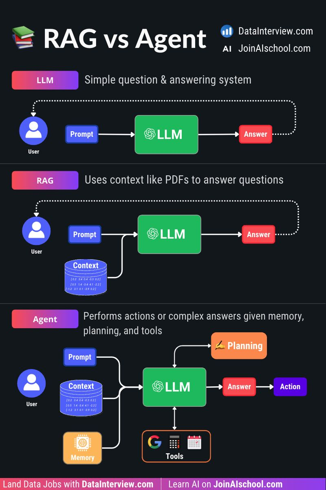

# LLM、RAG 和 Agent 有什么区别？

𝗟𝗟𝗠

基于海量数据训练而成。它通过输入提示词来生成答案。适合用于简单的问答型应用。

𝗥𝗔𝗚

即 Retrieval-Augmented Generation（检索增强生成）。它会结合外部数据（例如公司的财务报表）来回答问题，从而减少幻觉问题。

𝗔𝗴𝗲𝗻𝘁

能够自主思考。给定一个任务后，LLM 会规划一系列动作、记住对话历史，并使用工具来做出决策。

什么时候该用哪一种？答案取决于具体应用场景。

⤷ 如果只是简单回答通用事实类问题，用 LLM 即可

⤷ 如果是基于公司数据进行问答，用 RAG

⤷ 如果涉及复杂决策和复杂回答，用 Agent

参考：

https://www.linkedin.com/posts/danleedata_llm-vs-rag-vs-agent-what-are-the-differences-activity-7270799207630782464-hIV2

