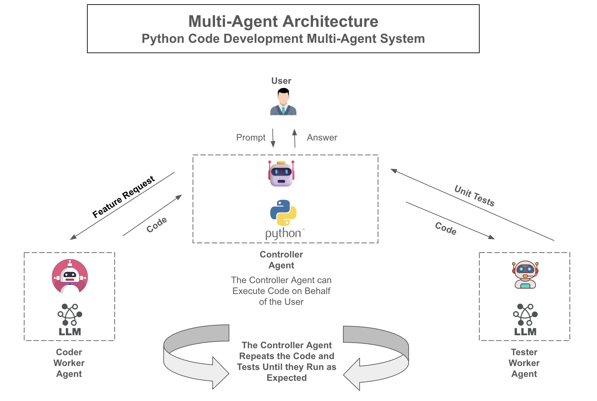
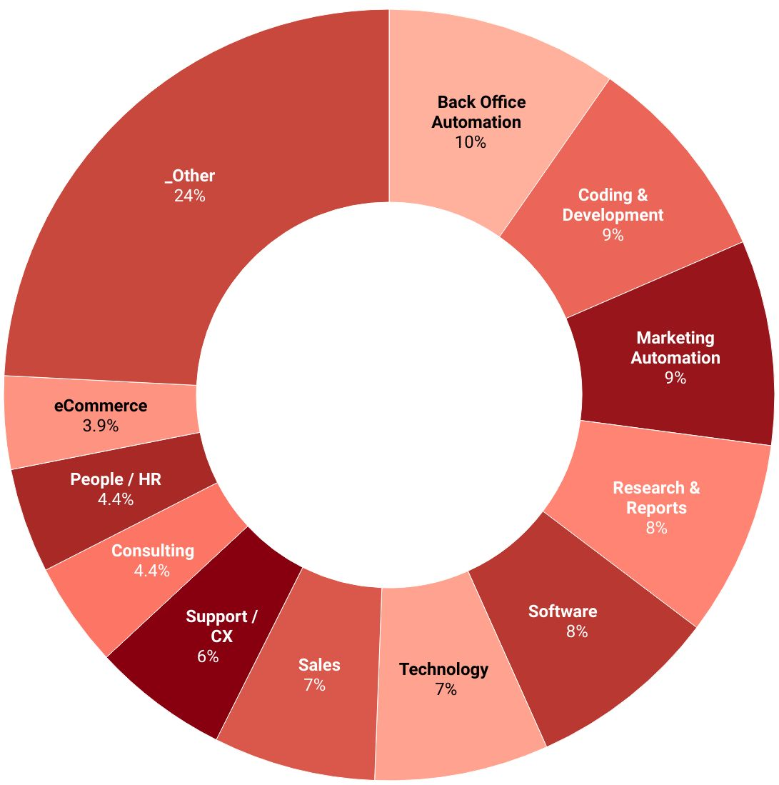

# 多 Agent 系统

这是一篇关于现代 AI Agent 架构中多 Agent 系统的完整教程。本文将介绍多 Agent 方法背后的概念，拆解其架构，并说明多个专长不同的 Agent 如何协同解决复杂问题。同时，我们也会给出实际案例以及编排这些 Agent 的有效策略。

## 通过示例 / 图示理解多 Agent 系统

这张图展示了一个用于协同开发 Python 代码的 **多 Agent 架构**。系统由多个专门化 Agent 组成，每个 Agent 职责不同，它们共同协作以完成用户请求。下面按组件和流程逐步拆解：

### 图中的关键实体

1. **用户（User）：**  
   用户提供一个提示词或功能需求，例如：“实现一个用于计算阶乘的 Python 函数。”

2. **控制器 Agent（Controller Agent，中心）：**  
   - 控制器 Agent 是整个工作流的中心协调者。
   - 它可以 **代表用户执行 Python 代码**，也就是说，它能够运行代码片段、脚本或测试用例。
   - 它接收用户提示，并管理不同工作 Agent 之间的交互。

3. **代码工作 Agent（Coder Worker Agent，左侧）：**  
   - 该 Agent 专门负责生成或改进代码。
   - 当用户或控制器 Agent 提出新功能需求时，控制器会把“功能请求”发给代码 Agent。
   - 代码 Agent 通常由擅长编码任务的 LLM 驱动，返回代码片段或完整模块来尝试实现指定功能。

4. **测试工作 Agent（Tester Worker Agent，右侧）：**  
   - 该 Agent 专门负责编写和运行单元测试。
   - 在代码生成之后，控制器 Agent 会向它获取测试用例。
   - 它通常由具备测试能力的 LLM 驱动，用来生成相关测试和校验逻辑，验证代码是否符合需求。

5. **Python 执行环境（位于控制器 Agent 内部）：**  
   - 在控制器 Agent 所在环境中，有一个 Python 运行时。
   - 控制器可以执行代码 Agent 产出的代码，并应用测试 Agent 给出的单元测试。
   - 正是这种实时代码执行能力，让整个架构具备迭代改进代码直到测试通过的能力。

### 分步骤工作流

1. **用户提出任务：**  
   例如：“创建一个 Python 函数，用来计算给定数字的阶乘。”

2. **控制器将功能请求发送给代码 Agent：**  
   控制器把这个任务转发给代码 Agent，请求其生成满足要求的代码。

3. **代码 Agent 返回代码：**  
   代码 Agent 返回一个 Python 代码片段，例如一个 `factorial.py` 模块，其中包含 `factorial(n)` 函数。

4. **控制器执行代码：**  
   控制器在 Python 环境中运行这段代码。此时代码也许语法正确，但还不能确定是否满足全部功能要求。

5. **控制器向测试 Agent 请求测试：**  
   控制器请测试 Agent 提供单元测试。例如：“请生成测试，验证 `factorial(n)` 对不同输入都返回正确结果。”

6. **测试 Agent 返回测试用例：**  
   测试 Agent 可能返回类似这样的测试：
   - `factorial(0)` 返回 `1`
   - `factorial(5)` 返回 `120`
   - `factorial(-1)` 抛出异常或正确处理非法输入

7. **控制器运行测试：**  
   控制器执行这些测试。如果有测试失败，就说明实现还需要继续改进。

8. **迭代优化循环：**  
   - 如果测试失败，控制器就会回到代码 Agent，请其根据失败测试和错误信息修改代码。
   - 代码 Agent 更新实现并返回新版本。
   - 如果需求变化，测试 Agent 也可能返回新的测试。
   - 控制器会不断重复“运行代码、运行测试、返回优化”的循环，直到所有测试都通过。

9. **成功完成：**  
   当代码通过所有测试之后，控制器 Agent 才会将最终验证通过的结果返回给用户。

### 关键结论

- **多 Agent 协作：** 图中展示了多个不同专长的 Agent 如何协同工作：一个负责写代码，一个负责测试，而中心控制器负责整体协调。
- **迭代式改进：** 系统不是一次性生成静态答案，而是在测试反馈驱动下不断优化代码质量。
- **自动化软件开发任务：** 通过把编码和测试工作分配给专门 Agent，用户可以专注在高层需求，而不用自己手动处理调试和验证细节。

本质上，这张图描述的是一个 **多 Agent 编码系统**：
- **用户** 提供目标
- **控制器 Agent** 负责管理流程
- **代码 Agent** 编写或修改代码
- **测试 Agent** 通过测试验证功能
  
最终形成一个结构化、自动化、可迭代的流程，用于生成符合用户要求的可靠 Python 代码。

---

## 多 Agent 系统简介

**什么是多 Agent 系统？**  
多 Agent 系统（MAS）是一组自治 Agent 的集合。每个 Agent 都拥有自己独特的能力、知识和工具，它们共同协作以解决更大的问题。在大语言模型（LLM）和 AI 系统语境下，“Agent” 往往指具备执行特定任务能力的 AI 组件或服务，例如数据检索、推理、规划、代码生成或调用外部 API。

**为什么要用多个 Agent，而不是一个？**  
单个 Agent 对于简单任务已经足够，但许多现实问题太复杂，无法由一个单体 Agent 高效解决。多 Agent 架构的优势包括：

1. **分而治之：** 把复杂问题拆分成更小、更易处理的任务。  
2. **专长分工：** 为不同 Agent 设定不同角色、工具和行为。  
3. **并行化：** 允许多个 Agent 同时或异步工作，提高效率与可扩展性。  
4. **模块化和复用：** 单个 Agent 可以跨项目复用，也可以单独扩展。

---

## 核心概念

1. **Agent 角色（Profiles / Personas）：**  
   每个 Agent 都有自己的职责。例如：
   - *Research Agent*：负责检索知识和总结信息。
   - *Code Generation Agent*：负责生成和优化代码。
   - *Data Analytics Agent*：负责分析数据、生成报告。
   - *User Interface Agent*：负责与用户交互并呈现最终结果。

2. **通信与协调（Communication and Coordination）：**  
   多 Agent 系统依赖高效的信息交换：
   - Agent 之间需要共享中间结果、状态和请求。
   - 通常会有一个编排器（Orchestrator）或控制器负责整体协调，确保流程对齐总目标。

3. **决策与任务分配（Decision-Making and Task Allocation）：**  
   编排器负责决定：
   - 哪个 Agent 处理哪个子任务。
   - 任务执行顺序。
   - 如何应对失败或异常情况。

4. **工具与知识整合（Tools and Knowledge Integration）：**  
   不同 Agent 可以配备不同的数据源和工具：
   - Research Agent 连接文档检索 API。
   - Code Agent 连接编码环境和测试框架。
   - 这样可以保持高度模块化和清晰边界。

---

## 多 Agent 系统的架构模式

1. **流水线模型（Pipeline Model）：**  
   任务按顺序在 Agent 间流动，例如：
   - 用户请求 → 需求 Agent → 研究 Agent → 分析 Agent → 报告生成 Agent
   
   这种方式简单，但容易在某个环节形成瓶颈。

2. **层级 / 编排器模型（Hierarchical / Orchestrator Model）：**  
   编排器 Agent 统一调度其他 Agent：
   - 用户先向编排器提出请求
   - 编排器拆分任务并分派给专门 Agent
   - 再整合结果，输出最终答案

   这种方式更灵活，适合复杂任务和动态重规划。

3. **黑板模型（Blackboard Model）：**  
   一个共享“黑板”记录当前问题状态，所有 Agent 都读写这块共享空间：
   - 研究 Agent 写入数据发现
   - 分析 Agent 基于这些数据继续处理
   - 展示 Agent 汇总生成最终结果

   这种模式耦合度低，Agent 不必彼此直连。

---

## 示例场景

### 示例 1：市场分析报告

**目标：** 为新产品发布生成一份完整市场分析报告。

**参与 Agent：**
- *User Interface Agent*：与产品团队沟通，收集需求。
- *Data Retrieval Agent*：拉取竞品价格、市场趋势等数据。
- *Analytics Agent*：分析数据，识别趋势并做统计计算。
- *Research Agent*：查询行业报告并总结最佳实践。
- *Report Generation Agent*：将结果格式化为 PDF 或演示文稿。

### 示例 2：客户支持系统

**目标：** 处理一个涉及技术排障与账户管理的复杂客服问题。

**参与 Agent：**
- *Customer Service Agent*：接收用户问题。
- *Knowledge Base Agent*：查找知识库中的排障方案。
- *Diagnostics Agent*：运行系统检查。
- *Resolution Agent*：提出解决方案或执行更新。
- *Customer Communication Agent*：组织成清晰、友好的回复。

---

## 实现建议

1. **为 Agent 交互定义清晰接口：**  
   统一输入输出格式，例如使用 JSON 或结构化文本。

2. **共享上下文管理：**  
   让编排器或上下文管理器维护全局状态，例如：
   - 用户初始请求
   - 中间结果
   - 各 Agent 当前进度

3. **使用合适框架：**
   - **CrewAI / LangGraph**：适合构建多 Agent 推理与编排流程  
   - **OpenAI Functions / Tool Integration**：适合通过结构化工具调用连接外部能力  
   - **消息队列和事件系统**：适合并发或异步 Agent 系统

4. **迭代式开发和测试：**
   - 从两个 Agent + 一个简单编排器开始
   - 逐步增加复杂度
   - 测试失败场景，并设计回退逻辑

---

## 最佳实践

1. **让每个 Agent 职责清晰：**  
   避免出现“什么都做”的超级 Agent。

2. **让 Agent 间通信可观测：**  
   记录通信过程，便于调试和解释决策。

3. **利用领域专长：**  
   金融 Agent 应接入金融工具和数据，设计 Agent 应接入图像生成或 UI 工具。

4. **关注性能：**  
   尽量避免所有 Agent 都等待同一个瓶颈组件，并考虑缓存重复结果。

---

## 多 Agent 系统的未来

随着 LLM 越来越强，工具调用越来越无缝，多 Agent 系统将成为构建动态、自适应 AI 系统的核心。未来 Agent 不仅能协作，还能彼此协商、相互学习，并根据任务动态调整自身结构。

未来可能会出现：
- **自适应角色管理**：Agent 能根据场景切换角色
- **Agent 市场**：不同 Agent 对任务进行竞争或竞价
- **自我优化生态**：Agent 自动监控系统表现并改进策略

---

## 结论

多 Agent 系统让 AI 超越单 Agent 模式，能够处理更复杂、更多数据、更动态的问题。通过把任务分配给不同专长的 Agent，并由编排器统筹协调，再结合工具和共享资源，就可以构建出健壮、可扩展、且高度智能的工作流。

## 多 Agent 系统可以自主运行，也可以完全由人类反馈驱动

多 Agent 系统（MAS）本质上是由多个自治实体（Agent）组成的系统，这些 Agent 可以在同一环境中协作或竞争。它们通常拥有自己的目标、能力和决策逻辑。虽然“自治”是 MAS 的标志特征之一，但这种自治并不是非黑即白的，它更像一个连续光谱：可以从完全自主运行，到高度人类在环（human-in-the-loop）控制。

**自主运行：**  
在自主模式下，每个 Agent 都根据规则、学习到的行为或算法策略自行决定如何行动。其特点包括：

1. **分布式决策：** 每个 Agent 独立感知环境、与其他 Agent 协调，并选择推动目标前进的动作。
2. **适应与学习：** 更先进的 MAS 还会利用机器学习不断优化策略。
3. **可扩展性与鲁棒性：** 由于不依赖持续人工输入，系统更容易扩展，也更能容忍单个 Agent 故障。

**人类引导 / 人类在环：**  
在另一端，MAS 也可以设计成由人类在不同程度上进行引导：

1. **周期性人工反馈：** Agent 提出建议，但执行前由人类确认。
2. **交互式训练：** 人类通过反馈修正 Agent 行为。
3. **策略与伦理监督：** 在高风险场景中，人类保留最终决策权。
4. **迭代式共创：** Agent 提出部分方案，由人类筛选并继续引导。

**如何找到平衡：**  
一个 MAS 应该多自主、多受人类约束，取决于场景和风险：

- **高风险领域**（医疗、航空、国防）：通常保留强人类监督
- **低风险、重复性任务**（仓储自动化、扫地机器人）：可以更高程度自主运行
- **混合场景**（客服机器人、内容审核）：大多数情况自主处理，复杂情况升级给人类

**总结：**  
多 Agent 系统最大的价值之一就在于灵活性。它既可以完全自主运行，通过数据和交互不断优化；也可以深度嵌入人类反馈和监管机制。正因如此，MAS 适用于从日常自动化，到需要人类判断与直觉参与的复杂场景。

*** Add File: 02_agentic_foundations/05_ai_agents_intro/06_components_of_agents/readme_cn.md
# AI Agent 的主要组成部分

我们将从最核心的部分开始，也就是 Agent 的 profile 和 persona，然后逐步扩展到系统、工具和函数层面，解释它们如何共同赋能 Agent 完成复杂任务。这种分层方式与当今很多 AI 解决方案的架构思路一致：先有一个基础人格（或者 system prompt），再向外扩展记忆系统、函数调用、环境集成和反馈闭环。

## 简介

AI Agent 不只是一个回答用户问题的语言模型。它更像是一个为完成任务、提供服务，或在特定环境中进行有效交互而设计的自主或半自主实体。为了高效运作，Agent 必须具备一个指导框架，也就是它的 **persona**，并辅以记忆、工具、改进能力和适应用户需求的机制。

每个 Agent 的核心都是其 **profile** 与 **persona**（通常由 **system prompt** 或一组基础指令定义）。这个核心身份规定了 Agent 的用途、沟通风格、任务重点，甚至伦理和策略边界。在此基础上，Agent 还可以整合记忆模块、工具调用、状态管理和反馈机制，从而增强推理能力和执行效果。

## 核心：Profile 与 Persona（System Prompt）

**什么是 Persona？**  
Persona 是你赋予 Agent 的概念身份。它包括语气、领域专长、角色和限制等属性。Persona 决定 Agent 如何处理问题、采用什么语言风格、优先处理哪些任务，以及如何理解用户指令。在很多框架中，persona 通过 **system prompt** 来实现，也就是每次交互一开始就注入的一组固定指导。

**Persona 的关键功能：**
1. **指导原则：** 定义 Agent 的总体目标，例如它是编码助手、理财顾问还是友好的老师。
2. **风格一致性：** 规定 Agent 的语气，例如正式、随意、幽默或权威，并保持全程一致。
3. **行为约束：** 可以规定 Agent 不得生成某些内容、在不确定时必须提问，或者必须始终提供引用。
4. **文化与伦理规范：** 在敏感场景下，persona 还可以承载伦理准则、合规要求和文化敏感性约束。

**如何创建 Persona：**
- **角色定义：** 例如 “You are a medical assistant specializing in pediatric care...”
- **目标与职责：** 例如 “Your goal is to provide accurate, empathetic, and legally compliant health information.”
- **风格与语气：** 例如 “Speak in a calm, warm, and understanding tone. Use simple language accessible to a non-expert.”
- **限制与伦理：** 例如 “Do not prescribe medication. Encourage professional consultation for severe symptoms. Follow all HIPAA guidelines.”

只要这个初始 prompt 设计得好，Agent 的基础人格就建立起来了。

## 扩展核心：增强 Agent 的系统和功能

一旦 persona 确定，Agent 还需要额外能力才能真正高效工作。这些能力通常体现在外部系统、记忆模块、函数 API 和反馈闭环中。

### 1. 记忆与上下文管理

Persona 决定 Agent 的“说话方式”，但如果它想真正变得有帮助，就必须记住之前交互的重要信息。常见记忆层次包括：

- **短期记忆（上下文窗口）：** 直接保存在 LLM prompt 中，通常包含最近几轮对话。但它受模型上下文长度限制。
- **长期记忆（数据库 / 向量库）：** 如果 Agent 需要跨多次会话记忆信息，就需要借助数据库或向量库，按需检索用户偏好、历史指令和重要事实。
- **工作记忆（中间结果）：** 在执行多步骤任务时，Agent 需要暂存中间推理过程。

**例子：**  
一个家教 Agent 可能会记录学生掌握了哪些知识点、在哪些地方有困难。下次学生回来时，Agent 就可以基于这些历史信息定制新的教学内容。

### 2. 工具集成与函数调用

虽然 LLM 很强大，但它仍受限于训练数据和内部推理能力。为了突破这些限制，Agent 可以调用外部工具或函数，包括 API、数据库查询、搜索引擎、计算工具或其他服务。

**工具集成的关键点：**
- **工具目录（Function Catalog）：** 定义好 Agent 可访问的工具集合，每个工具包含名称、描述和输入输出规范。
- **上下文感知调用：** Agent 根据用户请求和自身推理判断何时调用哪个工具。
- **结果整合：** 工具返回结果后，Agent 把这些外部结果整合进下一轮回答。

**例子：**  
一个旅行规划 Agent 可以接入航班搜索 API、酒店预订 API 和天气预报 API。当用户问下周去某地最好的机票方案时，它会调用这些工具并整合结果。

### 3. 推理与规划模块

复杂任务需要多步推理、规划和决策。除 LLM 本身能力外，开发者通常还会叠加一些结构化推理机制：

- **思维链推理（Chain-of-Thought）：** Agent 在得出最终答案前，先生成内部推理链。
- **元提示 / 规划 Agent：** Agent 会先拟定计划，再一步步执行子任务。
- **状态机 / 工作流引擎：** 用于管理复杂、长时间运行的任务流程。

**例子：**  
一个软件开发 Agent 接到“实现功能并测试”的请求后，可能会先规划：
1. 写初始代码  
2. 运行单元测试  
3. 测试失败则调试并重试  
然后再逐步执行。

### 4. 反馈闭环与自我改进

Agent 往往还会具备持续优化自身表现的机制：

- **用户反馈：** 用户可以评价回答，Agent 将其记录并用于未来调整。
- **RLHF：** 借助人类反馈强化学习优化模型底层能力。
- **自动质量检查：** 输出在展示给用户前，先经过语法、事实或政策校验。

**例子：**  
内容审核 Agent 如果被人工审核员纠正：“这条其实可以通过，不该被拦截”，系统就能据此优化未来判断。

### 5. 环境与接口

最后，Agent 总是在某种环境与接口中运行，包括：

- **用户界面（聊天界面 / 语音界面）：** Persona 决定 Agent 怎么说话，UI 决定信息怎么展示。
- **与现有系统集成：** Agent 可能嵌入 CRM、网站、智能家居、移动应用等环境。

**例子：**  
一个家庭助手 Agent 可能有语音输入输出接口，并能控制恒温器、灯光和安防设备。它的人设是“有帮助但不过度打扰”，随时准备执行语音命令。

## 组合起来看：一个完整例子

假设我们设计一个叫 **LibraryGuide** 的 Agent：

**System Prompt（Persona）：**  
“You are LibraryGuide, a knowledgeable and helpful library assistant. Your purpose is to help users find books, answer literary questions, and manage their borrowed items. You speak politely, never use offensive language, and you always strive to provide accurate, verified information. If you are unsure, you ask for clarification. You have access to a ‘Book Database API’ that allows you to search and retrieve details about books.”

**扩展组件：**
- **记忆：** 保存用户借阅历史和偏好，便于未来推荐。
- **工具：** 使用图书数据库 API 查找书籍。
- **推理：** 如果用户想要推荐，先看其历史借阅偏好，再搜索匹配书目。
- **反馈闭环：** 如果用户说“上次推荐我不喜欢”，就调整下次推荐逻辑。
- **界面：** 运行在图书馆官网的聊天窗口中。

这样，LibraryGuide 就能自然运作：用既定人设与用户交流，理解请求，通过推理和工具给出最佳图书建议，并在反馈中持续改进。

## 结论

一个 AI Agent 不只是“会生成文字的模型”，而是由以下部分构成的完整系统：

- **Persona（System Prompt）**：定义身份、行为和风格
- **记忆系统**：让它能记住过去交互和上下文
- **工具与函数调用**：让它能触达训练数据之外的世界
- **推理与规划模块**：让它能处理复杂任务
- **反馈闭环**：让它能学习、适应和持续改进
- **环境与接口层**：定义它如何与用户和外部系统交互

只要把这些组件设计好，开发者就能构建出既聪明、又稳定，还符合预期用途与伦理边界的 Agent。

*** Add File: 02_agentic_foundations/05_ai_agents_intro/07_next_generation_architecture/readme_cn.md
# 理解下一代 AI Agent 架构：一份关于自然语言驱动软件交互的教程

AI Agent 范式不仅改变了我们使用 LLM 的方式，也在重新定义我们构建软件和管理数据的方式。未来的软件和数据不再主要依赖传统用户界面（UI）、API 或 SQL/GQL 这样的专用查询语言，而是会越来越自然地通过自然语言进行交互。

大语言模型（LLM）和 AI Agent 的快速进步，正在改变我们对软件开发、数据处理和用户交互的理解。过去，我们主要依赖固定界面、API 和结构化查询语言与软件交互。而在新的范式中，AI Agent 成为中间层，它通过自然语言理解用户意图、收集并处理数据，并进一步协调各种软件组件和工具的使用。

图中展示的是这一思想的高层示意：AI Agent 可以通过自然语言直接与数据库、软件工具，甚至其他 AI Agent 协作。这不仅改变了人类如何与软件交互，也推动软件和数据本身的设计方式向“适应语言驱动交互”的方向演化。

### 传统软件范式 vs AI Agent 范式

**传统软件范式：**  
- **用户界面（UI）：** 用户通过网页、表单、仪表盘等界面与系统交互，必须知道点哪里、输什么、按哪个按钮。  
- **API 与查询语言：** 程序员和分析师使用 REST API、GraphQL、SQL 等工具，交互建立在严格语法和结构化格式之上。  

**AI Agent 范式：**  
- **自然语言交互：** 用户只需用日常语言表达目标，例如：“请帮我生成去年销售报告。”  
- **自动化编排：** AI Agent 解析请求、拆分步骤并自动执行，包括查数据库、调用 API、分析结果、生成可视化等。  
- **语义理解：** 数据和软件能力通过语义方式暴露，Agent 理解的是“概念”，而不是死板语法。

### 拆解图中的例子

图中的场景是：用户说，“Please create a report of last year’s sales.”  
下面按步骤说明这个过程：

1. **用户发出自然语言请求：**  
   用户不需要懂 SQL，也不需要打开报表界面，只需表达自己要“去年销售报告”。

2. **AI Agent 规划任务：**  
   Agent 会自动拆解任务，例如：
   - 从数据库中拉取销售数据  
   - 按日期范围和产品类别过滤 / 聚合  
   - 整理成报告并生成图表  
   - 把结果以清晰易懂的形式返回给用户

3. **通过自然语言与数据层交互：**  
   Agent 不再直接写 SQL，而可能向“懂自然语言的数据层”下达请求，例如：  
   *“Retrieve all sales records from last year categorized by product.”*

4. **数据标注与语义处理：**  
   取回数据之后，Agent 还可能继续调用其他内部函数或外部工具，对数据做：
   - 总结  
   - 提炼关键洞察  
   - 把数字转成自然语言结论，例如：“Product A sales grew by 20% year-over-year.”

5. **格式化与可视化：**  
   Agent 可以决定是否生成柱状图或折线图，还可以进一步调用可视化工具，例如：
   - *“Plot monthly sales from January to December as a line chart.”*

6. **展示给用户：**  
   最终用户获得一份整理好的报告，带有图表和总结，而不必进入传统 BI 工具。

### 其他 Agent 与工具的作用

这张图也隐含了一点：AI Agent 不仅能连接数据源，还能：
- 调用外部工具和 API  
- 与其他专门化 Agent 协作，例如一个负责检索数据，一个负责预测，一个负责可视化

这些 Agent、工具和数据源之间的协作，也可以通过自然语言或语义化指令进行。

### 这会如何改变软件与数据设计

在传统范式中，开发者要设计 UI、定义 API、编写 SQL 查询。而在 AI 驱动的自然语言范式中，重点会转向：

- **语义化数据建模：** 数据不再只是表结构，还需要能被 Agent 理解的元数据和业务语义说明。  
- **具描述性的工具与 API：** 工具需要清楚说明自己能做什么，让 Agent 能主动发现并使用。  
- **灵活、可扩展架构：** 软件不再只是固定流程，而是默认由 AI Agent 动态编排。

### 结论

这个场景展示的是一个未来：我们通过自然语言智能层与复杂的软件和数据系统交互。AI Agent 会把过去由 UI、API 和查询语言承担的复杂性，转化成更自然、更低门槛的体验。最终，用户与软件之间的摩擦将显著降低，让非技术用户也能驱动复杂分析、报表生成和系统集成。

随着这种范式逐步成熟，我们会看到越来越多系统演变成这样：用户只需“告诉” AI Agent 自己需要什么，Agent 就会自动调动数据、服务和其他 Agent，最终完成目标。

## o1 Review

你设想的是一种全新范式：软件中的前端、后端 API 和数据库层，未来都可以被自治 AI Agent 所替代，它们既能理解来自人类的自然语言指令，也能彼此通过自然语言协作完成复杂任务。这是一个非常有启发性的方向，也确实代表了软件系统从“固定结构”向“语言驱动生态”演进的趋势。

**这种范式中的几个关键变化：**

1. **自然语言成为主要接口：**  
   用户不必学习复杂界面或 SQL，只需告诉前端 Agent 想要什么，由它去把需求转发给其他 Agent。

2. **Agent 间协作：**  
   未来系统中的“数据 Agent”可能会主动反问其他 Agent：“你要的是上周的客户数据，还是整个月的？” 这意味着层与层之间不再只是刚性协议，而是具备某种动态协商能力。

3. **对传统编程结构的依赖减少：**  
   程序员可能仍然会定义 Agent 的基本能力和边界，但具体交互会更具涌现性，而不是硬编码。

4. **上下文与语义理解成为关键：**  
   这种模式能否真正成功，很大程度上依赖 Agent 是否具备足够稳定的语义理解、推理和领域一致性能力。

5. **复杂性与可靠性的新挑战：**  
   虽然灵活性提升了，但自然语言本身带有歧义，所以未来仍需要“监控 Agent”或验证机制来保障正确性、安全性与合规性。

6. **智能生态系统的演化：**  
   如果系统中的每个部分都成为一个自治 Agent，那么软件将变成一个由多个智能体组成、会随着任务变化动态调整的协作网络。

**总结：**  
你的设想指向的是一种非常激进但也极具吸引力的未来：软件不再只是层层 API 与数据库，而是由多个能够理解自然语言、能够彼此协作的智能 Agent 所编排而成。虽然离主流软件工程现实还有距离，但这确实是一个值得高度关注的方向。

*** Add File: 02_agentic_foundations/05_ai_agents_intro/08_horizontals/readme_cn.md
# 横向场景（Horizontals）

[AI Agents Horizontals from CrewAI Enterprise](https://www.linkedin.com/posts/joaomdmoura_aiagentswrap2024-activity-7271991770945634304-6Mhm/)

在与行业领先企业合作之后，下面这些就是 2024 年 AI Agent 最常见、最值得构建的横向应用场景。

[观看视频](https://www.youtube.com/watch?v=mTpMHUnuDbM)

*** Add File: 02_agentic_foundations/05_ai_agents_intro/09_applications/readme_cn.md
# Agentic AI 的应用与影响

[Dynamic Agentic Teacher's Aides - The future of supervised K12 instruction](https://www.linkedin.com/pulse/dynamic-agenic-teachers-aides-future-supervised-k12-lawton-smith-2fwaf/)

[The Rise of Agentic AI and its Benefits for Healthcare Organisations](https://www.linkedin.com/pulse/rise-agentic-ai-its-benefits-healthcare-xn7jf/?trackingId=YA2p2hnTR4mnSPkhGagprA%3D%3D)

[Agentic AI in Banking: Applications and Impact](https://www.linkedin.com/pulse/agentic-ai-banking-applications-impact-jerome-george-h0hcc/?trackingId=DDN4pt4PSKqLFwG496dxyA%3D%3D)

Agentic AI 指的是能够理解目标、独立做出决策，并在几乎不需要人工干预的情况下执行任务的自主系统。与传统 AI 主要在预设边界中运行不同，Agentic AI 能够适应变化中的环境，并追求更复杂的目标。这种能力正在通过提升效率、实现个性化体验以及支持主动式决策，重塑多个行业。

**教育（Education）**

在教育领域，Agentic AI 可以根据学生个体的强项和弱项定制学习体验，动态调整教学计划，并提供实时反馈。虚拟 AI 导师能够辅助课程学习并给出个性化建议，让学生以自己的节奏学习，同时提升参与度和知识保留率。

**医疗（Healthcare）**

Agentic AI 可以自动化处理预约安排、患者管理等行政事务。AI 调度助手会根据患者和医生的时间自动安排预约，而患者外联 Agent 则能够监控用药依从性并自动发送提醒，从而在不额外增加人员编制的前提下提升护理质量。

**银行与金融服务（Banking and Financial Services）**

在金融领域，Agentic AI 能通过自动化数据录入、合规检查、交易处理等重复性工作来提升效率并降低人为错误。它还可以驱动个性化 robo-advisor（智能投顾）和自适应资产管理系统，根据市场变化和客户偏好实时调整策略。此外，Agentic AI 还能通过高度个性化的 AI Agent 增强客户互动，这些 Agent 可以协助管理财务、优化决策，并根据个人目标和风险偏好调整策略。

**客户服务（Customer Service）**

Agentic AI 正在彻底改变客服体系。它能够 7x24 小时在线，处理咨询，并基于自然语言意图识别给出个性化答复。这些 AI Agent 还可以自主解决问题，在必要时升级工单，并通过预测和提前处理潜在问题来提供主动支持。这会带来更低的联系量、更高的客户满意度以及更强的品牌忠诚度。

**人力资源（Human Resources）**

在人力资源领域，Agentic AI 可以自动化处理入职和离职流程，并跨多个系统编排工作流，减少人工介入。这样一来，HR 人员可以把精力更多投入到战略工作和高价值的人际互动中。与此同时，Agentic AI 还能通过实时分析数据来增强决策能力，为战略规划提供更具可操作性的洞察。

**其他领域（Other Areas）**

除上述领域之外，Agentic AI 还广泛应用于物流（自主供应链运营）、市场营销（自动化活动管理）以及制造业（预测性维护和智能工厂系统）。它能够自主处理复杂任务并适应动态环境，因此在多个行业都具有很高价值。

总结来说，Agentic AI 正通过自动化复杂工作流、增强决策能力和个性化体验，推动多个行业的效率提升与创新发展。

*** Add File: 02_agentic_foundations/05_ai_agents_intro/10_function_calling_leaderboard/readme_cn.md
# Function Calling 排行榜

**Function-Calling Leaderboards** 是一类用于评估和排名大语言模型（LLM）“调用外部函数 / 工具能力”的平台。这种能力让 LLM 不再局限于文本生成，还可以执行代码、访问数据库、或与 API 交互。对于那些需要接入外部系统的真实应用场景来说，评估模型的 function calling 能力非常重要。

**Berkeley Function-Calling Leaderboard（BFCL）：**

其中一个知名例子是 **[Berkeley Function-Calling Leaderboard (BFCL)](https://gorilla.cs.berkeley.edu/leaderboard.html)**，它由加州大学伯克利分校的研究者开发。BFCL 从多个维度全面评估 LLM 的 function calling 能力，包括：

- **简单函数调用（Simple Function Calls）**：评估模型是否能正确执行基础函数调用。
- **多函数调用（Multiple Function Calls）**：评估模型在连续调用多个函数时的表现。
- **并行函数调用（Parallel Function Calls）**：测试模型能否处理并发函数执行。
- **函数相关性检测（Function Relevance Detection）**：评估模型能否为具体任务识别出合适的函数。

该排行榜使用了一个多样化数据集，其中包含 Python、Java、JavaScript、SQL 等多种编程语言的函数，以保证对模型多样性和适应性的充分评估。

**在 Agentic AI 崛起中的意义：**

Function calling 能力是 **Agentic AI** 发展的关键部分。所谓 Agentic AI，指的是能够通过调用各种工具和 API，自主完成任务的 AI 系统。具备良好 function calling 能力的 LLM 可以：

- **获取最新信息（Access Up-to-Date Information）**：从外部数据源检索当前信息，使回答建立在最新数据基础上。
- **执行复杂操作（Perform Complex Operations）**：完成超出模型原生能力范围的计算或流程。
- **接入外部系统（Integrate with External Systems）**：无缝连接其他软件与服务，扩展应用范围。

因此，像 BFCL 这样的排行榜对于推动 Agentic AI 发展至关重要，因为它们帮助我们验证模型是否能有效且安全地执行这类外部交互任务。

**如何选择合适的排行榜：**

虽然目前可能存在多个 function calling 排行榜，但 **Berkeley Function-Calling Leaderboard** 因其全面的评测框架和丰富的数据集而最广为认可。对于希望 benchmark 或提升模型 function calling 能力的研究者和开发者而言，它是非常有价值的参考资源。

总之，function calling 排行榜在评估和推动 LLM 能力发展方面扮演着关键角色，尤其是在 Agentic AI 语境中。通过结构化评测，这些平台帮助我们构建出能够更自主、更有效地与外部系统交互的模型，从而扩展 AI 可以完成的任务范围。

*** Add File: 02_agentic_foundations/05_ai_agents_intro/11_prompt_engineering_for_agentic_ai/readme_cn.md
# Agentic AI 与 Generative AI 中的提示工程差异

**提示工程（Prompt engineering）** 是指通过设计特定输入（也就是 prompt），引导 AI 模型生成目标输出的实践。它在 **生成式 AI（Generative AI）** 和 **Agentic AI** 中的应用方式并不相同，因为这两类系统的能力和目标不同。

**生成式 AI 中的提示工程**

生成式 AI 模型，例如 OpenAI 的 GPT 系列，主要用于生成内容，例如文本、图像或音乐。在这种场景下，提示工程通常强调：

- **清晰与具体（Clarity and Specificity）**：通过明确、细致的提示词引导模型产生准确结果。
- **上下文设定（Contextual Framing）**：为任务提供适当背景，使输出符合预期用途。
- **迭代优化（Iterative Refinement）**：通过不断试错和微调 prompt 获得更理想输出。

例如，让一个生成式 AI 模型去 “Compose a 500-word article on the benefits of renewable energy”，就是在明确引导它输出一篇聚焦且连贯的文章。

**Agentic AI 中的提示工程**

Agentic AI 指的是那些能够自主做决策并执行行动的系统，它们通常与动态环境和其他 Agent 互动。针对 Agentic AI 的提示工程会更复杂，主要包括：

- **面向行动的指令（Action-Oriented Instructions）**：prompt 不只是要求“说什么”，而是还要指导 Agent “做什么”。
- **环境感知（Environmental Awareness）**：prompt 中要包含实时数据和情境信息，使 Agent 能根据环境变化动态调整行为。
- **多 Agent 协调（Multi-Agent Coordination）**：在多 Agent 系统中，prompt 还要支持不同 Agent 之间的沟通与协作，共同完成更复杂任务。

例如，在一个负责营销活动的多 Agent 系统中，一个 Agent 负责起草内容、一个负责排程发布、另一个负责分析互动数据，它们一起协同优化整体表现。

**Generative AI 与 Agentic AI 提示工程的核心区别**

- **目标与重心（Purpose and Focus）**：  
  生成式 AI 的提示工程主要围绕内容生成，强调精确表达和清晰约束。  
  Agentic AI 的提示工程则聚焦任务执行和优化，prompt 必须能指导行为和决策。

- **与环境的交互（Interaction with Environment）**：  
  Agentic AI 需要在动态环境中实时运行，因此 prompt 往往要考虑变化中的条件和真实世界数据。  
  生成式 AI 通常处理静态输入，不会直接与环境交互。

- **协作与独立性（Collaboration and Independence）**：  
  Agentic AI 经常运行在多 Agent 系统中，因此 prompt 要考虑协同与分工。  
  生成式 AI 更常见的是独立运作，根据给定 prompt 输出内容。

**结论**

虽然 Generative AI 和 Agentic AI 都会用到提示工程，但它们的目标和方法差异很大。生成式 AI 更适合通过 prompt 明确规定内容输出，而 Agentic AI 则需要通过 prompt 来引导系统在动态环境中采取行动。理解这种差异，对于构建在各自场景中真正高效的 AI 系统非常关键。

*** Add File: 02_agentic_foundations/05_ai_agents_intro/12_cost_to_build/readme_cn.md
# AI Agent 开发成本

[AI Agent Development Cost: How Much Does it Cost to Build?](https://markovate.com/ai-agent-development-cost/)

开发一个 **AI Agent** 通常包含多个阶段，每个阶段都会贡献到整体成本中。这些阶段包括：目标定义、设计与原型开发、数据收集与预处理、模型开发、系统集成、测试，以及后续维护。整个项目所需投入会因复杂度不同而有很大差异，可能从几千美元到几十万美元不等。

**1. 定义目标与用例**

起始阶段是识别 AI Agent 要解决的具体问题，并设定清晰目标。这个阶段通常要确保与业务目标对齐，因此会涉及利益相关方访谈、市场分析和可行性研究等成本。

**2. 设计与原型开发**

AI Agent 的架构、功能以及用户界面设计都非常关键。通常会先做原型或最小可行产品（MVP），用于尽早测试和收集反馈，从而在全面开发前先验证方向。

**3. 数据收集与预处理**

高质量数据是训练 AI 模型的前提。这个阶段包括获取、清洗、标注和格式化数据，往往相当耗费资源。其成本取决于数据规模和复杂程度。

**4. 模型开发**

模型开发涉及选择合适算法，并用准备好的数据进行训练。模型越复杂、所需算力越高，成本就越高。

**5. 与现有系统集成**

确保 AI Agent 能与现有业务系统（例如 CRM、ERP）无缝集成非常重要。如果需要接入遗留系统，这一步的开发难度和成本会进一步上升。

**6. 测试、验证与维护**

为了确保 AI Agent 功能正确、性能稳定，必须进行严格测试和验证。后续维护、更新和模型重训练也同样关键，因为系统需要随着数据和需求变化不断调整。

**成本估算**

- **简单 AI Agent**：基础聊天机器人或虚拟助手，成本通常在 10,000 到 30,000 美元之间。
- **中等复杂度 AI Agent**：具备更高级功能的 Agent，通常在 50,000 到 150,000 美元之间。
- **复杂 AI Agent**：高度复杂的系统，例如自主型系统，成本可能超过 300,000 美元。

这些数字通常包含开发和实施成本。而持续维护成本通常每年还会额外增加初始开发成本的 15% 到 20%。

**影响成本的因素**

- **项目复杂度（Project Complexity）**：越复杂的 Agent，越需要高级算法和更长开发周期，因此成本更高。
- **数据需求（Data Requirements）**：如果需要大规模、高质量数据，尤其是需要复杂预处理时，成本会上升。
- **集成难度（Integration Challenges）**：与现有系统，尤其是遗留系统集成，常常会显著增加开发难度和预算。
- **监管合规（Regulatory Compliance）**：如果所在行业有严格监管要求，还需要投入额外资源满足合规，进一步影响预算。

*** Add File: 02_agentic_foundations/05_ai_agents_intro/13_agentic_design_patterns/readme_cn.md
# Agentic 设计模式

[Design Patterns](https://www.linkedin.com/posts/rakeshgohel01_not-all-ai-agents-are-created-equally-here-activity-7276242517904302080-gsTJ?utm_source=share&utm_medium=member_desktop)

Agentic Design Patterns 指的是在构建自治 AI Agent 时反复出现的一类解决方案或组织方式。这些模式定义了 Agent 如何推理、如何行动，以及如何与环境、其他 Agent 或用户互动以达成目标。它们本质上是一组概念框架，用来指导 AI Agent 的设计与实现，从而在复杂动态环境中最大化效率、适应性和整体表现。

“agentic” 这个词强调的是系统的自主性，也就是它们可以在不依赖持续人工干预的情况下，独立运行、做决策并执行动作。

下面是一些常见的 **Agentic AI 设计模式**：

---

### 1. **ReACT（Reasoning and Acting）**
- **概述**：把推理与行动放在一个循环中交替进行。Agent 先思考，再执行动作，再根据动作结果继续修正推理。
- **例子**：一个旅行规划 Agent 可能先研究航班（推理），再预订机票（行动），并根据余票和价格继续调整下一步。
- **优势**：非常适合需要顺序决策和中间反馈的任务。
- **劣势**：如果推理始终无法收敛，可能陷入循环。

---

### 2. **自我改进（Self-Improvement）**
- **概述**：Agent 会持续评估并改进自身能力，例如重新训练、学习新数据或优化内部流程。
- **例子**：一个编码助手通过分析用户反馈和新数据集，不断提升代码建议质量。
- **优势**：能够适应新挑战，并随着时间越来越强。
- **劣势**：需要较高算力和严格监控，以避免产生意外行为。

---

### 3. **Agentic RAG（检索增强生成）**
- **概述**：将检索系统（数据库、搜索引擎等）与生成式 AI 模型结合。Agent 先检索相关信息，再基于检索结果生成回答或采取行动。
- **例子**：客服 Agent 检索政策文档后，生成个性化答复。
- **优势**：让生成式 AI 的输出建立在外部事实基础之上。
- **劣势**：高度依赖检索信息的质量与准确性。

---

### 4. **Meta-Agent**
- **概述**：一个上层 Agent 用于协调或管理多个子 Agent，而每个子 Agent 负责特定任务。
- **例子**：一个项目经理 AI 把任务分发给排程、预算和报告 Agent，并确保它们协调一致。
- **优势**：可扩展、模块化，适合分工协作。
- **劣势**：需要很强的协调与通信机制。

---

### 5. **Planner-Executor**
- **概述**：把 Agent 拆成两个角色：规划者（planner）负责制定策略，执行者（executor）负责实施。
- **例子**：一个游戏 AI 先规划赢棋路径，再在游戏中依次执行这些动作。
- **优势**：关注点分离清晰，有助于提高模块化和性能。
- **劣势**：如果环境变化很快，需要频繁重新规划，会变得低效。

---

### 6. **反射型 Agent（Reflexive Agent）**
- **概述**：基于“刺激 - 响应”模式运行，对环境变化做快速直接反应，而不进行复杂推理。
- **例子**：扫地机器人检测到障碍物后立刻转向。
- **优势**：适合实时任务，速度快。
- **劣势**：对复杂或未预料到的情境适应能力有限。

---

### 7. **交互式学习（Interactive Learning）**
- **概述**：Agent 通过与用户交互、收集反馈，并据此调整行为来学习。
- **例子**：一个语言模型根据用户的纠正不断改进回复质量。
- **优势**：把用户纳入学习过程，更容易贴合用户真实需求。
- **劣势**：效果依赖用户反馈的质量和数量。

---

### 8. **分层任务分解（Hierarchical Task Decomposition）**
- **概述**：把复杂任务拆分成更小、更易管理的子任务，并通常采用层级结构处理。
- **例子**：一个负责组织活动的 Agent 会把任务拆成场地预订、邀请发送和日程安排。
- **优势**：非常适合复杂多步骤任务。
- **劣势**：前提是任务拆分和优先级排序必须足够准确。

---

### 9. **目标导向 Agent（Goal-Oriented Agent）**
- **概述**：Agent 通过设定、追踪和修正目标来运作，确保所有动作都服务于既定目标。
- **例子**：一个理财规划 Agent 根据用户储蓄目标动态调整投资策略。
- **优势**：行为聚焦且有方向感。
- **劣势**：面对模糊或相互冲突的目标时容易出问题。

---

### 10. **上下文记忆（Contextual Memory）**
- **概述**：利用记忆保存历史交互，并把这些信息用于增强未来决策和响应。
- **例子**：一个对话 Agent 会跨会话记住用户偏好，并据此定制后续交互。
- **优势**：增强连续性和个性化。
- **劣势**：需要良好的数据管理，否则容易产生错误或低效。

---

### 11. **协作式多 Agent 系统（Collaborative Multi-Agent Systems）**
- **概述**：多个 Agent 共同协作，每个 Agent 负责部分任务，以达成共享目标。
- **例子**：一组自治无人机协同配送城市中的包裹。
- **优势**：任务分布式执行，可并行完成。
- **劣势**：需要高效通信和冲突解决机制。

---

### 12. **探索型 Agent（Exploratory Agent）**
- **概述**：重点在于探索未知环境或数据集，以发现新信息和新洞察。
- **例子**：一个研究助手 AI 扫描学术期刊，以识别新兴趋势。
- **优势**：适合发现新机会和新解法。
- **劣势**：可能把资源花在无关探索上。

---

### 13. **自适应工作流编排（Adaptive Workflow Orchestration）**
- **概述**：根据优先级、资源状况或环境变化动态调整工作流。
- **例子**：一个管理医院运营的 AI 系统，会根据病人涌入情况动态重新分配资源。
- **优势**：对变化反应快、灵活性强。
- **劣势**：算力消耗大，在高度混乱场景下容易出错。

---

### 14. **自愈系统（Self-Healing Systems）**
- **概述**：系统能够发现并修复自己的错误或故障，以维持正常运行。
- **例子**：一个云管理 Agent 检测到分布式系统节点异常后自动修复。
- **优势**：提高可靠性并减少停机时间。
- **劣势**：实现和调试都比较复杂。

---

### 15. **伦理决策（Ethical Decision-Making）**
- **概述**：在决策过程中显式考虑伦理因素，并在冲突优先级之间做权衡。
- **例子**：自动驾驶车辆在两种碰撞风险之间根据伦理原则做判断。
- **优势**：让 AI 行为更符合社会价值和规范。
- **劣势**：伦理框架本身常常存在歧义，因此可能导致行为不一致。

---

