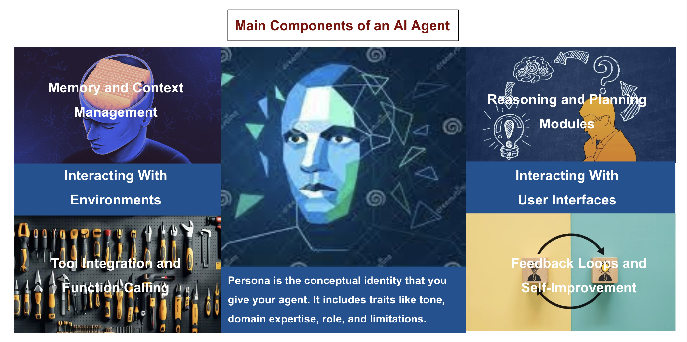

# AI Agent 的主要组成部分

我们将从最核心的部分开始，也就是 Agent 的 profile 和 persona，然后逐步扩展到系统、工具和函数层面，解释它们如何共同赋能 Agent 完成复杂任务。这种分层方式与当今很多 AI 解决方案的架构思路一致：先有一个基础人格（或者 system prompt），再向外扩展记忆系统、函数调用、环境集成和反馈闭环。

## 简介

AI Agent 不只是一个回答用户问题的语言模型。它更像是一个为完成任务、提供服务，或在特定环境中进行有效交互而设计的自主或半自主实体。为了高效运作，Agent 必须具备一个指导框架，也就是它的 **persona**，并辅以记忆、工具、改进能力和适应用户需求的机制。

每个 Agent 的核心都是其 **profile** 与 **persona**（通常由 **system prompt** 或一组基础指令定义）。这个核心身份规定了 Agent 的用途、沟通风格、任务重点，甚至伦理和策略边界。在此基础上，Agent 还可以整合记忆模块、工具调用、状态管理和反馈机制，从而增强推理能力和执行效果。

## 核心：Profile 与 Persona（System Prompt）

**什么是 Persona？**  
Persona 是你赋予 Agent 的概念身份。它包括语气、领域专长、角色和限制等属性。Persona 决定 Agent 如何处理问题、采用什么语言风格、优先处理哪些任务，以及如何理解用户指令。在很多框架中，persona 通过 **system prompt** 来实现，也就是每次交互一开始就注入的一组固定指导。

**Persona 的关键功能：**
1. **指导原则：** 定义 Agent 的总体目标，例如它是编码助手、理财顾问还是友好的老师。
2. **风格一致性：** 规定 Agent 的语气，例如正式、随意、幽默或权威，并保持全程一致。
3. **行为约束：** 可以规定 Agent 不得生成某些内容、在不确定时必须提问，或者必须始终提供引用。
4. **文化与伦理规范：** 在敏感场景下，persona 还可以承载伦理准则、合规要求和文化敏感性约束。

**如何创建 Persona：**
- **角色定义：** 例如 “You are a medical assistant specializing in pediatric care...”
- **目标与职责：** 例如 “Your goal is to provide accurate, empathetic, and legally compliant health information.”
- **风格与语气：** 例如 “Speak in a calm, warm, and understanding tone. Use simple language accessible to a non-expert.”
- **限制与伦理：** 例如 “Do not prescribe medication. Encourage professional consultation for severe symptoms. Follow all HIPAA guidelines.”

只要这个初始 prompt 设计得好，Agent 的基础人格就建立起来了。

## 扩展核心：增强 Agent 的系统和功能

一旦 persona 确定，Agent 还需要额外能力才能真正高效工作。这些能力通常体现在外部系统、记忆模块、函数 API 和反馈闭环中。

### 1. 记忆与上下文管理

Persona 决定 Agent 的“说话方式”，但如果它想真正变得有帮助，就必须记住之前交互的重要信息。常见记忆层次包括：

- **短期记忆（上下文窗口）：** 直接保存在 LLM prompt 中，通常包含最近几轮对话。但它受模型上下文长度限制。
- **长期记忆（数据库 / 向量库）：** 如果 Agent 需要跨多次会话记忆信息，就需要借助数据库或向量库，按需检索用户偏好、历史指令和重要事实。
- **工作记忆（中间结果）：** 在执行多步骤任务时，Agent 需要暂存中间推理过程。

**例子：**  
一个家教 Agent 可能会记录学生掌握了哪些知识点、在哪些地方有困难。下次学生回来时，Agent 就可以基于这些历史信息定制新的教学内容。

### 2. 工具集成与函数调用

虽然 LLM 很强大，但它仍受限于训练数据和内部推理能力。为了突破这些限制，Agent 可以调用外部工具或函数，包括 API、数据库查询、搜索引擎、计算工具或其他服务。

**工具集成的关键点：**
- **工具目录（Function Catalog）：** 定义好 Agent 可访问的工具集合，每个工具包含名称、描述和输入输出规范。
- **上下文感知调用：** Agent 根据用户请求和自身推理判断何时调用哪个工具。
- **结果整合：** 工具返回结果后，Agent 把这些外部结果整合进下一轮回答。

**例子：**  
一个旅行规划 Agent 可以接入航班搜索 API、酒店预订 API 和天气预报 API。当用户问下周去某地最好的机票方案时，它会调用这些工具并整合结果。

### 3. 推理与规划模块

复杂任务需要多步推理、规划和决策。除 LLM 本身能力外，开发者通常还会叠加一些结构化推理机制：

- **思维链推理（Chain-of-Thought）：** Agent 在得出最终答案前，先生成内部推理链。
- **元提示 / 规划 Agent：** Agent 会先拟定计划，再一步步执行子任务。
- **状态机 / 工作流引擎：** 用于管理复杂、长时间运行的任务流程。

**例子：**  
一个软件开发 Agent 接到“实现功能并测试”的请求后，可能会先规划：
1. 写初始代码  
2. 运行单元测试  
3. 测试失败则调试并重试  
然后再逐步执行。

### 4. 反馈闭环与自我改进

Agent 往往还会具备持续优化自身表现的机制：

- **用户反馈：** 用户可以评价回答，Agent 将其记录并用于未来调整。
- **RLHF：** 借助人类反馈强化学习优化模型底层能力。
- **自动质量检查：** 输出在展示给用户前，先经过语法、事实或政策校验。

**例子：**  
内容审核 Agent 如果被人工审核员纠正：“这条其实可以通过，不该被拦截”，系统就能据此优化未来判断。

### 5. 环境与接口

最后，Agent 总是在某种环境与接口中运行，包括：

- **用户界面（聊天界面 / 语音界面）：** Persona 决定 Agent 怎么说话，UI 决定信息怎么展示。
- **与现有系统集成：** Agent 可能嵌入 CRM、网站、智能家居、移动应用等环境。

**例子：**  
一个家庭助手 Agent 可能有语音输入输出接口，并能控制恒温器、灯光和安防设备。它的人设是“有帮助但不过度打扰”，随时准备执行语音命令。

## 组合起来看：一个完整例子

假设我们设计一个叫 **LibraryGuide** 的 Agent：

**System Prompt（Persona）：**  
“You are LibraryGuide, a knowledgeable and helpful library assistant. Your purpose is to help users find books, answer literary questions, and manage their borrowed items. You speak politely, never use offensive language, and you always strive to provide accurate, verified information. If you are unsure, you ask for clarification. You have access to a ‘Book Database API’ that allows you to search and retrieve details about books.”

**扩展组件：**
- **记忆：** 保存用户借阅历史和偏好，便于未来推荐。
- **工具：** 使用图书数据库 API 查找书籍。
- **推理：** 如果用户想要推荐，先看其历史借阅偏好，再搜索匹配书目。
- **反馈闭环：** 如果用户说“上次推荐我不喜欢”，就调整下次推荐逻辑。
- **界面：** 运行在图书馆官网的聊天窗口中。

这样，LibraryGuide 就能自然运作：用既定人设与用户交流，理解请求，通过推理和工具给出最佳图书建议，并在反馈中持续改进。

## 结论

一个 AI Agent 不只是“会生成文字的模型”，而是由以下部分构成的完整系统：

- **Persona（System Prompt）**：定义身份、行为和风格
- **记忆系统**：让它能记住过去交互和上下文
- **工具与函数调用**：让它能触达训练数据之外的世界
- **推理与规划模块**：让它能处理复杂任务
- **反馈闭环**：让它能学习、适应和持续改进
- **环境与接口层**：定义它如何与用户和外部系统交互

只要把这些组件设计好，开发者就能构建出既聪明、又稳定，还符合预期用途与伦理边界的 Agent。

