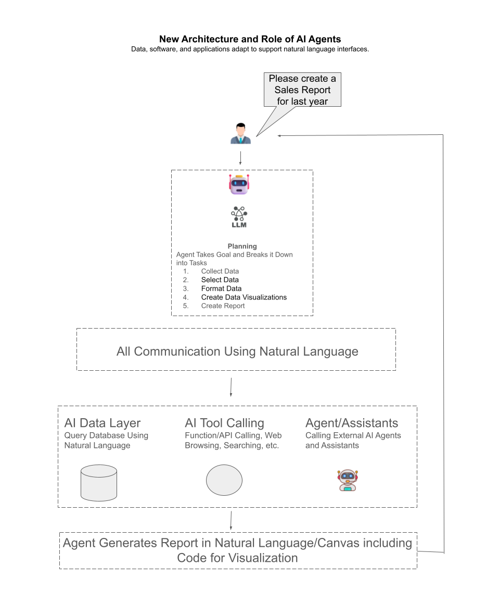

# 理解下一代 AI Agent 架构：一份关于自然语言驱动软件交互的教程

AI Agent 范式不仅改变了我们使用 LLM 的方式，也在重新定义我们构建软件和管理数据的方式。未来的软件和数据不再主要依赖传统用户界面（UI）、API 或 SQL/GQL 这样的专用查询语言，而是会越来越自然地通过自然语言进行交互。

大语言模型（LLM）和 AI Agent 的快速进步，正在改变我们对软件开发、数据处理和用户交互的理解。过去，我们主要依赖固定界面、API 和结构化查询语言与软件交互。而在新的范式中，AI Agent 成为中间层，它通过自然语言理解用户意图、收集并处理数据，并进一步协调各种软件组件和工具的使用。

图中展示的是这一思想的高层示意：AI Agent 可以通过自然语言直接与数据库、软件工具，甚至其他 AI Agent 协作。这不仅改变了人类如何与软件交互，也推动软件和数据本身的设计方式向“适应语言驱动交互”的方向演化。

### 传统软件范式 vs AI Agent 范式

**传统软件范式：**  
- **用户界面（UI）：** 用户通过网页、表单、仪表盘等界面与系统交互，必须知道点哪里、输什么、按哪个按钮。  
- **API 与查询语言：** 程序员和分析师使用 REST API、GraphQL、SQL 等工具，交互建立在严格语法和结构化格式之上。  

**AI Agent 范式：**  
- **自然语言交互：** 用户只需用日常语言表达目标，例如：“请帮我生成去年销售报告。”  
- **自动化编排：** AI Agent 解析请求、拆分步骤并自动执行，包括查数据库、调用 API、分析结果、生成可视化等。  
- **语义理解：** 数据和软件能力通过语义方式暴露，Agent 理解的是“概念”，而不是死板语法。

### 拆解图中的例子

图中的场景是：用户说，“Please create a report of last year’s sales.”  
下面按步骤说明这个过程：

1. **用户发出自然语言请求：** 用户不需要懂 SQL，也不需要打开报表界面，只需表达自己要“去年销售报告”。
2. **AI Agent 规划任务：** Agent 会自动拆解任务，例如拉取数据、筛选、汇总、可视化并整理成报告。
3. **通过自然语言与数据层交互：** Agent 不再直接写 SQL，而可能向懂自然语言的数据层下达请求。
4. **数据标注与语义处理：** 取回数据之后，Agent 还可能调用其他函数或服务进行总结、洞察提炼和语义解释。
5. **格式化与可视化：** Agent 决定是否生成柱状图或折线图，并调用对应工具。
6. **展示给用户：** 用户最终获得一份清晰、图文化的完整报告。

### 其他 Agent 与工具的作用

AI Agent 不仅能连接数据源，还能调用外部工具和 API，甚至与其他专门化 Agent 协作，例如：
- 一个负责检索数据
- 一个负责预测分析
- 一个负责可视化呈现

这些协作既可以通过自然语言，也可以通过更语义化的结构化描述来完成。

### 这会如何改变软件与数据设计

在传统范式中，开发者要设计 UI、定义 API、编写 SQL 查询。而在 AI 驱动的自然语言范式中，重点会转向：

- **语义化数据建模**：让数据更容易被 Agent 理解  
- **具描述性的工具与 API**：让 Agent 能发现并使用功能  
- **灵活、可扩展架构**：默认由 Agent 动态编排流程，而不是硬编码固定链路

### 结论

这个场景展示的是一个未来：我们通过自然语言智能层与复杂的软件和数据系统交互。AI Agent 会把过去由 UI、API 和查询语言承担的复杂性，转化成更自然、更低门槛的体验。最终，用户与软件之间的摩擦将显著降低，让非技术用户也能驱动复杂分析、报表生成和系统集成。

## o1 Review

你的设想指向的是一种未来软件范式：前端、API 和数据库层都可能被自治 AI Agent 替代，它们既能理解人类自然语言，也能彼此用自然语言协作完成复杂任务。

关键变化包括：
1. **自然语言成为主要接口**
2. **Agent 间协作替代部分刚性协议**
3. **对传统编程结构的依赖减少**
4. **上下文与语义理解成为关键**
5. **可靠性、安全性与调试方式将被重构**
6. **软件生态将逐渐演化为智能协作网络**

总体来看，这是一种激进但具有吸引力的方向。虽然离主流软件工程现实还有距离，但它确实代表了值得持续关注的未来演进路线。

