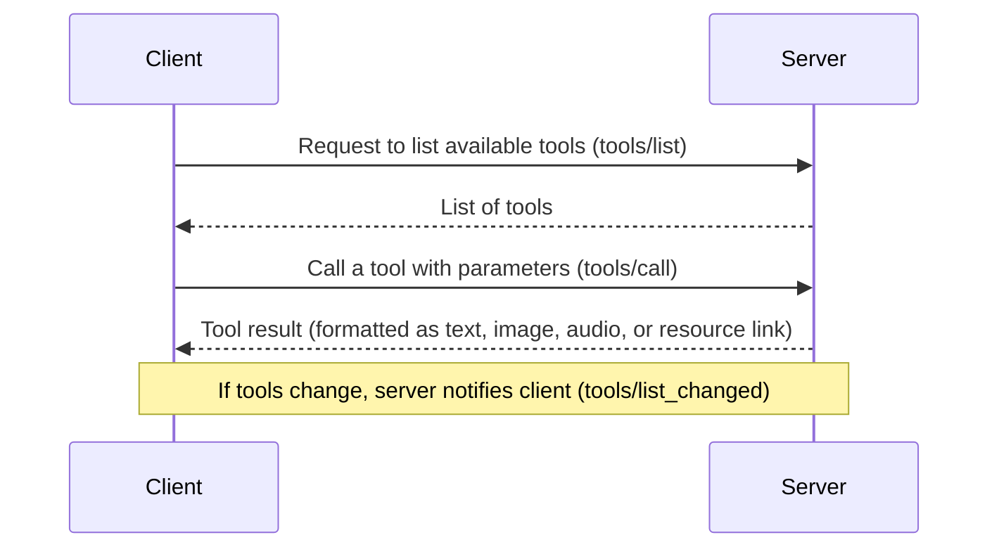

# 03：使用 MCP 定义 Tools

## 介绍

在这一步，你将学习如何使用 FastMCP Python SDK 创建并使用 MCP tools。本指南会向你展示，如何以尽量低的成本，把普通 Python 函数转成易于使用的工具。

## Tools 的工作方式：发现与执行

下面是一个简单的流程概览：

1. **发现工具**：MCP Client 发送 `tools/list` 请求，获取当前可用工具列表。
2. **使用工具**：当你想执行某个工具时，Client 会发送 `tools/call` 请求，并带上工具名和所需参数。
3. **处理错误**：如果出现问题，例如文档不存在，工具会抛出 Python 错误，而这个错误会自动被转换成 MCP 错误响应。

下面是一张简单的流程图：



### 1. 使用 `@mcp.tool` 定义工具

使用 `@mcp.tool` 装饰器，你可以把一个普通 Python 函数转换成 MCP 工具。这个装饰器会结合 Python 类型注解以及 Pydantic 的 `Field`，自动生成清晰、友好的接口。也就是说，你不必再手写复杂的 JSON schema。

*进一步阅读：* [MCP Tools Documentation](https://modelcontextprotocol.io/specification/2025-06-18/server/tools)

### 2. 列出工具

为了发现可用工具，Client 会发送 `tools/list` 请求。该操作支持分页。

**请求：**

```json
{
  "jsonrpc": "2.0",
  "id": 1,
  "method": "tools/list",
  "params": {
    "cursor": "optional-cursor-value"
  }
}
```

**响应：**

```json
{
  "jsonrpc": "2.0",
  "id": 1,
  "result": {
    "tools": [
      {
        "name": "get_weather",
        "title": "Weather Information Provider",
        "description": "Get current weather info",
        "inputSchema": {
          "type": "object",
          "properties": {
            "location": {
              "type": "string",
              "description": "City name or zip code"
            }
          },
          "required": ["location"]
        }
      }
    ],
    "nextCursor": "next-page-cursor"
  }
}
```

### 3. 调用工具

要调用某个工具，Client 会发送 `tools/call` 请求：

**请求：**

```json
{
  "jsonrpc": "2.0",
  "id": 2,
  "method": "tools/call",
  "params": {
    "name": "get_weather",
    "arguments": {
      "location": "New York"
    }
  }
}
```

**响应：**

```json
{
  "jsonrpc": "2.0",
  "id": 2,
  "result": {
    "content": [
      {
        "type": "text",
        "text": "Current weather in New York:\nTemperature: 72°F\nConditions: Partly cloudy"
      }
    ],
    "isError": false
  }
}
```

> 动手实践代码请查看 `hello_mcp`。

## Todo 练习：简单文档工具

打开基线项目中的 `mcp_server.py` 文件，完成前两个 TODO。

下面是两个简单工具，用于操作保存在内存字典中的文档。

### 文档读取工具

这个工具可以通过文档 ID 读取文档内容。

```python
@mcp.tool(
    name="read_doc_contents",
    description="Read the contents of a document and return it as a string."
)
def read_document(
    doc_id: str = Field(description="Id of the document to read")
):
    if doc_id not in docs:
        raise ValueError(f"Doc with id {doc_id} not found")
    return docs[doc_id]
```

**你将学到：**

- **自动生成接口**：函数参数会被自动转成清晰的 schema
- **友好的错误提示**：如果文档不存在，会返回清晰的错误信息

### 文档编辑工具

这个工具允许你通过替换指定字符串来更新文档内容。

```python
@mcp.tool(
    name="edit_document",
    description="Edit a document by replacing a string in the document's content with new text."
)
def edit_document(
    doc_id: str = Field(description="Id of the document to be edited"),
    old_str: str = Field(description="The text to replace. Must match exactly."),
    new_str: str = Field(description="The new text to insert.")
):
    if doc_id not in docs:
        raise ValueError(f"Doc with id {doc_id} not found")
    docs[doc_id] = docs[doc_id].replace(old_str, new_str)
    return f"Successfully updated document {doc_id}"
```

**你将学到：**

- **处理多个输入参数**：这个工具使用三个参数，演示如何管理多个输入
- **贴近真实场景**：它展示了一个实用的查找并替换操作
- **清晰错误信息**：与读取工具一样，异常情况会返回易理解的错误信息

## 测试你的 Tools

1. 启动 MCP Server：

```bash
uv run uvicorn mcp_server:mcp_app --reload
```

2. 现在你可以通过以下方式测试工具：

- **MCP Inspector**：交互式查看并试用你的工具
- **Postman Collection**：使用提供的 Postman 集合 `MCP_Defining_Tools.postman_collection.json` 发送请求并查看响应

## 使用 MCP Inspector 和 Postman 测试

测试你的 MCP tools 很简单，主要有两种方式：

### MCP Inspector

MCP Inspector 是一个基于浏览器的工具，用来快速测试 MCP Server，而不需要把它集成进完整应用。步骤如下：

1. **激活 Python 环境**：确保你的项目 Python 环境已经激活
2. **启动 Inspector**：不要直接用 Python 命令跑 Server，而是执行：
   
   ```bash
   npx @modelcontextprotocol/inspector
   ```

   该命令会通过 streamable HTTP 传输连接到你的 MCP Server。

3. **在浏览器中打开**：命令执行后会提供一个本地 URL，例如 `http://127.0.0.1:6274`，在浏览器中打开它

4. **连接到你的 Server**：在 Inspector 界面点击 **Connect**。连接状态会从 “Disconnected” 变为 “Connected”

5. **列出并测试工具**：进入 Tools 区域，点击 “List Tools” 查看可用工具，选择某个工具，例如 `read_doc_contents`，填写所需参数后点击 “Run Tool”。Inspector 会展示状态和返回数据，便于你验证工具是否工作正常

### Postman

你也可以使用 Postman 测试 MCP tools。步骤如下：

1. **导入 Collection**：把提供的 Postman 集合文件 `MCP_Defining_Tools.postman_collection.json` 导入 Postman
2. **发送请求**：选择你要测试的工具对应请求，并在请求体中填写必要参数
3. **查看响应**：发送请求后查看 JSON 响应，用来确认工具返回的结果是否符合预期，同时验证错误处理是否正常

这些测试方式能让你以一种实际且交互式的方式调试、打磨 MCP tools。更多细节请参考 [MCP Tools Specification](https://modelcontextprotocol.io/specification/2025-06-18/server/tools.md)。

## 回顾：你做了什么

1. **定义工具**：使用 `@mcp.tool` 装饰器把普通 Python 函数转换成 MCP tools
2. **注册工具**：当 Server 启动时，这些工具会自动被列出并准备好使用
3. **调用工具**：你学会了如何通过 `tools/call` 和正确参数调用工具
4. **处理错误**：你看到简单的 Python 错误是如何帮助定位问题的

## 更多资源

- [MCP Tools Specification](https://modelcontextprotocol.io/specification/2025-06-18/server/tools)
- [MCP Tools Concepts](https://modelcontextprotocol.io/docs/concepts/tools)
- [FastMCP Python SDK on GitHub](https://github.com/modelcontextprotocol/python-sdk)

感谢你完成这一步。学习新东西时感到有挑战是很正常的。慢慢来，反复看示例，并尝试修改工具实现，真正理解它们是如何工作的。
