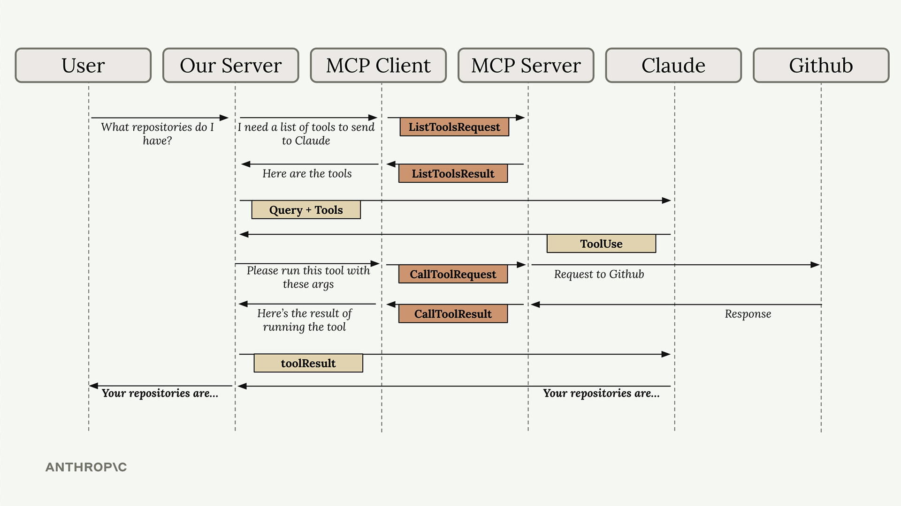

# 04：实现一个 Client

[课堂代码：Model Context Protocol - Implementing Core MCP Client](./class_code/)

MCP Client 把与 Server 通信的复杂性封装起来，让你可以专注于应用逻辑，同时仍然能够访问强大的外部工具和数据源。



理解这个流程非常关键，因为在后续章节中，你构建自己的 MCP Client 和 Server 时会看到这些组成部分全部一起工作。

> 这一步面向正在学习 Anthropic MCP 入门课程的同学。课堂上的重点是理解核心原语。

在这一步中，我们来实现 CLI MCP 应用中的 Client 端。

## 理解 MCP Client 生命周期

一个稳健的 Client-Server 应用必须认真管理连接生命周期。根据 [MCP Lifecycle Specification](https://modelcontextprotocol.io/specification/2025-06-18/basic/lifecycle)，MCP 生命周期包括以下阶段：

- **Initialization**：Client 和 Server 协商协议版本与能力。Client 先发送 `initialize` 请求，在准备完成后再发送 `initialized` 通知。
- **Operation**：进入正常通信阶段。Client 发送请求，例如列出工具或调用工具，并接收 Server 返回的响应。
- **Shutdown**：当会话结束时，连接需要被优雅关闭。这个阶段的资源管理非常重要，否则可能留下悬空连接。

把这些阶段纳入你的 Client 设计，可以让应用更稳健，也更能从容处理错误和意外中断。

## 我们的 Client 架构

MCP Client 由两个主要部分组成：

1. **MCP Client Class**
   - 这是我们自定义的类，用来简化与 Server Session 的交互
   - 它通过封装常见操作，让使用 MCP Server 更简单

2. **Client Session**
   - 这是真正由 MCP Python SDK 提供的 MCP Server 连接
   - Session 负责消息的发送和接收，所以你不需要操心底层细节

我们的自定义 Client 类还会确保资源被妥善管理，在连接不再需要时正确清理。

## Client 核心函数

MCP Client 里有两个核心函数需要你补全：

### 列出工具函数

这个函数从 MCP Server 获取所有可用工具列表。它调用 Session 内置方法，并返回工具列表。

实现示例：

```python
async def list_tools(self) -> list[types.Tool]:
    result = await self.session().list_tools()
    return result.tools
```

### 调用工具函数

这个函数用于执行 Server 上的指定工具。你需要传入工具名称和输入参数，它会在 Server 上执行工具并返回结果。

实现示例：

```python
async def call_tool(self, tool_name: str, tool_input: dict) -> types.CallToolResult | None:
    return await self.session().call_tool(tool_name, tool_input)
```

## 测试 Client

完成 Client 实现后，先启动 `mcp_server`，然后开始测试：

1. **单独测试 Client**
   - 使用下面命令运行 Client 测试脚手架：

     ```bash
     uv run mcp_client.py
     ```

   - 这个命令会连接到你的 MCP Server，并打印可用工具列表，你可以借此确认 Client 是否成功拿到正确数据

2. **通过聊天应用测试**
   - 使用下面命令运行主应用：

     ```bash
     uv run main.py
     ```

   - 尝试提问，例如：
     `What is the contents of the report.pdf document?`
     你的应用会通过 Client 调用合适的工具，并返回结果

## 总结

在这一步中，你学会了如何实现 MCP Client 及其两个核心函数 `list_tools()` 和 `call_tool()`。它们让应用能够高效地与 MCP Server 交互。你也学会了如何通过简单的命令行方式测试 Client，并初步接触了 MCP 生命周期这个重要概念。

建议你多看看代码，多动手尝试，并参考 [MCP Lifecycle Specification](https://modelcontextprotocol.io/specification/2025-06-18/basic/lifecycle) 获取更多细节。这是构建稳健、可交互应用的重要一步。

## 下一步

1. **回顾 MCP 生命周期**
   - 在实现 Client 时，回头想一想 [MCP Lifecycle Specification](https://modelcontextprotocol.io/specification/2025-06-18/basic/lifecycle) 中描述的 MCP 生命周期。
   - 思考 Initialization、Operation 和 Shutdown 这几个阶段，是如何帮助你管理连接和资源的。
   - 这种思考会帮助你更深入理解，如何构建稳健、长时间运行的应用。

2. **讨论问题**
   - 正确处理 Client 生命周期，会如何提高应用的韧性？
   - 在 Shutdown 阶段管理资源时，你可能会遇到哪些挑战？
   - 你可以如何利用 MCP 生命周期中的这些思路，进一步改进自己的 Client 设计？

继续多做实验，必要时反复回看这些概念。编码愉快。
