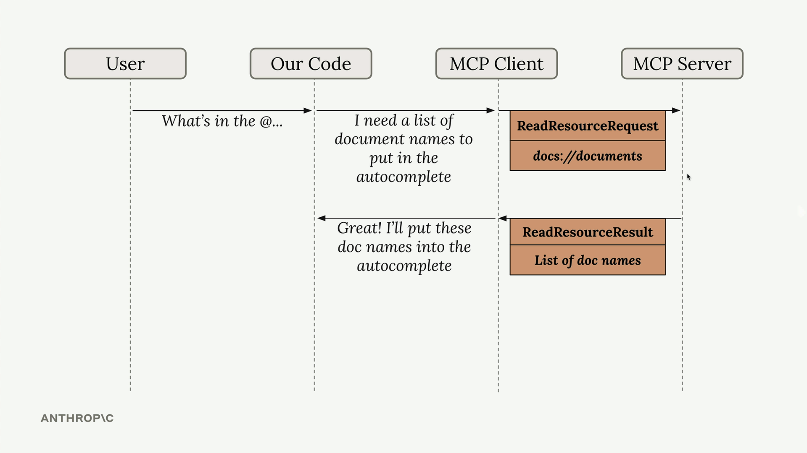

# 05. 使用 Resources

[课堂代码：Model Context Protocol - Defining Resources and MCP Client](./class_code/)

MCP Server 中的 Resources 允许你把数据暴露给 Client，这有点像典型 HTTP Server 里的 GET 请求处理器。它非常适合那种“获取信息”而不是“执行动作”的场景。

### 🏗️ MCP Resources 与你熟悉的东西对比

| **如果你熟悉……** | **MCP Resources 类似于……** | **关键优势** |
|-------------------------------|--------------------------------|-------------------|
| **文件系统** | AI 可以浏览和读取的文件 | 对 AI 来说可发现、结构化 |
| **REST API GET 接口** | 只读 API 端点 | 内建元数据和分类能力 |
| **RAG（检索增强生成）** | 给 AI 提供上下文的知识库 | 在不同 AI 平台之间标准化 |
| **文档网站** | AI 可导航的文档内容 | 自描述且拥有丰富元数据 |
| **数据库视图** | 可查询的数据集合 | 更适合 AI 的格式和发现方式 |

## Resources 的关键特征

- **只读**：Resources 提供数据，而不是动作
- **基于 URI**：通过特定 URI 访问，可带可选参数
- **带 MIME 类型**：支持多种内容类型，例如 JSON、文本、图片等
- **应用控制**：由应用决定何时暴露资源
- **静态或模板化**：既可以是固定资源，也可以是带参数的资源

每个 Resource 都由一个唯一 URI 标识，并可包含文本或二进制数据。

### Resource URI

Resources 使用 URI 标识，格式如下：

```text
[protocol]://[host]/[path]
```

例如：

- `file:///home/user/documents/report.pdf`
- `postgres://database/customers/schema`
- `screen://localhost/display1`

协议和路径结构由 MCP Server 的实现定义。Server 可以定义自己的自定义 URI scheme。

### Resources 可以包含两类内容

1. **文本资源**
   - 包含 UTF-8 编码文本
   - 适合源码、配置文件、JSON/XML 数据等

2. **二进制资源**
   - 包含 base64 编码后的原始二进制数据
   - 适合图片、PDF、音频、视频以及其他非文本格式

## Resources 是如何工作的？

Resources 采用请求-响应模式。Client 需要数据时，会发送一个 `ReadResourceRequest`，并通过 URI 指定所需资源。MCP Server 处理请求后，会在 `ReadResourceResult` 中返回数据。



Resources 可以返回任意类型的数据，例如字符串、JSON、二进制数据等。你可以通过 `mime_type` 参数告诉 Client 当前返回的是什么类型的数据：

- `application/json` 表示结构化数据
- `text/plain` 表示纯文本
- `application/pdf` 表示二进制文件

MCP Python SDK 会自动序列化返回值。你不需要手动把对象转成 JSON 字符串，只需要返回数据结构，SDK 会替你处理序列化。

## Resources 的类型

Resources 分为两类：

### 1. 直接资源（Direct Resources）

直接资源拥有固定不变的 URI，适合那些不需要参数的场景。

### 2. 模板资源（Templated Resources）

模板资源的 URI 中包含参数。Python SDK 会自动解析这些参数，并把它们作为关键字参数传给你的函数。

*进一步阅读：* [MCP Resources Documentation](https://modelcontextprotocol.io/specification/2025-06-18/server/resources)

## 协议消息结构

### 1. 列出资源

为了发现可用资源，Client 会发送 `resources/list` 请求。该操作支持分页。

**请求：**

```json
{
  "jsonrpc": "2.0",
  "id": 1,
  "method": "resources/list",
  "params": {
    "cursor": "optional-cursor-value"
  }
}
```

**响应：**

```json
{
  "jsonrpc": "2.0",
  "id": 1,
  "result": {
    "resources": [
      {
        "uri": "file:///project/src/main.rs",
        "name": "main.rs",
        "title": "Rust Software Application Main File",
        "description": "Primary application entry point",
        "mimeType": "text/x-rust"
      }
    ],
    "nextCursor": "next-page-cursor"
  }
}
```

### 2. 读取资源

要获取资源内容，Client 会发送 `resources/read` 请求：

```json
{
  "jsonrpc": "2.0",
  "id": 2,
  "method": "resources/read",
  "params": {
    "uri": "file:///project/src/main.rs"
  }
}
```

```json
{
  "jsonrpc": "2.0",
  "id": 2,
  "result": {
    "contents": [
      {
        "uri": "file:///project/src/main.rs",
        "name": "main.rs",
        "title": "Rust Software Application Main File",
        "mimeType": "text/x-rust",
        "text": "fn main() {\n    println!(\"Hello world!\");\n}"
      }
    ]
  }
}
```

### 列出 Resource Templates

Resource templates 允许 Server 使用 URI 模板暴露参数化资源。参数还可以通过 completion API 自动补全。

**请求：**

```json
{
  "jsonrpc": "2.0",
  "id": 3,
  "method": "resources/templates/list"
}
```

## Todo 练习：给你的 Server 增加 Resources

现在来更新项目里的 Server，为其添加 resources 及访问模式。

### 1. 编写一个返回所有文档 ID 的 Resource

更新 `mcp_server.py`：

```python
@mcp.resource(
    "docs://documents",
    mime_type="application/json"
)
def list_docs() -> list[str]:
    return list(docs.keys())
```

### 2. 编写一个返回指定文档内容的 Resource

```python
@mcp.resource(
    "docs://{doc_id}",
    mime_type="text/plain"
)
def get_doc(doc_id: str) -> str:
    return docs[doc_id]
```

## 在 MCP Client 中实现 Resource 读取

为了让 MCP Client 支持 Resource 访问，你需要实现一个 `read_resource` 函数。

首先，在 `mcp_client.py` 中加入必要 import：

```python
import json
from pydantic import AnyUrl
```

核心函数会向 MCP Server 发请求，并根据 MIME type 处理返回结果：

```python
async def read_resource(self, uri: str) -> Any:
    result = await self.session().read_resource(AnyUrl(uri))
    resource = result.contents[0]
    
    if isinstance(resource, types.TextResourceContents):
        if resource.mimeType == "application/json":
            return json.loads(resource.text)
    
    return resource.text
```

## 测试 Resource 访问

实现完成后，你可以通过以下方式测试 Resource 功能：

1. 启动 MCP Inspector，确认 Server resources 是否实现正确
2. 使用 Postman Collection，更细致地理解 resources 的工作方式
3. 使用 CLI 应用。当你输入 `@` 再跟上 resource 名称时，系统会：
   - 在自动补全列表中显示可用 resources
   - 允许你用方向键和空格选择 resource
   - 将 resource 内容直接加入 prompt
   - 把所有内容直接发给 AI 模型，而不需要额外的 tool call
4. 另外，还可以使用新的 Postman 请求 “List Documents Resource” 和 “Get Document Content” 来直接验证 resource 端点

与让 AI 模型额外发起工具调用来读取文档相比，这种方式的用户体验会流畅得多。

## 资源

- [MCP Resource Specification](https://modelcontextprotocol.io/specification/2025-06-18#resources)
- [MIME Types Reference](https://developer.mozilla.org/en-US/docs/Web/HTTP/Basics_of_HTTP/MIME_types)
- [URI Design Best Practices](https://tools.ietf.org/html/rfc3986)
