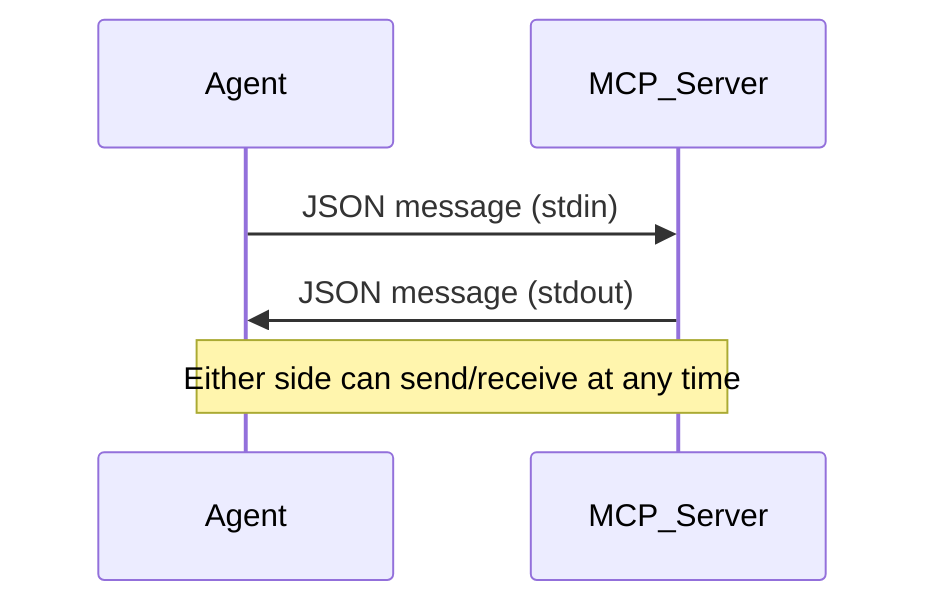
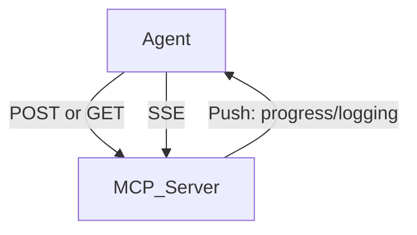
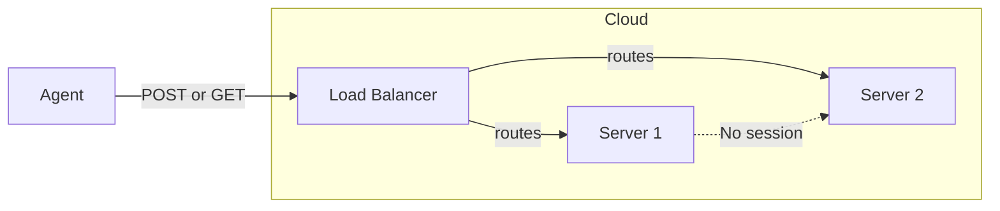

# MCP 传输层：Agent 与服务器究竟如何通信

---

## 🌱 好奇心引导

> **为什么有些 agent 特性（比如进度条或日志）在你的本机上运行得很好，但一部署到云端就失效了？agent 和服务器之间“在线路上”到底发生了什么？**

---

## 🚦 什么是传输层？

**传输层（transport）** 就是承载 MCP 消息、让 agent 与工具服务器之间完成通信的“通道”。
你选择哪种传输方式，会直接决定：
- **哪些功能能正常工作**（进度、日志、通知等）
- **系统的可扩展性如何**
- **调试和开发是否方便**

---

## 🚂 STDIO 传输

- **它是怎么工作的：**
  - agent 把 MCP 服务器作为子进程启动。
  - 双方通过标准输入/输出（`stdin` / `stdout`）通信。
  - 任意一方都可以在任意时刻发送消息，实现真正的双向通信。
- **它为什么很好用：**
  - 非常适合本地开发和测试。
  - 所有 MCP 能力都能工作：进度条、日志、通知、服务端主动发起请求等。
- **它的限制：**
  - 只适用于 agent 和服务器运行在同一台机器上的情况。
  - 不适合云端或分布式部署。

> *如果服务器需要发送一个进度更新，它只需要写到 stdout，agent 就能立刻读到。*

**🧠 主动思考：**
*为什么 STDIO 如此容易实现完整双向通信？如果你想把服务器部署到云上，会遇到什么挑战？*

---

## 🌐 StreamableHTTP 传输

- **为什么需要它：**
  - 允许 agent 通过 HTTP 连接远程或公共 MCP 服务器。
  - 支持云端和分布式部署。
- **挑战在哪里：**
  - HTTP 天生是客户端向服务器发请求，而不是反过来。
  - 仅用普通 HTTP，很难实现服务端主动发送消息（例如进度更新）。
- **解决方案：**
  - **Server-Sent Events（SSE）：**
    - 客户端建立一个长连接的 HTTP 通道（SSE）。
    - 这样服务器就可以把消息“推送”回客户端，例如进度、日志等。
  - **双连接模型：**
    - 一条 SSE 连接用于通用的服务端到客户端消息。
    - 每次工具调用还可能有额外的 SSE 连接。

- **SSE 连接** 就像一条“广播频道”，服务器可以通过它持续推送更新。
- 示例：
  > *当你调用某个工具时，服务器可以通过 SSE 实时把进度和日志流式回传给你。*

**🧠 主动思考：**
*HTTP 通常是单向请求-响应模式，SSE 是如何帮助服务器“绕过限制”并向客户端发消息的？*

---

### 无状态 StreamableHTTP（通过 `stateless_http` 扩展）

- 在无状态 HTTP 下，每个请求都可能被路由到不同的服务器，因此无法维护会话，也无法持续流式推送更新。

> 如果你想亲手看看无状态 HTTP 到底会失去哪些能力，可以看下一节的实践内容。

---

## ⚙️ 配置开关与扩展性

- **`stateless_http`：**
  - 横向扩展时需要它（例如负载均衡后面挂多台服务器）。
  - **代价：** 会失去会话状态、进度更新、服务端主动请求等能力。
- **`json_response`：**
  - 禁用 `POST` 响应中的流式返回，只返回最终结果，不返回中间更新。
  - **适用场景：** 适合简单集成，或者你只关心最终结果，想避免处理流式响应的复杂度。
- **开启这些之后会失去什么？**
  - 没有进度条、没有日志、没有服务端主动发起请求、没有 sampling、没有订阅。

**🧠 主动思考：**
*如果你需要扩展到成千上万的客户端，启用无状态 HTTP 会失去什么？在什么情况下这笔代价是值得的？*

---

## 🚦 什么时候使用哪种传输（快速对比）

| 传输方式 | 最适合 | 支持的能力 | 限制 / 取舍 |
|-------------------|------------------------|----------------------------|-------------------------------|
| STDIO | 本地开发、测试 | 全部 MCP 能力 | 不适用于分布式 / 云端 |
| StreamableHTTP | 云端、远程、生产环境 | 全部能力（在有状态模式下） | 需要 SSE，整体更复杂 |
| Stateless HTTP | 大规模部署、负载均衡 | 仅基础工具调用 | 没有进度、没有会话 |

---

## 🏁 关键结论

- **STDIO** 最适合本地开发和完整能力的 MCP，但不适用于分布式 / 云端场景。
- **StreamableHTTP** 支持云端部署，但你必须理解它为弥补 HTTP 限制所采用的机制和取舍。
- **你对传输方式的选择，本身就是一项架构设计决策**，它会决定 agent 能做什么，以及系统如何扩展。
- **一定要用你计划上线时使用的传输方式来做测试。**

---

## ✍️ 学生反思

> **用你自己的话回答：**
> 为什么你可能会选择 StreamableHTTP 而不是 STDIO？这样做你会失去什么，又会获得什么？

---

## 🧩 主动学习问题

1. **场景题：**
   你想把 agent 部署到云端，并支持成千上万用户。你会选择哪种传输和哪些配置？哪些能力可能会失效？
2. **填空题：**
   你启用 `stateless_http` 的主要原因通常是为了 ________，但你会失去 ________。
3. **简答题：**
   SSE 是如何让 HTTP 支持服务端到客户端通信的？

---

**准备开始动手了吗？**
进入下一节，看看真实的 MCP 连接生命周期在实践中是如何运行的，以及当你在有状态和无状态 HTTP 之间切换时会发生什么。

➡️ [前往：Stateful HTTP Lifecycle →](../02_stateful_http_lifecycle/README.md)
