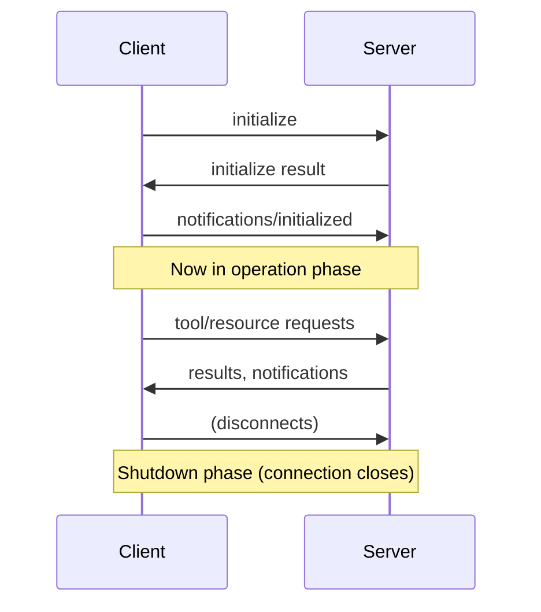

# 状态与 StreamableHTTP 传输生命周期（2025-06-18）

> **如果你还没有看过传输方式的取舍，请先回顾上一节：[MCP Transports](../01_mcp_transports/readme.md)**

MCP 服务器中的 `stateless_http` 和 `json_response` 标志控制着服务器行为中非常基础的部分。理解它们在什么情况下使用、为什么使用，非常关键，尤其是在你计划扩展服务器规模或把它部署到生产环境时。

## 什么时候需要 Stateless HTTP

假设你构建了一个 MCP 服务器，而且它开始流行起来。最开始时，也许只有少量客户端连接到单个服务器实例：

随着服务器不断增长，可能会有成千上万的客户端尝试连接。此时只运行一个服务器实例，就无法支撑全部流量：

典型的解决方案是横向扩展，也就是在负载均衡器后面运行多个服务器实例：

但问题也从这里开始变复杂。还记得 MCP 客户端需要两条独立连接吗：

1. 一个用于接收服务端到客户端请求的 `GET SSE` 连接
2. 一个用于调用工具并接收响应的 `POST` 请求

在负载均衡器后面，这些请求可能会被路由到不同的服务器实例。如果你的工具需要使用 Claude（通过 sampling），那么处理 `POST` 请求的服务器就必须与处理 `GET SSE` 连接的服务器协调。这样一来，多台服务器之间就会出现复杂的协同问题。

## Stateless HTTP 如何解决这个问题

将 `stateless_http=True` 后，这种协同问题就会消失，但代价也很明显：

启用 Stateless HTTP 时：

- 客户端拿不到 session ID，服务器无法跟踪具体客户端
- 没有服务端到客户端的请求，`GET SSE` 这条通路不可用
- 没有 sampling，无法使用 Claude 或其他 AI 模型
- 没有进度报告，长时间运行的操作无法发送进度更新
- 没有订阅，无法通知客户端资源更新

不过它也有一个好处：客户端不再需要初始化。客户端可以跳过最初的握手流程，直接发起请求。

## 什么时候使用这些标志

在以下情况下使用 Stateless HTTP：
- 你需要通过负载均衡做横向扩展
- 你不需要服务端到客户端通信
- 你的工具不依赖 AI 模型 sampling
- 你希望尽量减少连接开销

在以下情况下使用 JSON response：
- 你不需要流式响应
- 你更希望使用更简单的、非流式的 HTTP 响应
- 你正在与只期望纯 JSON 的系统集成

### 🤔 什么是有状态 HTTP 的 MCP 连接生命周期？（通俗解释）

**简单定义**：MCP 连接生命周期是 AI 与服务器之间用来建立连接、协商能力、进行通信并断开连接的**对话协议**。

**现实类比**：把它想象成认识一个新朋友：
1. 🤝 **介绍（Initialization）**："你好，我是 Claude。我能做 X、Y、Z。你能做什么？"
2. 🗣️ **对话（Operation）**：双方基于协商好的能力进行正常往返通信
3. 👋 **告别（Shutdown）**："谢谢交流，下次再见！"

---

### 📋 三个必要阶段

#### **阶段 1：初始化（握手）**
- 🤝 **协商协议版本**：确保双方兼容
- 📋 **交换能力**："我能做 X，你能做 Y"
- 🆔 **共享身份信息**：名称、版本、描述
- ✅ **确认就绪**：双方都准备好进入正常运行阶段

#### **阶段 2：运行（对话）**
- 🔧 使用协商好的能力**调用工具**
- 📚 读取已经发现的**资源**
- 💬 使用可用的**提示词**
- 🔄 以合理方式**处理错误**

#### **阶段 3：关闭（告别）**
- 🧹 **清理资源**和连接
- 💾 如有需要，**保存状态**
- 👋 **优雅断开连接**，避免数据丢失

---

### 🗺️ 生命周期时序图



本节课程依据官方 [MCP 2025-06-18 生命周期规范](https://modelcontextprotocol.io/specification/2025-06-18/basic/lifecycle)，演示了 MCP 生命周期的三个阶段：**Initialization → Operation → Shutdown**。

## MCP 关键概念（2025-06-18）

### 🎯 **生命周期阶段**
1. **Initialization**：协议版本一致与能力协商
2. **Operation**：使用协商好的能力进行正常协议通信
3. **Shutdown**：优雅地终止连接

### 📊 **核心要求**
- **协议版本**：在 JSON 请求中使用 `"2025-06-18"`（依据官方规范）
- **HTTP Header**：初始化之后包含 `MCP-Protocol-Version: 2025-06-18`
- **会话管理**：在有状态模式下由服务器自动处理 session
- **错误处理**：返回符合 JSON-RPC 2.0 的错误响应

## 🔧 官方 2025-06-18 实现

### **阶段 1：初始化**

**客户端初始化请求：**
```json
{
    "jsonrpc": "2.0",
    "id": 1,
    "method": "initialize",
    "params": {
        "protocolVersion": "2025-06-18",
        "capabilities": {
            "roots": {
                "listChanged": true
            },
            "sampling": {},
            "elicitation": {}
        },
        "clientInfo": {
            "name": "ExampleClient",
            "title": "Example Client Display Name",
            "version": "1.0.0"
        }
    }
}
```

**服务端初始化响应：**
```json
{
    "jsonrpc": "2.0",
    "id": 1,
    "result": {
        "protocolVersion": "2025-06-18",
        "capabilities": {
            "logging": {},
            "prompts": {
                "listChanged": true
            },
            "resources": {
                "subscribe": true,
                "listChanged": true
            },
            "tools": {
                "listChanged": true
            },
            "completions": {}
        },
        "serverInfo": {
            "name": "ExampleServer",
            "title": "Example Server Display Name",
            "version": "1.0.0"
        },
        "instructions": "Optional instructions for the client"
    }
}
```

**客户端 initialized 通知：**
```json
{
    "jsonrpc": "2.0",
    "method": "notifications/initialized"
}
```

### **阶段 2：运行**

初始化之后，客户端 **必须** 携带 `MCP-Protocol-Version` Header：

```http
POST /mcp/ HTTP/1.1
Content-Type: application/json
MCP-Protocol-Version: 2025-06-18
mcp-session-id: <session-id>

{
    "jsonrpc": "2.0",
    "method": "tools/list",
    "params": {},
    "id": 2
}
```

### **阶段 3：关闭**

依据规范：
- **未定义专门的关闭消息**
- **HTTP 传输**：通过关闭 HTTP 连接来表示关闭
- Session 清理会自动发生

## 🚀 快速开始

**FastMCP 会自动处理的内容：**

> **FastMCP 会帮你自动完成这些复杂部分：**
> - ✅ 协议版本协商（`2025-06-18` ↔ `2025-06-18`）
> - ✅ HTTP Header 要求（`MCP-Protocol-Version`）
> - ✅ Session 管理（有状态模式）
> - ✅ 能力协商
> - ✅ JSON-RPC 2.0 合规
> - ✅ 错误处理
> - ✅ 优雅关闭

### **终端 1：启动增强版服务器**
```bash
uv add mcp uvicorn httpx
uv run uvicorn server:mcp_app --host 0.0.0.0 --port 8000 --reload
```

### **终端 2：使用客户端测试**
```bash
uv run python client.py
```

## 核心学习成果

### **✅ 生命周期管理**
- 理解三个强制阶段
- 理解 JSON 与 HTTP Header 之间的协议版本协商
- 理解能力交换与校验
- 理解正确的会话处理方式

### **✅ 2025-06-18 合规**
- 使用正确的协议版本（JSON 中是 `"2025-06-18"`）
- 使用必需的 HTTP Header（`MCP-Protocol-Version: 2025-06-18`）
- 使用包含 `title` 字段的增强能力结构
- 采用正确的错误处理模式

### **✅ FastMCP 的优势**
- 自动生命周期管理
- 内建 2025-06-18 合规支持
- 更简化的开发体验
- 可用于生产环境的错误处理

---

## 🔍 使用 `stateless_http` 会失去什么

- ❌ 没有 session ID（无法维护按客户端区分的状态）
- ❌ 没有服务端到客户端请求（没有 SSE 通路）
- ❌ 没有 sampling（无法使用 Claude 或其他 AI 模型）
- ❌ 没有进度报告（无法流式发送更新）
- ❌ 没有订阅（无法通知资源更新）
- ✅ 但代价换来的收益是：不需要初始化，而且可以通过负载均衡做横向扩展

---

## 参考资料

- [MCP 2025-06-18 生命周期](https://modelcontextprotocol.io/specification/2025-06-18/basic/lifecycle)
- [HTTP 传输要求](https://modelcontextprotocol.io/specification/2025-06-18/basic/transports#protocol-version-header)
- [JSON-RPC 2.0 规范](https://www.jsonrpc.org/specification)

本课程展示了 FastMCP 如何让完整实现 MCP 2025-06-18 生命周期规范变得直接且可靠。
