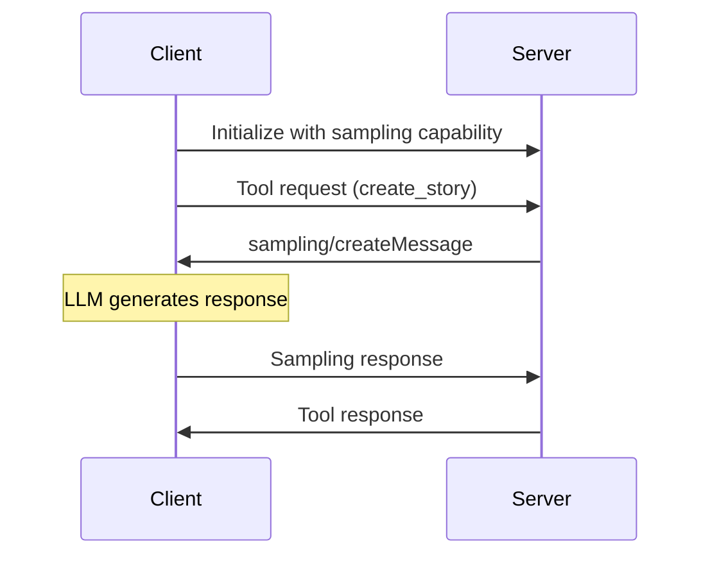

# [Sampling](https://modelcontextprotocol.io/specification/2025-06-18/client/sampling) - 给工具装上“大脑”

为什么服务器有时会想让客户端替自己“思考”，而不是自己把所有事情都做完？

> Sampling 允许 MCP 服务器把创造性或复杂推理委托给客户端的 LLM，从而把成本和控制权转移给客户端。这使得工具可以更灵活、更具适应性，也更强大。比如，不用在服务器里硬编码一个故事生成器，服务器可以按需请求客户端的 LLM 来写故事。这要求使用有状态、双向通信（StreamableHTTP）。

## Sampling 是如何工作的

这个流程并不复杂：
- 服务器先完成自己的工作（例如抓取 Wikipedia 文章）
- 服务器构造一个用于文本生成的提示词
- 服务器向客户端发送 sampling 请求
- 客户端使用给定的提示词调用 Claude
- 客户端把生成的文本返回给服务器
- 服务器把生成结果用于自己的最终响应

## 🧠 核心挑战：工具什么时候应该“思考”？

**场景：** 你正在构建一个内容生成工具，有两个选择：

**方案 A：让服务器直接调用 LLM API**
```python
def create_story(topic: str) -> str:
    story_generated = f"Once upon a time, there was a {topic}. The end." # output of an llm call
    return story_generated
```

**方案 B：把 AI 驱动逻辑放在客户端**
```python
async def create_story(ctx: Context, topic: str) -> str:
    # Ask the client's LLM to generate creative content
    prompt = f"Write a creative story about: {topic}"
    result = await ctx.sampling.create(messages=[...])
    return result.content
```

这种方式让客户端持续掌控模型访问、模型选择和权限控制，同时又能让服务器利用 AI 能力，而且服务器本身不需要 API key。

### 委托的力量

**Sampling** 代表着工具设计思路上的一次根本变化：

- **传统工具：** 所有逻辑和智能都在服务器里
- **支持 Sampling 的工具：** 服务器定义流程，客户端提供智能
- **结果：** 工具可以更灵活地适应场景、进行推理，并产生更复杂的输出

### 这里体现出的 MCP 关键概念

- **`sampling/create`（请求）：** 服务端向客户端发起 LLM 推理请求
- **Agentic Tools：** 在工作流中使用 AI 推理的工具
- **有状态连接：** 服务端向客户端通信所必需
- **能力协商：** 客户端在初始化时声明自己支持 sampling

## 🔑 MCP Sampling 的关键概念

### 消息流


## 什么时候使用 Sampling

当你在构建可被公众访问的 MCP 服务器时，Sampling 尤其有价值。你不会希望随机用户在你的成本上无限制地生成文本。通过使用 Sampling，每个客户端都为自己的 AI 使用付费，同时仍然可以使用你服务器提供的功能。

本质上，这种做法是把 AI 集成的复杂度从服务器转移到了客户端，而客户端通常已经具备必要的连接和凭据。

### 能力声明
```python
# Client declares sampling support
capabilities = ClientCapabilities(
    sampling=SamplingCapability(
        models=["openai/gpt-4o-mini"]  # Supported models
    )
)
```

### 消息结构
```python
# Server sampling request
result = await ctx.session.create_message(
    messages=[
        SamplingMessage(
            role="user",
            content=TextContent(
                type="text", 
                text="Write a story about..."
            )
        )
    ],
    max_tokens=100
)
```

## 🏗️ 架构深入理解

### 为什么必须是有状态 HTTP？

**传统 HTTP（无状态）：**
```
Client → Tool Request → Server
Client ← Tool Response ← Server
```

**Sampling HTTP（有状态）：**
```
Client → Tool Request → Server
Client ← Sampling Request ← Server  (Server asks client to think)
Client → Sampling Response → Server
Client ← Tool Response ← Server
```

**关键点：** Sampling 需要**双向通信**。服务器必须能够向客户端反向发送请求，而这要求连接是有状态的。

## 📋 动手练习：构建你自己的 Sampling 工具

### 第 1 步：分析给定实现

**🔍 探索任务：**
1. 打开 `mcp_code/server.py`
2. 找到 `create_story` 工具
3. 确认 `ctx.sampling.create()` 是在哪里调用的
4. 跟踪提示词是如何构造出来的

**💭 反思问题：**
- 为什么服务器要自己构造提示词，而不是只把主题直接传出去？
- 如果设置 `stateless_http=True` 会发生什么？
- 服务器是如何处理 sampling 失败的？

### 第 2 步：扩展实现

**🛠️ 编码挑战：**
新增一个叫做 `analyze_sentiment` 的工具，它需要：
1. 接收一段文本输入
2. 使用 sampling 分析情感倾向
3. 返回情感结果和置信度

**起始代码：**
```python
@mcp.tool()
async def analyze_sentiment(ctx: Context, text: str) -> str:
    # TODO: Construct appropriate prompt for sentiment analysis
    # TODO: Use ctx.sampling.create() to get AI analysis
    # TODO: Parse and return structured results
    pass
```

### 第 3 步：验证你的理解

**🧪 实验：**
1. 使用不同的故事主题运行客户端
2. 观察 AI 每次如何生成不同的故事
3. 尝试修改提示词，改变故事风格

**📊 可探索的问题：**
- Prompt engineering 如何影响输出质量？
- 当客户端的 sampler 失败时会发生什么？
- 你如何为 sampling 结果增加校验？

## 🚀 运行演示

### 前置条件
```bash
cd 01_sampling/mcp_code
uv sync
```

### 执行步骤

1. **先启动客户端：**
   ```bash
   uv run python client.py
   ```

2. **观察流程：**
   - 客户端声明支持 sampling
   - 客户端调用 `create_story` 工具
   - 服务器接收请求并使用 sampling
   - 客户端的 sampler 函数被调用
   - 故事沿着调用链返回

3. **预期输出：**
   ```
   🎯 MCP Sampling Client - 2025-06-18 Demo
   🔗 Connecting to sampling server...
   ✅ Connected! Server: mcp-sampling-server
   -> Client: Calling 'create_story' tool with topic: 'a function's adventure'
   <- Client: Received 'sampling/create' request from server.
   -> Client: Sending mock story back to the server.
   🎉 Final Story Received from Server:
   'In a world of shimmering code, a brave little function...'
   ```

## 🔄 与其他课程的关联

**构建基础：**
- **本节：** 服务器把推理委托给客户端
- **下一节（Elicitation）：** 服务器在执行过程中请求用户输入
- **再下一节（Roots）：** 服务器发现用户的项目上下文

**组合后的能力：**
当这些能力组合使用时，就能构建出既能理解代码（sampling）、又能提澄清问题（elicitation）、还能理解项目上下文（roots）的 AI 助手。

---
