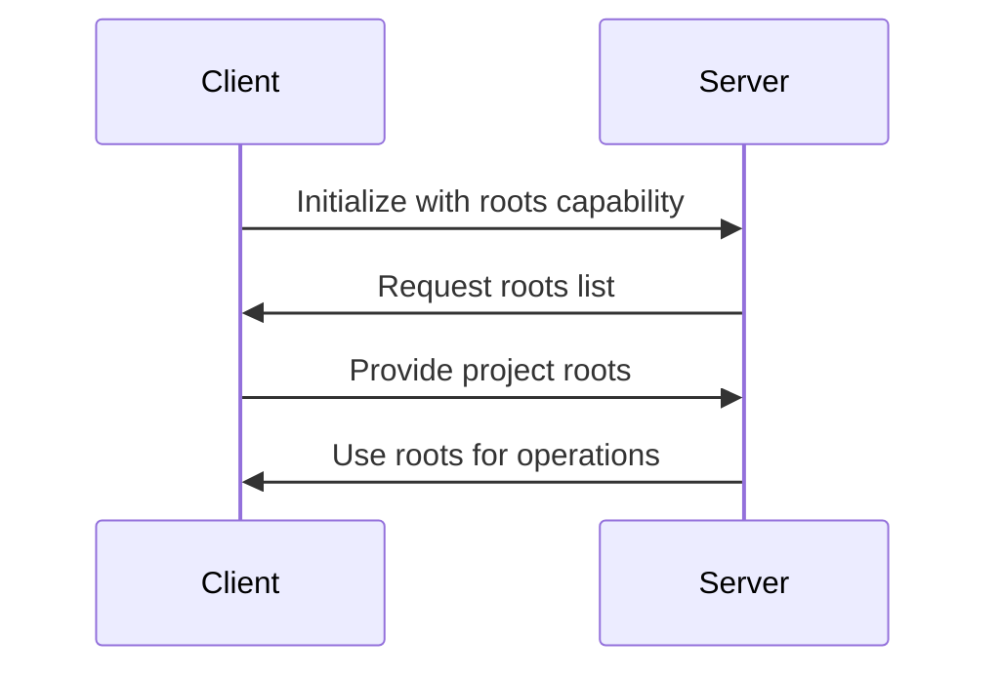

# 使用 [MCP Roots](https://modelcontextprotocol.io/specification/2025-06-18/client/roots) 发现项目上下文

Roots 是一种让 MCP 服务器访问你本地机器上特定文件和文件夹的方式。你可以把它理解成一个权限系统，相当于在告诉 MCP 服务器：“这些文件你可以访问。” 但它做的不只是授权这么简单。

### 问题是什么

开发工具通常需要理解它正在处理的项目结构：
- 哪些文件属于这个项目？
- 源代码文件在哪里？
- 项目的边界在哪里？

传统做法通常需要手动配置：
```python
project_dir = "/path/to/project"  # Hardcoded or configured
analyze_code(f"{project_dir}/src/main.py")
```

如果没有 roots，你会遇到一个很常见的问题。假设你有一个 MCP 服务器，其中有个视频转换工具，接收一个文件路径，把 MP4 转成 MOV。

当用户让 Claude “把 biking.mp4 转成 mov 格式” 时，Claude 只会用文件名调用工具。但问题在于，Claude 没办法搜索你整个文件系统，去找到这个文件到底在哪。

你的文件系统可能很复杂，文件散落在不同目录里。用户知道 `biking.mp4` 在 Movies 文件夹中，但 Claude 并不知道这个上下文。

你当然可以要求用户每次都输入完整路径，但这对用户并不友好。没人愿意每次都手动敲完整文件路径。

## 解决方案：MCP Roots

MCP Roots 提供了自动化的项目上下文发现能力：
1. 客户端（IDE、编辑器）暴露项目目录
2. 服务器（工具、分析器）在需要时请求访问
3. 无需手动配置

```python
# Server just requests roots and gets project context
roots = await ctx.session.list_roots()
project_files = roots.roots[0].list_files("**/*.py")
```

### Roots 的实际工作流程

有了 roots 之后，工作流会变成这样：

1. 用户请求转换一个视频文件
2. Agent 调用 `list_roots` 看看自己可以访问哪些目录
3. Agent 在可访问目录中调用 `read_dir` 查找目标文件
4. 找到文件后，Agent 再用完整路径调用转换工具

这一切都可以自动完成，用户仍然只需要说一句“把 biking.mp4 转换一下”，不必提供完整路径。

## 🛠️ 实现方式

### 客户端侧
客户端需要：
1. 实现 roots 能力
2. 处理 `roots/list` 请求
3. 提供项目目录信息

基础实现可参考 `client.py`。

### 服务端侧
服务器可以：
1. 向客户端请求项目 roots
2. 使用 roots 分析项目结构
3. 在项目上下文中处理文件

基础实现可参考 `server.py`。

## 🔍 关键概念

### 1. Project Roots
- **定义**：构成项目边界的目录
- **示例**：
  - VS Code 中的工作区文件夹
  - PyCharm 中的项目目录
  - Git 仓库的根目录

### 2. URI 表示形式
```python
# Example root structure
{
    "uri": "file:///home/user/projects/myapp",
    "name": "MyApp Project"
}
```

### 3. 客户端-服务端流程


## 💻 动手实现

### 第 1 步：准备项目
```bash
cd mcp_code
uv sync
```

### 第 2 步：运行演示
终端 1：
```bash
uv run uvicorn server:mcp_app --reload
```

终端 2：
```bash
uv run python client.py
```

### 第 3 步：观察输出
你会看到：
1. 客户端在初始化时声明 roots 能力
2. 服务器向客户端请求项目 roots
3. 项目分析结果，包括：
   - 按文件类型统计数量
   - 检测项目特征
   - 基础结构分析


## 📚 延伸阅读
- [MCP Roots 规范](https://modelcontextprotocol.io/specification/2025-06-18/client/roots)
- [开发工具中的项目上下文](https://modelcontextprotocol.io/blog/project-context)
- [Root 处理最佳实践](https://modelcontextprotocol.io/blog/root-handling)

---

记住：MCP roots 的价值在于让工具能够自动理解并利用项目上下文，从而让开发过程更高效、更具上下文感知能力。
