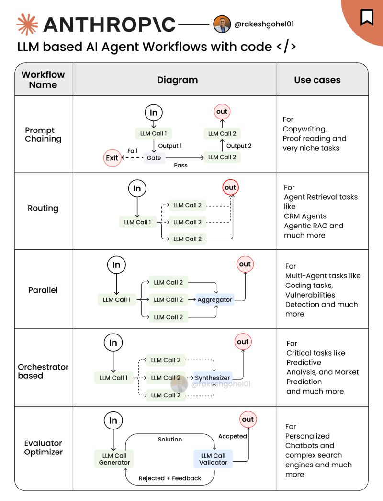

# Agentic AI 设计模式

Anthropic 提出的 Agentic 设计模式，本质上是一组用于构建高效 LLM（大语言模型）系统的架构与行为模板。它强调的重点不是复杂框架，而是简单性、透明性，以及可落地的可组合性。

这些模式的目标，是让 AI 系统具备模块化、可扩展和可适配的特性，并强调先用简单设计起步，只有在确实需要时再逐步增强。这一思路来自 Anthropic 在真实世界实现中的实践经验。

[Building effective agents By Anthropic](https://www.anthropic.com/research/building-effective-agents)

> 这篇文章的核心观点很明确：先别急着做复杂 Agent，先用最简单、最透明、最可控的方式把问题解决。
>
> Anthropic 把 AI 系统分成两类：
>
>   - Workflows：流程是预先写好的，LLM 只是流程中的一个步骤。
>   - Agents：LLM 会自己决定下一步做什么、调用什么工具、如何推进任务。
>
>   他们的主张不是“能用 Agent 就用 Agent”，而是：
>
>   - 能用单次 LLM 调用解决，就不要上 workflow
>   - 能用 workflow 解决，就不要急着上 autonomous agent
>   - 只有当任务路径不确定、步骤无法预先写死、并且需要模型边做边判断时，才值得上 agent
>
> 真正值得上 Agent 的任务通常有这些特征：
>
>   - 路径不固定
>   - 步骤数难以提前确定
>   - 需要边执行边判断下一步
>   - 可以从环境获得明确反馈
>     比如搜索结果、代码运行结果、测试结果、API 返回值
>
> 这也是为什么 研究型 Agent 和 Coding Agent 往往比较适合：它们都有外部反馈回路，可以持续修正。
>
> 对工程实践的启发
>
>   - 先从最小可行方案开始，不要一上来造复杂多 Agent 系统
>   - 优先把任务拆清楚，再决定是否需要 Agent
>   - 把工具接口、返回格式、错误处理和停止条件设计好
>   - 让系统尽量可观测，方便调试和评估
>   - 用增量方式升级：单次调用 → workflow → agent

下面这份对 [Anthropic 指南](https://www.anthropic.com/research/building-effective-agents) 的详细分析，可以作为构建高效 Agent 策略的一份全面综述和批判性解读。每个观点都建立在实际工程考量之上。虽然其中也存在一些权衡，例如复杂度带来的成本，但“保持简单、迭代增强”的核心主张，仍然是可靠的工程建议。构建高效 AI Agent，需要理解并实现那些能够让系统自主或半自主完成任务的基础模式。结合 Anthropic 关于构建高效 Agent 的研究，以及 OpenAI 最近发布的 Agents SDK，开发者可以构建出适配特定需求的稳健 AI 系统。

**1. 定义 Agents 与 Workflows**

- **Agents**：能够感知环境、作出决策，并对环境采取行动以实现特定目标的自主系统。它们会动态决定自己的执行流程和工具使用方式，并持续掌控任务执行过程。

- **Workflows**：为了高效完成任务而设计的、由预定义步骤组成的结构化流程。在 AI 场景中，Workflow 指的是通过预先写好的代码路径来编排 LLM 和工具，因此在任务定义清晰时，它能够提供更强的可预测性和一致性。

**2. 增强型大语言模型（LLMs）**

Agentic 系统的核心概念之一，是增强型 LLM，也就是被附加了额外能力、能够更有效与环境交互的模型。这些增强能力包括：

- **检索（Retrieval）**：访问并整合外部信息源，使 Agent 能获取训练数据之外的相关信息。

- **工具（Tools）**：与外部函数或 API 集成，使 Agent 可以执行特定操作，例如计算、数据处理或与其他软件系统交互。

- **记忆（Memory）**：在多轮交互中保留上下文或状态，使 Agent 能记住之前的对话、用户偏好或重要数据点，从而实现更连贯、更个性化的交互。

**3. 用 OpenAI Agents SDK 实现这些模式**

OpenAI Agents SDK 被设计得非常灵活，开发者可以用它建模多种 LLM 工作流，包括确定性流程、迭代循环等。关键模式包括：

**a. Prompt Chaining**

这种模式会把一个复杂任务拆解成一系列步骤，每一步的输出作为下一步的输入。这样的顺序处理方式，适合有条理地处理复杂任务。

**b. Routing**

Routing 会根据输入的性质，把任务分配给不同的 Agent 或模型。系统会先判断任务的复杂度或类型，再将其交给最合适的 Agent，从而提高处理效率。

**c. Parallelization**

Parallelization 允许多个任务同时执行，以提升效率并降低延迟。它特别适合那些彼此独立、可以并行完成的任务。

**d. Orchestrator-Workers**

在这种模式下，一个中心编排 Agent 会把子任务分发给多个专门化的 Worker Agent，并在最后汇总它们的结果。这种分工机制适合对复杂任务进行可扩展且有组织的处理。

**e. Evaluator-Optimizer**

这种模式通常由一个 Agent 负责生成候选解，另一个 Agent 负责评估并优化这些结果。评估者会给出反馈，指导优化者不断改进输出，从而通过多轮迭代获得更好的结果。

**4. 最佳实践**

- **从简单开始**：先实现最直接的方案，只在必要时增加复杂度。这样更容易开发、调试和维护。

- **理解框架本身**：如果使用框架，必须清楚理解底层执行过程，这样才能保持可控性与可调试性。对框架内部机制理解得越深，越有利于定制和排障。

- **按场景定制增强能力**：根据具体用例调整工具和记忆设计，提升 Agent 的实际效果。只有与任务需求直接对应的增强，才真正有价值。

通过使用这些模式和最佳实践，开发者可以借助 OpenAI Agents SDK 构建稳健、高效、并且适合自身需求的 AI Agent 系统。

如果你想看一个更直观的讲解和实操示例，下面这张图可能会有帮助：

